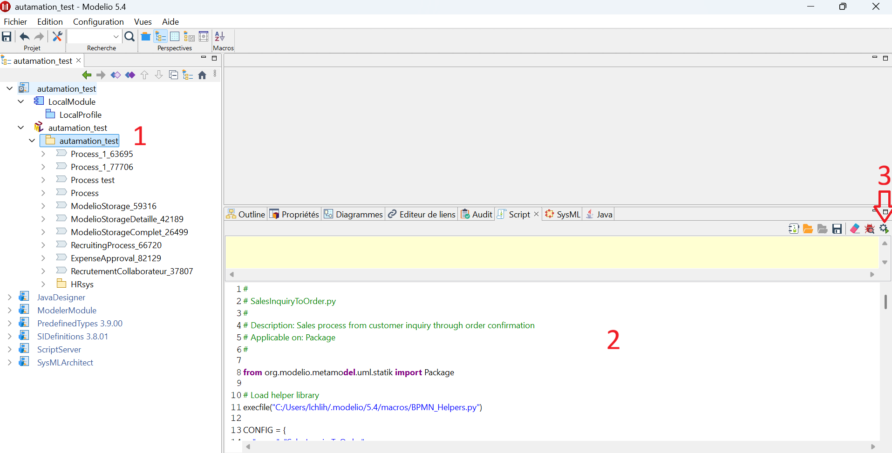

# Reproducing the experiment

Step-by-step guide to re-running the Config+Helpers vs. No-Helper evaluation
from the MODELS 2026 paper *"Towards LLM-Assisted Business Process Modeling
in an Industrial Modeling Tool"*.

Following these steps will reproduce the contents of
[`evaluation/results/raw_jsonl/`](evaluation/results/raw_jsonl/) — the
source-of-truth JSONL files from which all paper tables are derived (Step 4).
The original runs cover **2 approaches × 3 LLMs × 55 scenarios = 330 cells**.

**Prerequisites:** Python 3.10+, an [OpenRouter](https://openrouter.ai) API
key, and Modelio 5.4+ (for the execution step). Install Python dependencies
first:

```bash
pip install -r requirements.txt
```

---

## Step 1 — The dataset

The experiment uses the **PMo Dataset** (Brissard et al., 2025) as its
benchmark. We extracted two fields from it per scenario:

- **Natural-language description** — used as the LLM input.
- **BPMN 2.0 XML** — used as the ground-truth reference.

The 55 extracted records, enriched with complexity labels and structural
metrics, are in [`evaluation/dataset/PMo_input_processed.jsonl`](evaluation/dataset/PMo_input_processed.jsonl).

→ See [`evaluation/dataset/README.md`](evaluation/dataset/README.md) for a
full description of the dataset fields and how the ground-truth metrics were
derived.

---

## Step 2 — Run the LLM generation pipeline

[`tools/run_pipeline.py`](tools/run_pipeline.py) calls the OpenRouter API for
a chosen approach and model, and writes one enriched JSONL record per scenario.

### LLMs used in the original experiment

| Model | Provider | OpenRouter identifier |
|---|---|---|
| Claude Opus 4.5 | Anthropic | `anthropic/claude-opus-4-5` |
| GPT-5.2 | OpenAI | `openai/gpt-5-2` |
| GLM5 | zai-org | `z-ai/glm-5` |

All three were run with **provider-default sampling parameters** (temperature,
top-p, max tokens). You can use any OpenRouter-compatible model with
`--model`; the identifier above is passed directly to the API.

### System prompts

Each approach uses a different system prompt, loaded automatically by the
pipeline from:

- Config+Helpers: [`approaches/config-helpers/system_prompt.md`](approaches/config-helpers/system_prompt.md)
- No-Helper: [`approaches/no-helper/system_prompt.md`](approaches/no-helper/system_prompt.md)

No manual copy-paste needed — `--approach` selects the right prompt.

**Set up your API key** in `.env` at the repository root :

```
OPENROUTER_API_KEY=your-key-here
```

**Run for Config+Helpers, e.g. with Claude Opus 4.5:**

```bash
python tools/run_pipeline.py \
    --approach config-helpers \
    --model    anthropic/claude-opus-4-5 \
    --input    evaluation/dataset/PMo_input_processed.jsonl \
    --output   evaluation/results/raw_jsonl/exp_config_helper/generated_claude_opus.jsonl
```

**Run for No-Helper:**

```bash
python tools/run_pipeline.py \
    --approach no-helper \
    --model    anthropic/claude-opus-4-5 \
    --input    evaluation/dataset/PMo_input_processed.jsonl \
    --output   evaluation/results/raw_jsonl/exp_no_helper/generated_claude_opus.jsonl
```

**For token economy, we recommend both tips below before running all 55 scenarios:**

> **Tip — test on two scenarios first.**  
> Add `--limit 2 --verbose` to process only the first two records and print
> the exact prompt sent to the model, before committing to a full 55-scenario
> run:
> ```bash
> python tools/run_pipeline.py --approach config-helpers \
>     --model anthropic/claude-opus-4-5 \
>     --input evaluation/dataset/PMo_input_processed.jsonl \
>     --output /tmp/test_output.jsonl \
>     --limit 2 --verbose --delay 0
> ```

> **Tip — enable system-prompt caching.**  
> The system prompt for Config+Helpers is long (~4 000 tokens). Both Anthropic
> and OpenAI support prefix/prompt caching, which can cut input-token costs by
> up to 90 % on repeated calls with the same system prompt. Enable it in your
> OpenRouter dashboard or pass the appropriate header for your provider before
> running all 55 scenarios.

See `python tools/run_pipeline.py --help` for all options (`--resume`,
`--delay`, `--limit`, `--verbose`).

LLM versions and sampling settings are listed in the paper (§ Experiment Setup).

---

## Step 3 — Test generated scripts in Modelio

> **Transparency note — how the original experiment ran Modelio.**  
> The 330 scenarios were not executed manually. The original pipeline used an
> internal **ScriptServer** component that automated script injection into
> Modelio, package selection, and metric capture for each run. This component
> is **not included** in the artifact; the execution-related fields in the
> raw JSONL files were populated by it. We hope to open-source it soon.
> In the meantime, the manual steps below let you exercise any individual
> generated script and verify its output.

Once you have a JSONL output from Step 2, unpack it into the per-run folder
tree:

```bash
python tools/extract_runs_from_jsonl.py --clean
```

This populates `evaluation/runs/<approach>/<llm>/scenario_<NN>/` with
`generated.py`, `ground_truth.py`, `input_scenario.md`, and a partial
`metrics.json` (tokens and generation time from the API call). The
`execution_output.txt` and execution fields in `metrics.json` will be
empty at this point, they must be filled in manually after running each generated script in Modelio and recording the output (see below).

---

**To run a generated script and see the BPMN diagram:**

Once you have installed Modelio 5.4+ (see [`INSTALL.md`](INSTALL.md)) and created or opened a project:
1. **Select a Package** in the model explorer
   - If you don't have one: Right-click root → Create element → Package
2. Go to **Views → Script** to display the Script view, then paste the contents of any `evaluation/runs/.../generated.py`.
3. Click **Run** (play button)


---

**To extract structural metrics from a diagram you just generated:**

Open the Modelio Script console and run
[`tools/get_bpmn_metrics.py`](tools/get_bpmn_metrics.py). It works in two modes
depending on what is selected in the model explorer:

- **Single process selected** — prints lane, element, gateway, flow, and
  data-object counts for that process only.
- **Package selected** — iterates over all BPMN processes inside the package
  and prints metrics for each one.

The output can be compared directly against the ground-truth values in
`metrics.json`.

---

## Step 4 — Reproduce the paper tables

Once you have generated JSONL files in `evaluation/results/raw_jsonl/`, open
the analysis notebook:

```bash
jupyter lab evaluation/results/Evals.ipynb
```

Running all cells reproduces the five quantitative tables from the paper:

| Artifact table | Paper table | Content |
|---|---|---|
| Table 1 | Table 6 | Execution success rates |
| Table 2 | Table 7 | Generation time (seconds) |
| Table 3 | Table 8 | Token usage and estimated cost |
| Table 4 | Table 9 | Mean Absolute Error by structural dimension |
| Table 5 | Table 10 | Generated output size (lines of code) |

The notebook reads directly from `evaluation/results/raw_jsonl/` — no
intermediate files needed.

---
