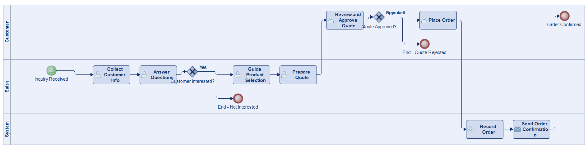
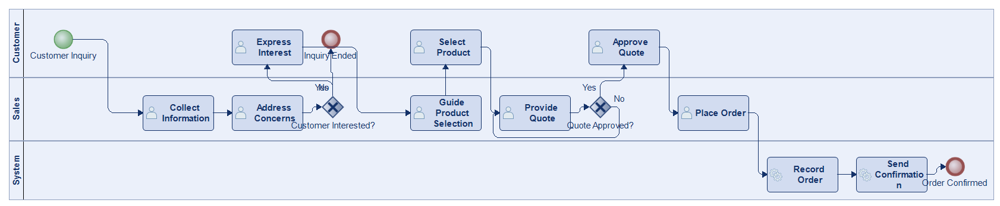
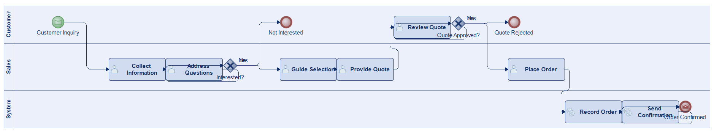
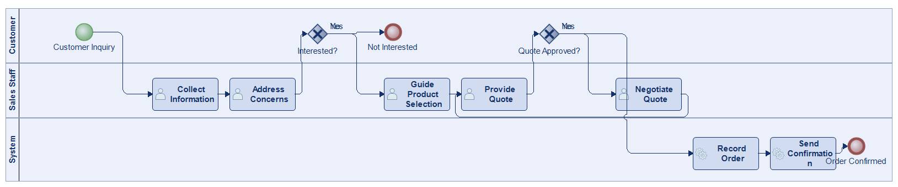

# Scenario 01

**Complexity:** Complex

[← back to comparisons index](README.md)

## Input scenario

> This process begins when a potential customer inquires about a product or service.
> Sales staff or customer support collects relevant information and addresses any concerns or questions.
> If the customer is interested, they are guided through selecting the appropriate product or service.
> Next, the sales representative provides a quote, and after approval from the customer, the process moves to order placement.
> The order is then recorded in the system, and the customer receives confirmation of their order.
> The process ends when the order is successfully placed and confirmed.

## Reference BPMN (ground truth)

| Lanes | Elements | Gateways | Flows | Data obj. | Data assoc. |
|--:|--:|--:|--:|--:|--:|
| 1 | 16 | 6 | 18 | 0 | 0 |

## Generated BPMN — 6 (approach × LLM) cells

Δ values in parentheses are `(generated − ground_truth)`.

### config-helpers / Claude Opus 4.5  ✅ executed

| metric | ground truth | generated | Δ |
|---|---:|---:|---:|
| Lanes | 1 | 2 | +1 |
| Elements | 16 | 14 | -2 |
| Gateways | 6 | 2 | -4 |
| Flows | 18 | 14 | -4 |
| Data obj. | 0 | 3 | +3 |
| Data assoc. | 0 | 6 | +6 |

**Generation:** 4,979 tokens · 18.4s · $0.053

### config-helpers / GPT-5.2  ✅ executed

| metric | ground truth | generated | Δ |
|---|---:|---:|---:|
| Lanes | 1 | 3 | +2 |
| Elements | 16 | 14 | -2 |
| Gateways | 6 | 2 | -4 |
| Flows | 18 | 13 | -5 |
| Data obj. | 0 | 0 | 0 |
| Data assoc. | 0 | 0 | 0 |

**Generation:** 4,627 tokens · 27.1s · $0.027

### config-helpers / GLM5  ❌ execution failed

_Render failed: `ERROR: IndentationError: unindent does not match any outer indentation level in <script> at line number 124 at column number 4`_  ([log](../runs/config-helpers/glm5/scenario_01/diagram_render_error.txt))

| metric | ground truth | generated | Δ |
|---|---:|---:|---:|
| Lanes | 1 | — |  |
| Elements | 16 | — |  |
| Gateways | 6 | — |  |
| Flows | 18 | — |  |
| Data obj. | 0 | — |  |
| Data assoc. | 0 | — |  |

**Generation:** 6,309 tokens · 163.9s · $0.010

> Original experiment-time error: `Script execution failed - check output`

### no-helper / Claude Opus 4.5  ✅ executed

| metric | ground truth | generated | Δ |
|---|---:|---:|---:|
| Lanes | 1 | 3 | +2 |
| Elements | 16 | 15 | -1 |
| Gateways | 6 | 2 | -4 |
| Flows | 18 | 15 | -3 |
| Data obj. | 0 | 0 | 0 |
| Data assoc. | 0 | 0 | 0 |

**Generation:** 19,175 tokens · 66.5s · $0.231

### no-helper / GPT-5.2  ✅ executed

| metric | ground truth | generated | Δ |
|---|---:|---:|---:|
| Lanes | 1 | 3 | +2 |
| Elements | 16 | 14 | -2 |
| Gateways | 6 | 2 | -4 |
| Flows | 18 | 13 | -5 |
| Data obj. | 0 | 0 | 0 |
| Data assoc. | 0 | 0 | 0 |

**Generation:** 16,240 tokens · 57.5s · $0.103

### no-helper / GLM5  ✅ executed

| metric | ground truth | generated | Δ |
|---|---:|---:|---:|
| Lanes | 1 | 3 | +2 |
| Elements | 16 | 12 | -4 |
| Gateways | 6 | 2 | -4 |
| Flows | 18 | 12 | -6 |
| Data obj. | 0 | 0 | 0 |
| Data assoc. | 0 | 0 | 0 |

**Generation:** 17,400 tokens · 115.8s · $0.024
