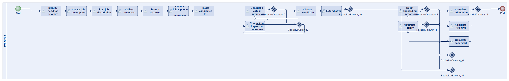
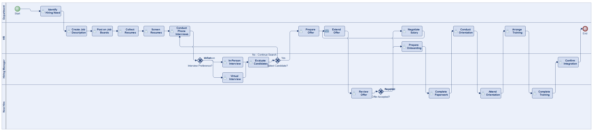
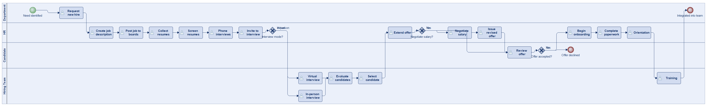
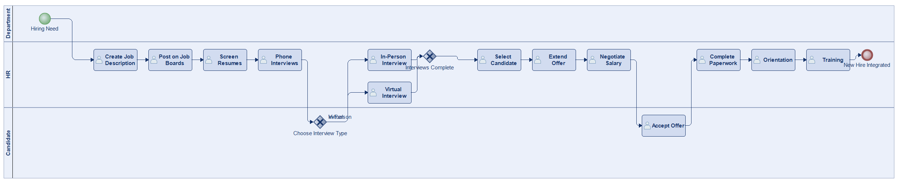
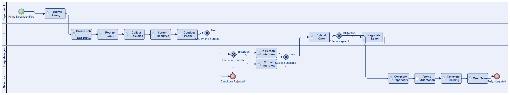
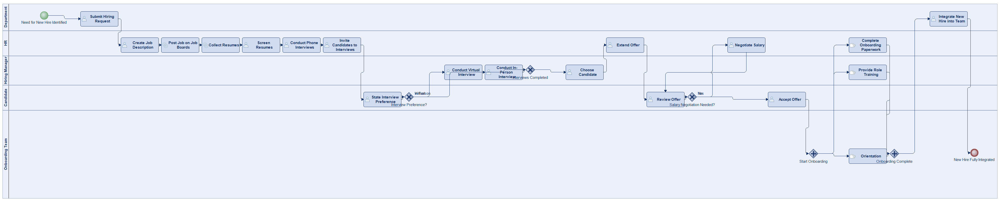
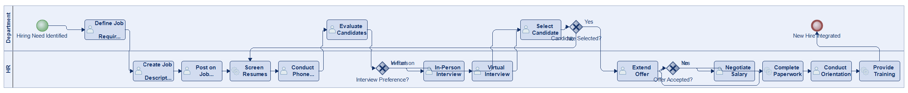

# Scenario 02

**Complexity:** Complex

[← back to comparisons index](README.md)

## Input scenario

> This process kicks off when a department identifies the need for a new hire.
> HR creates a job description and posts it on job boards.
> Resumes are collected and screened, followed by initial phone interviews.
> Selected candidates are invited for in-person or virtual interviews depending on each candidate's preference.
> Once a candidate is chosen, an offer is extended, and salary negotiations may take place.
> After the offer is accepted, the onboarding process begins, including paperwork, orientation, and training.
> The process concludes once all onboarding steps are completed and the new hire is fully integrated into the team.

## Reference BPMN (ground truth)

| Lanes | Elements | Gateways | Flows | Data obj. | Data assoc. |
|--:|--:|--:|--:|--:|--:|
| 1 | 26 | 8 | 31 | 0 | 0 |

## Generated BPMN — 6 (approach × LLM) cells

Δ values in parentheses are `(generated − ground_truth)`.

### config-helpers / Claude Opus 4.5  ✅ executed

| metric | ground truth | generated | Δ |
|---|---:|---:|---:|
| Lanes | 1 | 4 | +3 |
| Elements | 26 | 25 | -1 |
| Gateways | 8 | 3 | -5 |
| Flows | 31 | 27 | -4 |
| Data obj. | 0 | — |  |
| Data assoc. | 0 | — |  |

**Generation:** 5,557 tokens · 22.4s · $0.067

### config-helpers / GPT-5.2  ✅ executed

| metric | ground truth | generated | Δ |
|---|---:|---:|---:|
| Lanes | 1 | 4 | +3 |
| Elements | 26 | 25 | -1 |
| Gateways | 8 | 3 | -5 |
| Flows | 31 | 26 | -5 |
| Data obj. | 0 | 0 | 0 |
| Data assoc. | 0 | 0 | 0 |

**Generation:** 6,101 tokens · 41.2s · $0.048

### config-helpers / GLM5  ✅ executed

| metric | ground truth | generated | Δ |
|---|---:|---:|---:|
| Lanes | 1 | 3 | +2 |
| Elements | 26 | 17 | -9 |
| Gateways | 8 | 2 | -6 |
| Flows | 31 | 17 | -14 |
| Data obj. | 0 | 0 | 0 |
| Data assoc. | 0 | 0 | 0 |

**Generation:** 12,746 tokens · 215.9s · $0.024

### no-helper / Claude Opus 4.5  ✅ executed

| metric | ground truth | generated | Δ |
|---|---:|---:|---:|
| Lanes | 1 | 4 | +3 |
| Elements | 26 | 21 | -5 |
| Gateways | 8 | 4 | -4 |
| Flows | 31 | 23 | -8 |
| Data obj. | 0 | 0 | 0 |
| Data assoc. | 0 | 0 | 0 |

**Generation:** 19,650 tokens · 67.5s · $0.242

### no-helper / GPT-5.2  ✅ executed

| metric | ground truth | generated | Δ |
|---|---:|---:|---:|
| Lanes | 1 | 5 | +4 |
| Elements | 26 | 26 | 0 |
| Gateways | 8 | 5 | -3 |
| Flows | 31 | 29 | -2 |
| Data obj. | 0 | 0 | 0 |
| Data assoc. | 0 | 0 | 0 |

**Generation:** 18,225 tokens · 86.8s · $0.130

### no-helper / GLM5  ✅ executed

| metric | ground truth | generated | Δ |
|---|---:|---:|---:|
| Lanes | 1 | 2 | +1 |
| Elements | 26 | 19 | -7 |
| Gateways | 8 | 3 | -5 |
| Flows | 31 | 21 | -10 |
| Data obj. | 0 | 0 | 0 |
| Data assoc. | 0 | 0 | 0 |

**Generation:** 23,330 tokens · 200.8s · $0.038
