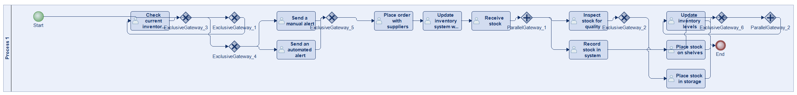
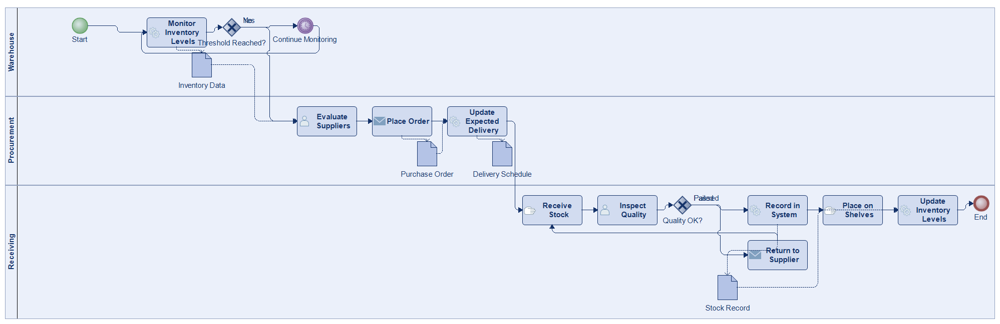
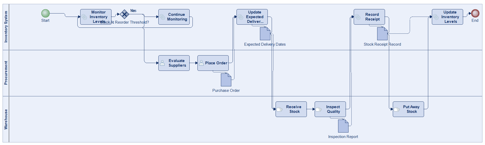
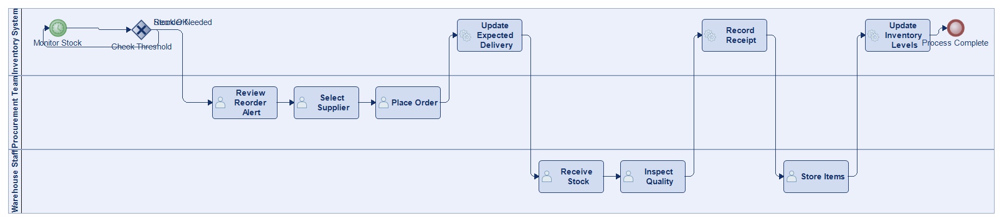
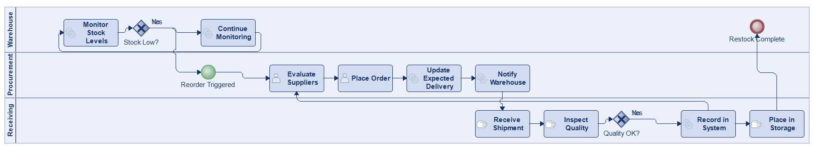
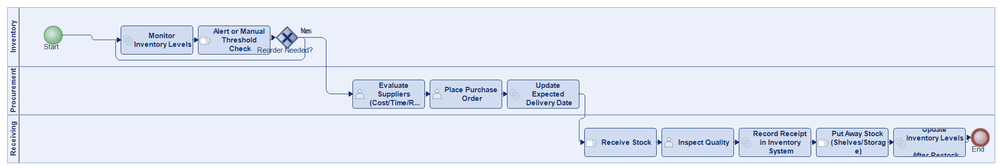

# Scenario 03

**Complexity:** Complex

[← back to comparisons index](README.md)

## Input scenario

> This process begins with monitoring inventory levels in a warehouse or store.
> When stock reaches a predefined threshold, an automated alert or manual check signals the need to reorder.
> The procurement team then places an order with suppliers, considering factors like cost, delivery time, and supplier reliability.
> Once the order is placed, the inventory system updates with expected delivery dates.
> Upon receiving the stock, it is inspected for quality, recorded in the system, and placed on shelves or in storage.
> The process ends when the inventory levels are updated after the restock is complete.

## Reference BPMN (ground truth)

| Lanes | Elements | Gateways | Flows | Data obj. | Data assoc. |
|--:|--:|--:|--:|--:|--:|
| 1 | 21 | 8 | 24 | 0 | 0 |

## Generated BPMN — 6 (approach × LLM) cells

Δ values in parentheses are `(generated − ground_truth)`.

### config-helpers / Claude Opus 4.5  ✅ executed

| metric | ground truth | generated | Δ |
|---|---:|---:|---:|
| Lanes | 1 | 3 | +2 |
| Elements | 21 | 15 | -6 |
| Gateways | 8 | 2 | -6 |
| Flows | 24 | 16 | -8 |
| Data obj. | 0 | 4 | +4 |
| Data assoc. | 0 | 7 | +7 |

**Generation:** 5,038 tokens · 17.9s · $0.054

### config-helpers / GPT-5.2  ✅ executed

| metric | ground truth | generated | Δ |
|---|---:|---:|---:|
| Lanes | 1 | 3 | +2 |
| Elements | 21 | 17 | -4 |
| Gateways | 8 | 1 | -7 |
| Flows | 24 | 13 | -11 |
| Data obj. | 0 | 4 | +4 |
| Data assoc. | 0 | 8 | +8 |

**Generation:** 4,837 tokens · 38.2s · $0.030

### config-helpers / GLM5  ✅ executed

| metric | ground truth | generated | Δ |
|---|---:|---:|---:|
| Lanes | 1 | 3 | +2 |
| Elements | 21 | 12 | -9 |
| Gateways | 8 | 1 | -7 |
| Flows | 24 | 12 | -12 |
| Data obj. | 0 | 0 | 0 |
| Data assoc. | 0 | 0 | 0 |

**Generation:** 4,597 tokens · 136.5s · $0.006

### no-helper / Claude Opus 4.5  ✅ executed

| metric | ground truth | generated | Δ |
|---|---:|---:|---:|
| Lanes | 1 | 3 | +2 |
| Elements | 21 | 15 | -6 |
| Gateways | 8 | 2 | -6 |
| Flows | 24 | 16 | -8 |
| Data obj. | 0 | 0 | 0 |
| Data assoc. | 0 | 0 | 0 |

**Generation:** 19,423 tokens · 68.9s · $0.237

### no-helper / GPT-5.2  ✅ executed

| metric | ground truth | generated | Δ |
|---|---:|---:|---:|
| Lanes | 1 | 3 | +2 |
| Elements | 21 | 13 | -8 |
| Gateways | 8 | 1 | -7 |
| Flows | 24 | 13 | -11 |
| Data obj. | 0 | 0 | 0 |
| Data assoc. | 0 | 0 | 0 |

**Generation:** 15,497 tokens · 59.9s · $0.092

### no-helper / GLM5  ❌ execution failed

_Render failed: `ERROR: ImportError: cannot import name BpmnTimerStartEvent in <script> at line number 80`_  ([log](../runs/no-helper/glm5/scenario_03/diagram_render_error.txt))

| metric | ground truth | generated | Δ |
|---|---:|---:|---:|
| Lanes | 1 | — |  |
| Elements | 21 | — |  |
| Gateways | 8 | — |  |
| Flows | 24 | — |  |
| Data obj. | 0 | — |  |
| Data assoc. | 0 | — |  |

**Generation:** 17,679 tokens · 100.4s · $0.025

> Original experiment-time error: `Script execution failed - check output`
