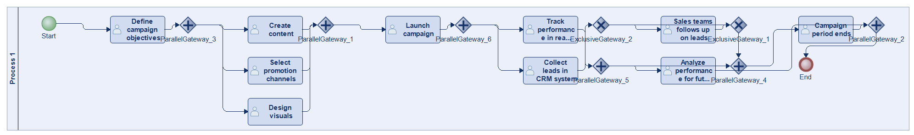
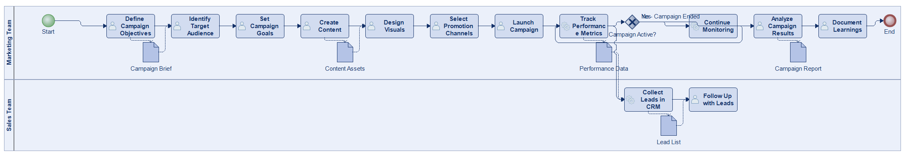
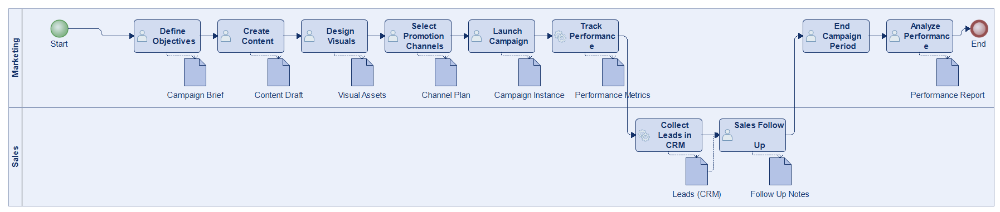
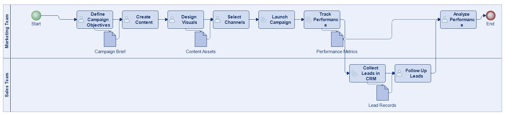
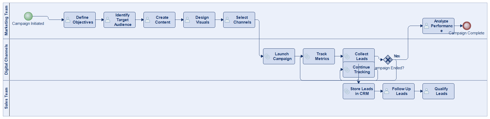
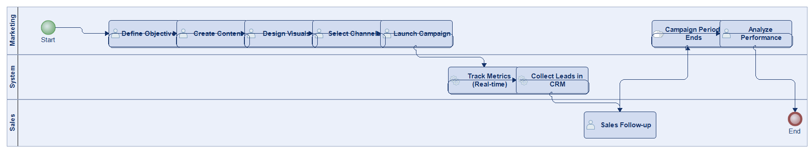
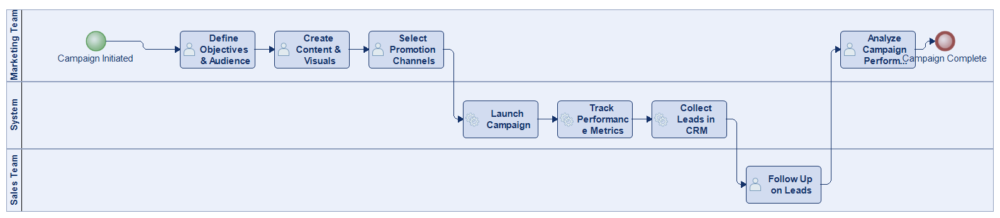

# Scenario 04

**Complexity:** Complex

[← back to comparisons index](README.md)

## Input scenario

> The process starts with defining the objectives of a marketing campaign, including the target audience and goals such as generating leads or increasing brand awareness.
> The marketing team creates the content, designs the visuals, and selects channels for promotion, whether digital ads, emails, or social media posts.
> The campaign is launched, and its performance is tracked in real-time through various metrics like click-through rates and conversions.
> Leads generated from the campaign are collected in the CRM system, where sales teams can follow up.
> The process concludes when the campaign period ends, and performance is analyzed for future optimization.

## Reference BPMN (ground truth)

| Lanes | Elements | Gateways | Flows | Data obj. | Data assoc. |
|--:|--:|--:|--:|--:|--:|
| 1 | 20 | 8 | 24 | 0 | 0 |

## Generated BPMN — 6 (approach × LLM) cells

Δ values in parentheses are `(generated − ground_truth)`.

### config-helpers / Claude Opus 4.5  ✅ executed

| metric | ground truth | generated | Δ |
|---|---:|---:|---:|
| Lanes | 1 | 2 | +1 |
| Elements | 20 | 16 | -4 |
| Gateways | 8 | 1 | -7 |
| Flows | 24 | 16 | -8 |
| Data obj. | 0 | 5 | +5 |
| Data assoc. | 0 | 9 | +9 |

**Generation:** 5,051 tokens · 16.2s · $0.055

### config-helpers / GPT-5.2  ✅ executed

| metric | ground truth | generated | Δ |
|---|---:|---:|---:|
| Lanes | 1 | 2 | +1 |
| Elements | 20 | 21 | +1 |
| Gateways | 8 | 0 | -8 |
| Flows | 24 | 11 | -13 |
| Data obj. | 0 | 9 | +9 |
| Data assoc. | 0 | 10 | +10 |

**Generation:** 4,336 tokens · 15.9s · $0.023

### config-helpers / GLM5  ✅ executed

| metric | ground truth | generated | Δ |
|---|---:|---:|---:|
| Lanes | 1 | 2 | +1 |
| Elements | 20 | 15 | -5 |
| Gateways | 8 | 0 | -8 |
| Flows | 24 | 10 | -14 |
| Data obj. | 0 | 4 | +4 |
| Data assoc. | 0 | 8 | +8 |

**Generation:** 8,494 tokens · 84.8s · $0.015

### no-helper / Claude Opus 4.5  ✅ executed

| metric | ground truth | generated | Δ |
|---|---:|---:|---:|
| Lanes | 1 | 3 | +2 |
| Elements | 20 | 16 | -4 |
| Gateways | 8 | 1 | -7 |
| Flows | 24 | 16 | -8 |
| Data obj. | 0 | 0 | 0 |
| Data assoc. | 0 | 0 | 0 |

**Generation:** 19,167 tokens · 64.8s · $0.230

### no-helper / GPT-5.2  ✅ executed

| metric | ground truth | generated | Δ |
|---|---:|---:|---:|
| Lanes | 1 | 3 | +2 |
| Elements | 20 | 12 | -8 |
| Gateways | 8 | 0 | -8 |
| Flows | 24 | 11 | -13 |
| Data obj. | 0 | 0 | 0 |
| Data assoc. | 0 | 0 | 0 |

**Generation:** 15,812 tokens · 61.6s · $0.097

### no-helper / GLM5  ✅ executed

| metric | ground truth | generated | Δ |
|---|---:|---:|---:|
| Lanes | 1 | 3 | +2 |
| Elements | 20 | 10 | -10 |
| Gateways | 8 | 0 | -8 |
| Flows | 24 | 9 | -15 |
| Data obj. | 0 | 0 | 0 |
| Data assoc. | 0 | 0 | 0 |

**Generation:** 17,299 tokens · 99.1s · $0.024
