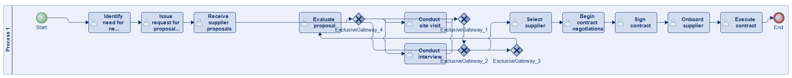
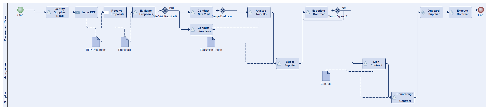
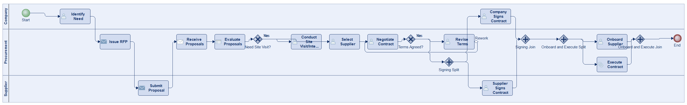
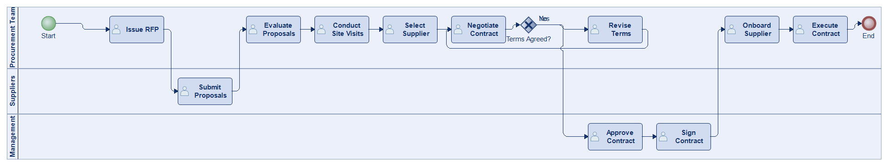
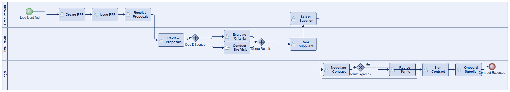
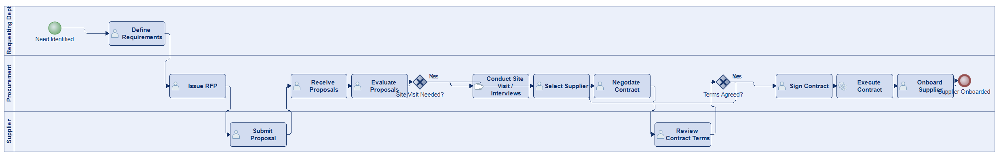
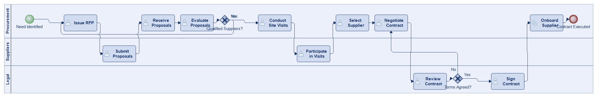

# Scenario 05

**Complexity:** Complex

[← back to comparisons index](README.md)

## Input scenario

> The process begins when a company identifies the need for a new supplier or vendor.
> The procurement team issues a request for proposals (RFP) and receives responses from various suppliers.
> Each proposal is evaluated based on criteria like cost, quality, and delivery time.
> The team may also conduct site visits or interviews with suppliers.
> After careful analysis, a supplier is selected, and contract negotiations begin.
> Once both parties agree on the terms, the contract is signed.
> The process ends when the supplier is officially onboarded, and the contract is executed.

## Reference BPMN (ground truth)

| Lanes | Elements | Gateways | Flows | Data obj. | Data assoc. |
|--:|--:|--:|--:|--:|--:|
| 1 | 17 | 4 | 19 | 0 | 0 |

## Generated BPMN — 6 (approach × LLM) cells

Δ values in parentheses are `(generated − ground_truth)`.

### config-helpers / Claude Opus 4.5  ✅ executed

| metric | ground truth | generated | Δ |
|---|---:|---:|---:|
| Lanes | 1 | 3 | +2 |
| Elements | 17 | 18 | +1 |
| Gateways | 4 | 3 | -1 |
| Flows | 19 | 19 | 0 |
| Data obj. | 0 | 4 | +4 |
| Data assoc. | 0 | 8 | +8 |

**Generation:** 5,197 tokens · 19.0s · $0.059

### config-helpers / GPT-5.2  ✅ executed

| metric | ground truth | generated | Δ |
|---|---:|---:|---:|
| Lanes | 1 | 3 | +2 |
| Elements | 17 | 21 | +4 |
| Gateways | 4 | 6 | +2 |
| Flows | 19 | 24 | +5 |
| Data obj. | 0 | 0 | 0 |
| Data assoc. | 0 | 0 | 0 |

**Generation:** 6,364 tokens · 60.4s · $0.051

### config-helpers / GLM5  ✅ executed

| metric | ground truth | generated | Δ |
|---|---:|---:|---:|
| Lanes | 1 | 3 | +2 |
| Elements | 17 | 14 | -3 |
| Gateways | 4 | 1 | -3 |
| Flows | 19 | 14 | -5 |
| Data obj. | 0 | 0 | 0 |
| Data assoc. | 0 | 0 | 0 |

**Generation:** 8,265 tokens · 169.8s · $0.014

### no-helper / Claude Opus 4.5  ✅ executed

| metric | ground truth | generated | Δ |
|---|---:|---:|---:|
| Lanes | 1 | 3 | +2 |
| Elements | 17 | 17 | 0 |
| Gateways | 4 | 3 | -1 |
| Flows | 19 | 18 | -1 |
| Data obj. | 0 | 0 | 0 |
| Data assoc. | 0 | 0 | 0 |

**Generation:** 19,854 tokens · 72.6s · $0.247

### no-helper / GPT-5.2  ✅ executed

| metric | ground truth | generated | Δ |
|---|---:|---:|---:|
| Lanes | 1 | 3 | +2 |
| Elements | 17 | 16 | -1 |
| Gateways | 4 | 2 | -2 |
| Flows | 19 | 17 | -2 |
| Data obj. | 0 | 0 | 0 |
| Data assoc. | 0 | 0 | 0 |

**Generation:** 16,273 tokens · 69.8s · $0.103

### no-helper / GLM5  ✅ executed

| metric | ground truth | generated | Δ |
|---|---:|---:|---:|
| Lanes | 1 | 3 | +2 |
| Elements | 17 | 15 | -2 |
| Gateways | 4 | 2 | -2 |
| Flows | 19 | 16 | -3 |
| Data obj. | 0 | 0 | 0 |
| Data assoc. | 0 | 0 | 0 |

**Generation:** 20,055 tokens · 123.8s · $0.030
