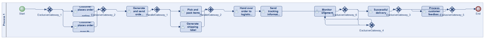
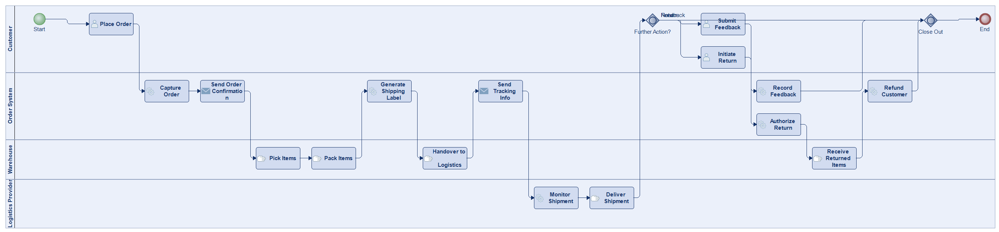
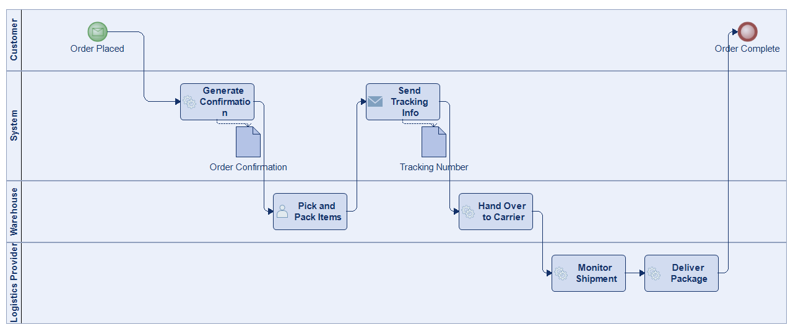
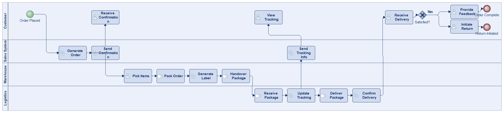
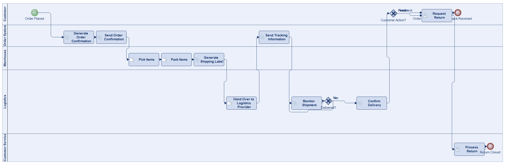
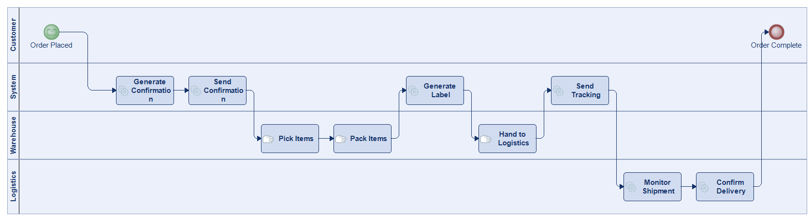

# Scenario 06

**Complexity:** Complex

[← back to comparisons index](README.md)

## Input scenario

> This process begins when a customer places an order through an online platform or over the phone.
> The system automatically generates an order confirmation and sends it to the customer.
> The warehouse team picks and packs the items, and a shipping label is generated.
> The order is then handed over to a logistics provider for delivery.
> Tracking information is sent to the customer.
> The process continues as the shipment is monitored until it reaches the customer's address.
> After successful delivery, the process ends, but customer feedback or returns may trigger further actions.

## Reference BPMN (ground truth)

| Lanes | Elements | Gateways | Flows | Data obj. | Data assoc. |
|--:|--:|--:|--:|--:|--:|
| 1 | 20 | 8 | 23 | 0 | 0 |

## Generated BPMN — 6 (approach × LLM) cells

Δ values in parentheses are `(generated − ground_truth)`.

### config-helpers / Claude Opus 4.5  ⚠️ executed at experiment time, render failed today

_Render failed: `ERROR: org.modelio.vcore.smkernel.IllegalModelManipulationException: IllegalModelManipulationException [Error: -1, object=null, closure=org.`_  ([log](../runs/config-helpers/claude_opus_4_5/scenario_06/diagram_render_error.txt))

| metric | ground truth | generated | Δ |
|---|---:|---:|---:|
| Lanes | 1 | 4 | +3 |
| Elements | 20 | 18 | -2 |
| Gateways | 8 | 1 | -7 |
| Flows | 23 | 19 | -4 |
| Data obj. | 0 | 4 | +4 |
| Data assoc. | 0 | 7 | +7 |

**Generation:** 5,130 tokens · 19.4s · $0.057

### config-helpers / GPT-5.2  ✅ executed

| metric | ground truth | generated | Δ |
|---|---:|---:|---:|
| Lanes | 1 | 4 | +3 |
| Elements | 20 | 20 | 0 |
| Gateways | 8 | 2 | -6 |
| Flows | 23 | 21 | -2 |
| Data obj. | 0 | 0 | 0 |
| Data assoc. | 0 | 0 | 0 |

**Generation:** 5,692 tokens · 36.4s · $0.042

### config-helpers / GLM5  ✅ executed

| metric | ground truth | generated | Δ |
|---|---:|---:|---:|
| Lanes | 1 | 4 | +3 |
| Elements | 20 | 10 | -10 |
| Gateways | 8 | 0 | -8 |
| Flows | 23 | 7 | -16 |
| Data obj. | 0 | 2 | +2 |
| Data assoc. | 0 | 2 | +2 |

**Generation:** 8,392 tokens · 139.6s · $0.014

### no-helper / Claude Opus 4.5  ✅ executed

| metric | ground truth | generated | Δ |
|---|---:|---:|---:|
| Lanes | 1 | 4 | +3 |
| Elements | 20 | 20 | 0 |
| Gateways | 8 | 1 | -7 |
| Flows | 23 | 19 | -4 |
| Data obj. | 0 | 0 | 0 |
| Data assoc. | 0 | 0 | 0 |

**Generation:** 20,057 tokens · 74.7s · $0.253

### no-helper / GPT-5.2  ✅ executed

| metric | ground truth | generated | Δ |
|---|---:|---:|---:|
| Lanes | 1 | 5 | +4 |
| Elements | 20 | 18 | -2 |
| Gateways | 8 | 2 | -6 |
| Flows | 23 | 18 | -5 |
| Data obj. | 0 | 0 | 0 |
| Data assoc. | 0 | 0 | 0 |

**Generation:** 17,143 tokens · 80.4s · $0.115

### no-helper / GLM5  ✅ executed

| metric | ground truth | generated | Δ |
|---|---:|---:|---:|
| Lanes | 1 | 4 | +3 |
| Elements | 20 | 11 | -9 |
| Gateways | 8 | 0 | -8 |
| Flows | 23 | 10 | -13 |
| Data obj. | 0 | 0 | 0 |
| Data assoc. | 0 | 0 | 0 |

**Generation:** 17,316 tokens · 101.4s · $0.024
