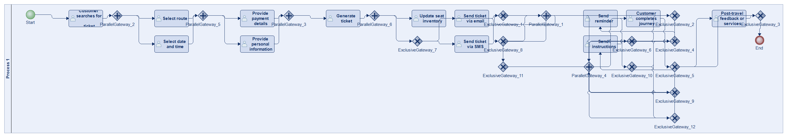
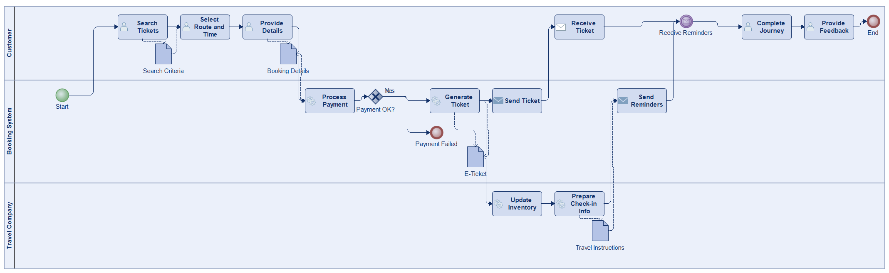
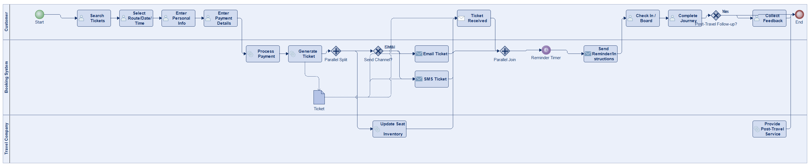
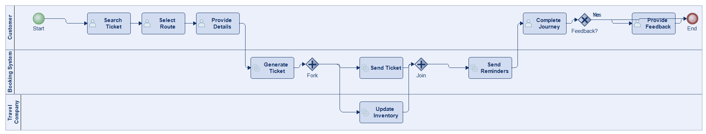
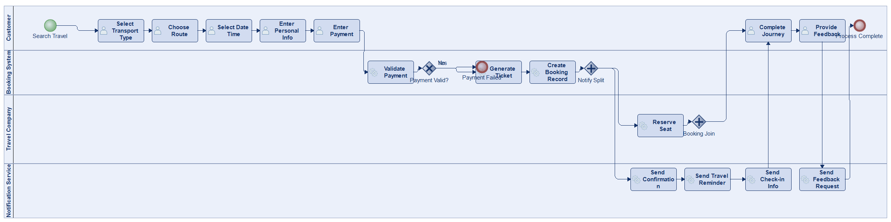
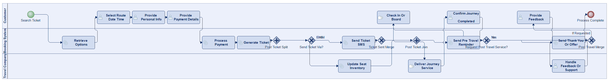
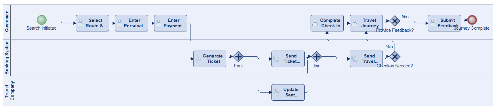

# Scenario 07

**Complexity:** Complex

[← back to comparisons index](README.md)

## Input scenario

> This process begins when a customer searches for a flight, train, or bus ticket.
> After selecting the preferred route, date, and time, the customer provides personal information and payment details.
> The booking system generates a ticket, which is sent to the customer via email or SMS.
> The travel company updates its seat inventory accordingly.
> Before travel, the customer may receive reminders and instructions for check-in or boarding.
> The process concludes once the customer completes their journey, though post-travel feedback or services may extend it slightly.

## Reference BPMN (ground truth)

| Lanes | Elements | Gateways | Flows | Data obj. | Data assoc. |
|--:|--:|--:|--:|--:|--:|
| 1 | 33 | 18 | 42 | 0 | 0 |

## Generated BPMN — 6 (approach × LLM) cells

Δ values in parentheses are `(generated − ground_truth)`.

### config-helpers / Claude Opus 4.5  ✅ executed

| metric | ground truth | generated | Δ |
|---|---:|---:|---:|
| Lanes | 1 | 3 | +2 |
| Elements | 33 | 17 | -16 |
| Gateways | 18 | 1 | -17 |
| Flows | 42 | 17 | -25 |
| Data obj. | 0 | 4 | +4 |
| Data assoc. | 0 | 8 | +8 |

**Generation:** 5,055 tokens · 19.2s · $0.055

### config-helpers / GPT-5.2  ✅ executed

| metric | ground truth | generated | Δ |
|---|---:|---:|---:|
| Lanes | 1 | 3 | +2 |
| Elements | 33 | 23 | -10 |
| Gateways | 18 | 4 | -14 |
| Flows | 42 | 24 | -18 |
| Data obj. | 0 | 1 | +1 |
| Data assoc. | 0 | 4 | +4 |

**Generation:** 6,119 tokens · 50.5s · $0.048

### config-helpers / GLM5  ✅ executed

| metric | ground truth | generated | Δ |
|---|---:|---:|---:|
| Lanes | 1 | 3 | +2 |
| Elements | 33 | 14 | -19 |
| Gateways | 18 | 3 | -15 |
| Flows | 42 | 15 | -27 |
| Data obj. | 0 | 0 | 0 |
| Data assoc. | 0 | 0 | 0 |

**Generation:** 12,187 tokens · 167.7s · $0.023

### no-helper / Claude Opus 4.5  ✅ executed

| metric | ground truth | generated | Δ |
|---|---:|---:|---:|
| Lanes | 1 | 4 | +3 |
| Elements | 33 | 22 | -11 |
| Gateways | 18 | 3 | -15 |
| Flows | 42 | 23 | -19 |
| Data obj. | 0 | 0 | 0 |
| Data assoc. | 0 | 0 | 0 |

**Generation:** 19,984 tokens · 74.1s · $0.251

### no-helper / GPT-5.2  ✅ executed

| metric | ground truth | generated | Δ |
|---|---:|---:|---:|
| Lanes | 1 | 3 | +2 |
| Elements | 33 | 24 | -9 |
| Gateways | 18 | 6 | -12 |
| Flows | 42 | 26 | -16 |
| Data obj. | 0 | 0 | 0 |
| Data assoc. | 0 | 0 | 0 |

**Generation:** 16,806 tokens · 81.3s · $0.111

### no-helper / GLM5  ✅ executed

| metric | ground truth | generated | Δ |
|---|---:|---:|---:|
| Lanes | 1 | 3 | +2 |
| Elements | 33 | 16 | -17 |
| Gateways | 18 | 4 | -14 |
| Flows | 42 | 18 | -24 |
| Data obj. | 0 | 0 | 0 |
| Data assoc. | 0 | 0 | 0 |

**Generation:** 19,080 tokens · 153.9s · $0.028
