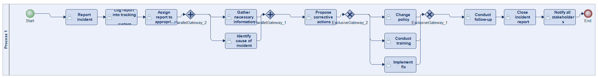
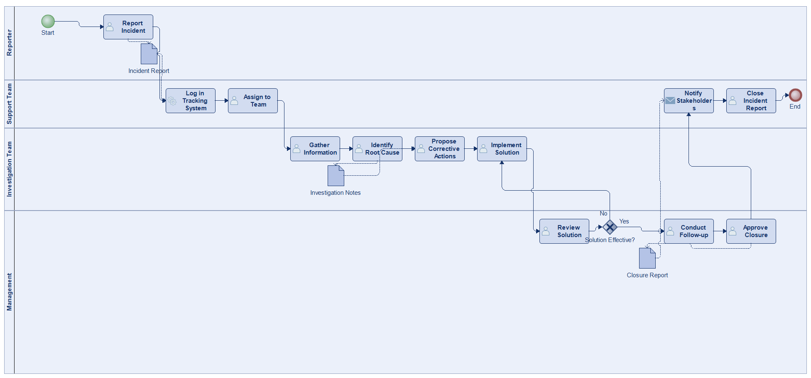
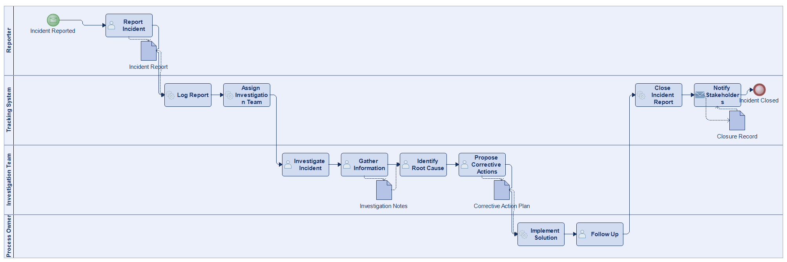
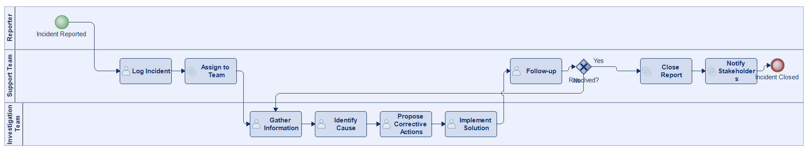
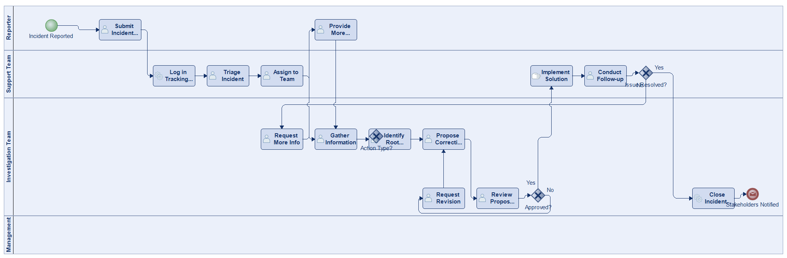
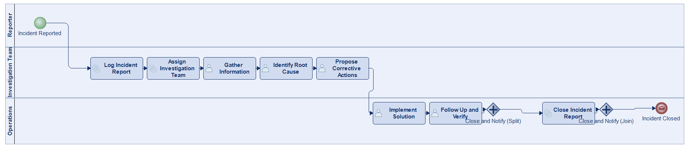
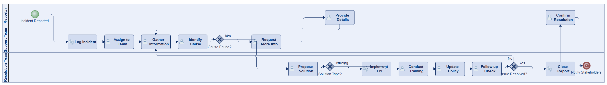

# Scenario 08

**Complexity:** Complex

[← back to comparisons index](README.md)

## Input scenario

> This process begins when an employee or customer reports an incident, such as a technical issue or workplace safety concern.
> The report is logged into a tracking system and assigned to the appropriate team for investigation.
> The team gathers necessary information, identifies the cause of the incident, and proposes corrective actions.
> The solution is implemented, whether it's a fix, training, or policy change.
> After the incident is resolved, a follow-up occurs to ensure that the issue won't recur.
> The process ends when the incident report is closed, and all stakeholders are notified.

## Reference BPMN (ground truth)

| Lanes | Elements | Gateways | Flows | Data obj. | Data assoc. |
|--:|--:|--:|--:|--:|--:|
| 1 | 18 | 4 | 20 | 0 | 0 |

## Generated BPMN — 6 (approach × LLM) cells

Δ values in parentheses are `(generated − ground_truth)`.

### config-helpers / Claude Opus 4.5  ✅ executed

| metric | ground truth | generated | Δ |
|---|---:|---:|---:|
| Lanes | 1 | 4 | +3 |
| Elements | 18 | 15 | -3 |
| Gateways | 4 | 1 | -3 |
| Flows | 20 | 15 | -5 |
| Data obj. | 0 | 3 | +3 |
| Data assoc. | 0 | 6 | +6 |

**Generation:** 5,112 tokens · 19.0s · $0.056

### config-helpers / GPT-5.2  ✅ executed

| metric | ground truth | generated | Δ |
|---|---:|---:|---:|
| Lanes | 1 | 4 | +3 |
| Elements | 18 | 17 | -1 |
| Gateways | 4 | 0 | -4 |
| Flows | 20 | 12 | -8 |
| Data obj. | 0 | 4 | +4 |
| Data assoc. | 0 | 8 | +8 |

**Generation:** 5,133 tokens · 27.8s · $0.034

### config-helpers / GLM5  ✅ executed

| metric | ground truth | generated | Δ |
|---|---:|---:|---:|
| Lanes | 1 | 3 | +2 |
| Elements | 18 | 12 | -6 |
| Gateways | 4 | 1 | -3 |
| Flows | 20 | 12 | -8 |
| Data obj. | 0 | 0 | 0 |
| Data assoc. | 0 | 0 | 0 |

**Generation:** 6,549 tokens · 47.3s · $0.010

### no-helper / Claude Opus 4.5  ✅ executed

| metric | ground truth | generated | Δ |
|---|---:|---:|---:|
| Lanes | 1 | 4 | +3 |
| Elements | 18 | 19 | +1 |
| Gateways | 4 | 3 | -1 |
| Flows | 20 | 19 | -1 |
| Data obj. | 0 | 0 | 0 |
| Data assoc. | 0 | 0 | 0 |

**Generation:** 19,481 tokens · 66.8s · $0.238

### no-helper / GPT-5.2  ✅ executed

| metric | ground truth | generated | Δ |
|---|---:|---:|---:|
| Lanes | 1 | 3 | +2 |
| Elements | 18 | 13 | -5 |
| Gateways | 4 | 2 | -2 |
| Flows | 20 | 13 | -7 |
| Data obj. | 0 | 0 | 0 |
| Data assoc. | 0 | 0 | 0 |

**Generation:** 15,738 tokens · 63.4s · $0.096

### no-helper / GLM5  ✅ executed

| metric | ground truth | generated | Δ |
|---|---:|---:|---:|
| Lanes | 1 | 3 | +2 |
| Elements | 18 | 18 | 0 |
| Gateways | 4 | 3 | -1 |
| Flows | 20 | 21 | +1 |
| Data obj. | 0 | 0 | 0 |
| Data assoc. | 0 | 0 | 0 |

**Generation:** 16,738 tokens · 143.4s · $0.022
