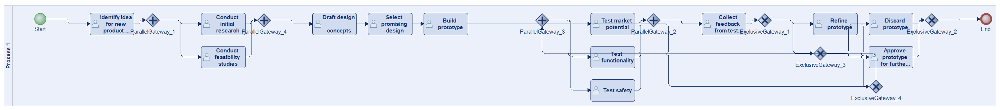
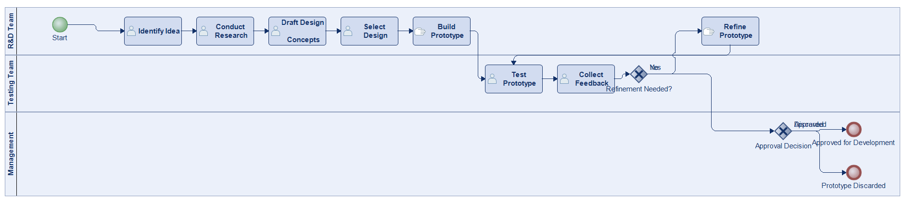
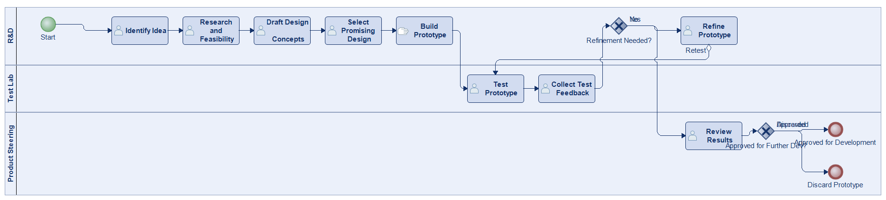
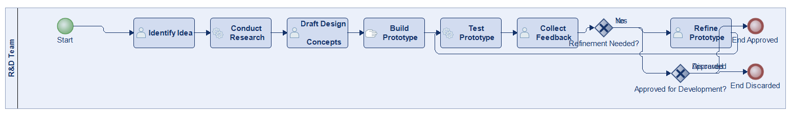
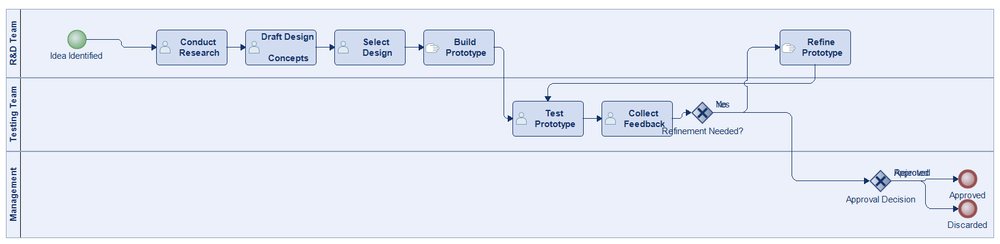
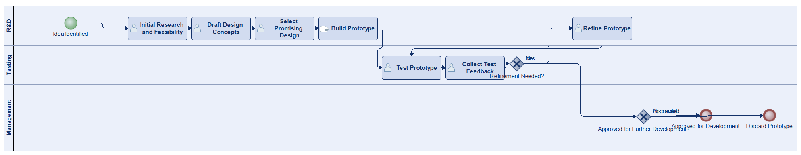
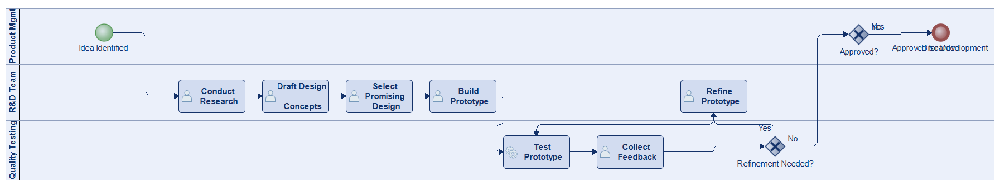

# Scenario 09

**Complexity:** Complex

[← back to comparisons index](README.md)

## Input scenario

> The process starts with identifying an idea for a new product or improvement to an existing one.
> The R&D team conducts initial research and feasibility studies, followed by drafting design concepts.
> After selecting a promising design, a prototype is built using available materials and resources.
> The prototype undergoes various tests to assess its functionality, safety, and market potential.
> Feedback from the testing phase is collected, and the prototype may be refined accordingly.
> If a refinement is needed, then the testing phase is reinitiated.
> The process ends when the prototype is either approved for further development or discarded.

## Reference BPMN (ground truth)

| Lanes | Elements | Gateways | Flows | Data obj. | Data assoc. |
|--:|--:|--:|--:|--:|--:|
| 1 | 23 | 8 | 27 | 0 | 0 |

## Generated BPMN — 6 (approach × LLM) cells

Δ values in parentheses are `(generated − ground_truth)`.

### config-helpers / Claude Opus 4.5  ✅ executed

| metric | ground truth | generated | Δ |
|---|---:|---:|---:|
| Lanes | 1 | 3 | +2 |
| Elements | 23 | 13 | -10 |
| Gateways | 8 | 2 | -6 |
| Flows | 27 | 13 | -14 |
| Data obj. | 0 | — |  |
| Data assoc. | 0 | — |  |

**Generation:** 4,832 tokens · 15.9s · $0.049

### config-helpers / GPT-5.2  ✅ executed

| metric | ground truth | generated | Δ |
|---|---:|---:|---:|
| Lanes | 1 | 3 | +2 |
| Elements | 23 | 14 | -9 |
| Gateways | 8 | 2 | -6 |
| Flows | 27 | 14 | -13 |
| Data obj. | 0 | 0 | 0 |
| Data assoc. | 0 | 0 | 0 |

**Generation:** 4,630 tokens · 20.4s · $0.027

### config-helpers / GLM5  ✅ executed

| metric | ground truth | generated | Δ |
|---|---:|---:|---:|
| Lanes | 1 | 1 | 0 |
| Elements | 23 | 12 | -11 |
| Gateways | 8 | 2 | -6 |
| Flows | 27 | 12 | -15 |
| Data obj. | 0 | 0 | 0 |
| Data assoc. | 0 | 0 | 0 |

**Generation:** 5,942 tokens · 22.6s · $0.009

### no-helper / Claude Opus 4.5  ✅ executed

| metric | ground truth | generated | Δ |
|---|---:|---:|---:|
| Lanes | 1 | 3 | +2 |
| Elements | 23 | 12 | -11 |
| Gateways | 8 | 2 | -6 |
| Flows | 27 | 12 | -15 |
| Data obj. | 0 | 0 | 0 |
| Data assoc. | 0 | 0 | 0 |

**Generation:** 19,355 tokens · 66.9s · $0.235

### no-helper / GPT-5.2  ✅ executed

| metric | ground truth | generated | Δ |
|---|---:|---:|---:|
| Lanes | 1 | 3 | +2 |
| Elements | 23 | 12 | -11 |
| Gateways | 8 | 2 | -6 |
| Flows | 27 | 12 | -15 |
| Data obj. | 0 | 0 | 0 |
| Data assoc. | 0 | 0 | 0 |

**Generation:** 15,635 tokens · 62.7s · $0.094

### no-helper / GLM5  ✅ executed

| metric | ground truth | generated | Δ |
|---|---:|---:|---:|
| Lanes | 1 | 3 | +2 |
| Elements | 23 | 12 | -11 |
| Gateways | 8 | 2 | -6 |
| Flows | 27 | 12 | -15 |
| Data obj. | 0 | 0 | 0 |
| Data assoc. | 0 | 0 | 0 |

**Generation:** 16,779 tokens · 94.0s · $0.023
