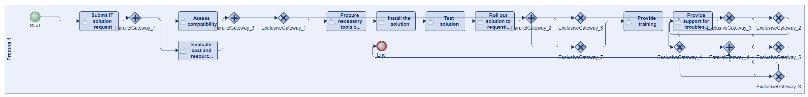
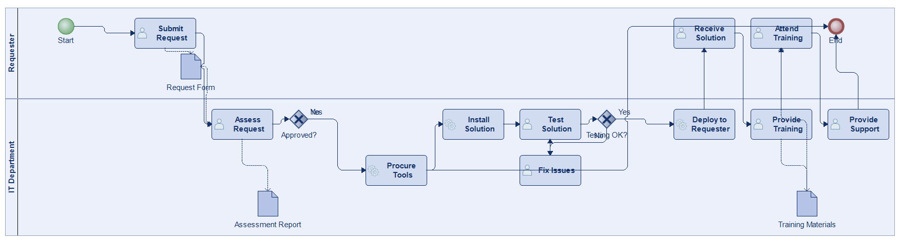
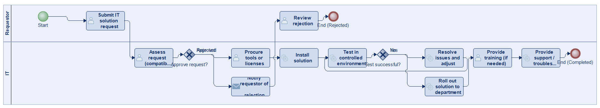
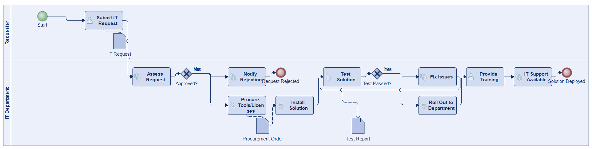
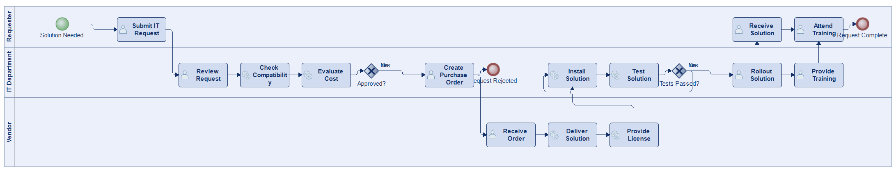
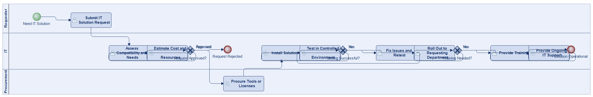
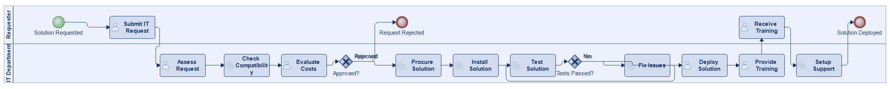

# Scenario 10

**Complexity:** Complex

[← back to comparisons index](README.md)

## Input scenario

> The process starts when an employee or department submits a request for an IT solution, such as new software or hardware.
> IT assesses the request, checking for compatibility with existing systems and evaluating cost and resource needs.
> If approved, IT procures the necessary tools or licenses, installs the solution, and tests it in a controlled environment.
> After successful testing, the new solution is rolled out to the requesting department.
> Training may be provided, and IT support remains available for troubleshooting.

## Reference BPMN (ground truth)

| Lanes | Elements | Gateways | Flows | Data obj. | Data assoc. |
|--:|--:|--:|--:|--:|--:|
| 1 | 23 | 12 | 28 | 0 | 0 |

## Generated BPMN — 6 (approach × LLM) cells

Δ values in parentheses are `(generated − ground_truth)`.

### config-helpers / Claude Opus 4.5  ✅ executed

| metric | ground truth | generated | Δ |
|---|---:|---:|---:|
| Lanes | 1 | 2 | +1 |
| Elements | 23 | 16 | -7 |
| Gateways | 12 | 2 | -10 |
| Flows | 28 | 17 | -11 |
| Data obj. | 0 | 3 | +3 |
| Data assoc. | 0 | 5 | +5 |

**Generation:** 4,935 tokens · 17.6s · $0.052

### config-helpers / GPT-5.2  ✅ executed

| metric | ground truth | generated | Δ |
|---|---:|---:|---:|
| Lanes | 1 | 2 | +1 |
| Elements | 23 | 16 | -7 |
| Gateways | 12 | 2 | -10 |
| Flows | 28 | 16 | -12 |
| Data obj. | 0 | 0 | 0 |
| Data assoc. | 0 | 0 | 0 |

**Generation:** 5,258 tokens · 28.6s · $0.036

### config-helpers / GLM5  ✅ executed

| metric | ground truth | generated | Δ |
|---|---:|---:|---:|
| Lanes | 1 | 2 | +1 |
| Elements | 23 | 18 | -5 |
| Gateways | 12 | 2 | -10 |
| Flows | 28 | 15 | -13 |
| Data obj. | 0 | 3 | +3 |
| Data assoc. | 0 | 5 | +5 |

**Generation:** 9,749 tokens · 153.1s · $0.018

### no-helper / Claude Opus 4.5  ✅ executed

| metric | ground truth | generated | Δ |
|---|---:|---:|---:|
| Lanes | 1 | 3 | +2 |
| Elements | 23 | 20 | -3 |
| Gateways | 12 | 2 | -10 |
| Flows | 28 | 21 | -7 |
| Data obj. | 0 | 0 | 0 |
| Data assoc. | 0 | 0 | 0 |

**Generation:** 19,282 tokens · 64.5s · $0.233

### no-helper / GPT-5.2  ✅ executed

| metric | ground truth | generated | Δ |
|---|---:|---:|---:|
| Lanes | 1 | 3 | +2 |
| Elements | 23 | 16 | -7 |
| Gateways | 12 | 3 | -9 |
| Flows | 28 | 17 | -11 |
| Data obj. | 0 | 0 | 0 |
| Data assoc. | 0 | 0 | 0 |

**Generation:** 16,162 tokens · 73.9s · $0.102

### no-helper / GLM5  ✅ executed

| metric | ground truth | generated | Δ |
|---|---:|---:|---:|
| Lanes | 1 | 2 | +1 |
| Elements | 23 | 17 | -6 |
| Gateways | 12 | 2 | -10 |
| Flows | 28 | 17 | -11 |
| Data obj. | 0 | 0 | 0 |
| Data assoc. | 0 | 0 | 0 |

**Generation:** 17,197 tokens · 86.7s · $0.024
