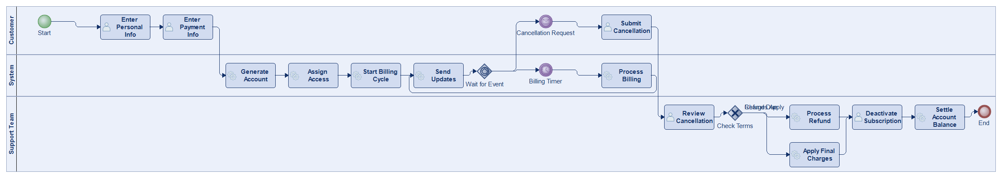
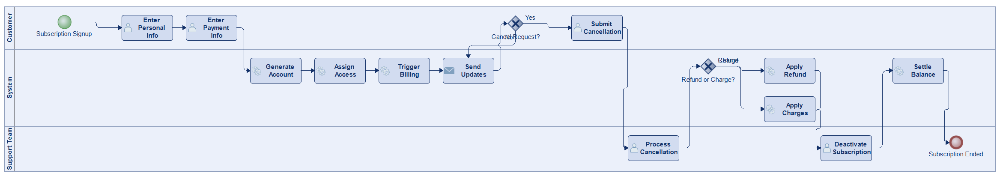
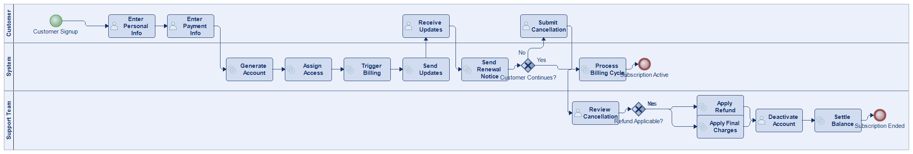
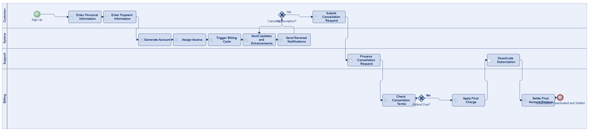
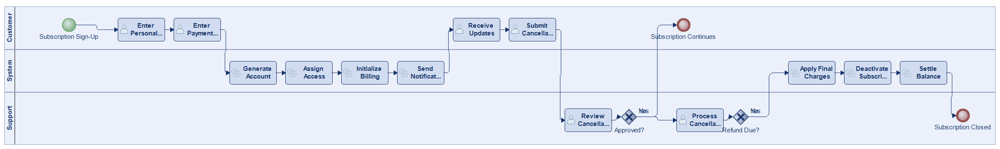

# Scenario 11

**Complexity:** Complex

[← back to comparisons index](README.md)

## Input scenario

> This process begins when a customer signs up for a subscription service, entering personal and payment information.
> The system generates an account, assigns access, and triggers automated billing cycles.
> Throughout the subscription, the customer receives regular updates, product enhancements, or renewal notifications.
> If the customer decides to cancel, they submit a cancellation request, which the support team processes.
> Depending on the terms, any refunds or charges are applied.
> The process concludes when the subscription is deactivated by the support team and the final account balance is settled.

## Reference BPMN (ground truth)

| Lanes | Elements | Gateways | Flows | Data obj. | Data assoc. |
|--:|--:|--:|--:|--:|--:|
| 1 | 26 | 12 | 33 | 0 | 0 |

## Generated BPMN — 6 (approach × LLM) cells

Δ values in parentheses are `(generated − ground_truth)`.

### config-helpers / Claude Opus 4.5  ✅ executed

| metric | ground truth | generated | Δ |
|---|---:|---:|---:|
| Lanes | 1 | 3 | +2 |
| Elements | 26 | 19 | -7 |
| Gateways | 12 | 2 | -10 |
| Flows | 33 | 20 | -13 |
| Data obj. | 0 | — |  |
| Data assoc. | 0 | — |  |

**Generation:** 5,154 tokens · 18.7s · $0.057

### config-helpers / GPT-5.2  ⚠️ executed at experiment time, render failed today

_Render failed: `ERROR: org.modelio.vcore.smkernel.IllegalModelManipulationException: IllegalModelManipulationException [Error: -1, object=null, closure=org.`_  ([log](../runs/config-helpers/gpt_5_2/scenario_11/diagram_render_error.txt))

| metric | ground truth | generated | Δ |
|---|---:|---:|---:|
| Lanes | 1 | 3 | +2 |
| Elements | 26 | 23 | -3 |
| Gateways | 12 | 2 | -10 |
| Flows | 33 | 19 | -14 |
| Data obj. | 0 | 5 | +5 |
| Data assoc. | 0 | 7 | +7 |

**Generation:** 5,729 tokens · 31.7s · $0.043

### config-helpers / GLM5  ✅ executed

| metric | ground truth | generated | Δ |
|---|---:|---:|---:|
| Lanes | 1 | 3 | +2 |
| Elements | 26 | 16 | -10 |
| Gateways | 12 | 2 | -10 |
| Flows | 33 | 17 | -16 |
| Data obj. | 0 | 0 | 0 |
| Data assoc. | 0 | 0 | 0 |

**Generation:** 6,970 tokens · 152.6s · $0.011

### no-helper / Claude Opus 4.5  ✅ executed

| metric | ground truth | generated | Δ |
|---|---:|---:|---:|
| Lanes | 1 | 3 | +2 |
| Elements | 26 | 20 | -6 |
| Gateways | 12 | 2 | -10 |
| Flows | 33 | 20 | -13 |
| Data obj. | 0 | 0 | 0 |
| Data assoc. | 0 | 0 | 0 |

**Generation:** 19,568 tokens · 70.5s · $0.240

### no-helper / GPT-5.2  ✅ executed

| metric | ground truth | generated | Δ |
|---|---:|---:|---:|
| Lanes | 1 | 4 | +3 |
| Elements | 26 | 18 | -8 |
| Gateways | 12 | 2 | -10 |
| Flows | 33 | 19 | -14 |
| Data obj. | 0 | 0 | 0 |
| Data assoc. | 0 | 0 | 0 |

**Generation:** 16,310 tokens · 70.0s · $0.104

### no-helper / GLM5  ✅ executed

| metric | ground truth | generated | Δ |
|---|---:|---:|---:|
| Lanes | 1 | 3 | +2 |
| Elements | 26 | 19 | -7 |
| Gateways | 12 | 2 | -10 |
| Flows | 33 | 19 | -14 |
| Data obj. | 0 | 0 | 0 |
| Data assoc. | 0 | 0 | 0 |

**Generation:** 18,090 tokens · 168.8s · $0.026
