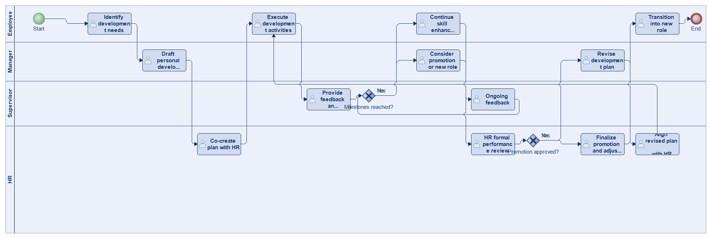
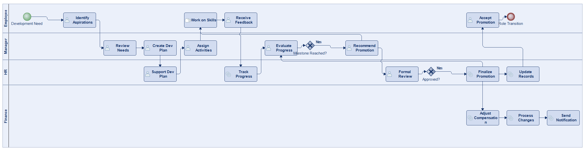
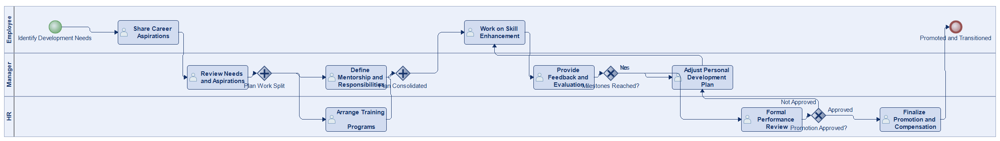
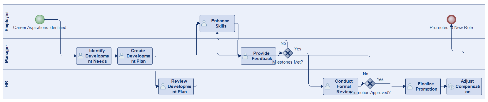

# Scenario 12

**Complexity:** Complex

[← back to comparisons index](README.md)

## Input scenario

> This process begins with identifying an employee's development needs or career aspirations.
> The manager and HR create a personal development plan, which may include training programs, mentorship, or additional responsibilities.
> The employee keeps working on skill enhancement while receiving feedback and evaluation from supervisors.
> Once certain milestones are reached, the employee is considered for a promotion or new role.
> HR conducts a formal review of performance, and if approved, the promotion is finalized with new responsibilities and compensation adjustments.
> The process ends when the employee is promoted and transitions into the new role.

## Reference BPMN (ground truth)

| Lanes | Elements | Gateways | Flows | Data obj. | Data assoc. |
|--:|--:|--:|--:|--:|--:|
| 1 | 22 | 10 | 26 | 0 | 0 |

## Generated BPMN — 6 (approach × LLM) cells

Δ values in parentheses are `(generated − ground_truth)`.

### config-helpers / Claude Opus 4.5  ⚠️ executed at experiment time, render failed today

_Render failed: `ERROR: org.modelio.vcore.smkernel.IllegalModelManipulationException: IllegalModelManipulationException [Error: -1, object=null, closure=org.`_  ([log](../runs/config-helpers/claude_opus_4_5/scenario_12/diagram_render_error.txt))

| metric | ground truth | generated | Δ |
|---|---:|---:|---:|
| Lanes | 1 | 3 | +2 |
| Elements | 22 | 14 | -8 |
| Gateways | 10 | 2 | -8 |
| Flows | 26 | 15 | -11 |
| Data obj. | 0 | 3 | +3 |
| Data assoc. | 0 | 5 | +5 |

**Generation:** 4,652 tokens · 11.2s · $0.045

### config-helpers / GPT-5.2  ✅ executed

| metric | ground truth | generated | Δ |
|---|---:|---:|---:|
| Lanes | 1 | 4 | +3 |
| Elements | 22 | 17 | -5 |
| Gateways | 10 | 2 | -8 |
| Flows | 26 | 18 | -8 |
| Data obj. | 0 | 0 | 0 |
| Data assoc. | 0 | 0 | 0 |

**Generation:** 5,491 tokens · 30.3s · $0.039

### config-helpers / GLM5  ❌ execution failed

_Render failed: `ERROR: IndentationError: unindent does not match any outer indentation level in <script> at line number 105 at column number 4`_  ([log](../runs/config-helpers/glm5/scenario_12/diagram_render_error.txt))

| metric | ground truth | generated | Δ |
|---|---:|---:|---:|
| Lanes | 1 | — |  |
| Elements | 22 | — |  |
| Gateways | 10 | — |  |
| Flows | 26 | — |  |
| Data obj. | 0 | — |  |
| Data assoc. | 0 | — |  |

**Generation:** 7,834 tokens · 345.3s · $0.013

> Original experiment-time error: `Script execution failed - check output`

### no-helper / Claude Opus 4.5  ✅ executed

| metric | ground truth | generated | Δ |
|---|---:|---:|---:|
| Lanes | 1 | 4 | +3 |
| Elements | 22 | 23 | +1 |
| Gateways | 10 | 2 | -8 |
| Flows | 26 | 24 | -2 |
| Data obj. | 0 | 0 | 0 |
| Data assoc. | 0 | 0 | 0 |

**Generation:** 19,483 tokens · 67.5s · $0.238

### no-helper / GPT-5.2  ✅ executed

| metric | ground truth | generated | Δ |
|---|---:|---:|---:|
| Lanes | 1 | 3 | +2 |
| Elements | 22 | 15 | -7 |
| Gateways | 10 | 4 | -6 |
| Flows | 26 | 17 | -9 |
| Data obj. | 0 | 0 | 0 |
| Data assoc. | 0 | 0 | 0 |

**Generation:** 16,611 tokens · 76.2s · $0.108

### no-helper / GLM5  ✅ executed

| metric | ground truth | generated | Δ |
|---|---:|---:|---:|
| Lanes | 1 | 3 | +2 |
| Elements | 22 | 12 | -10 |
| Gateways | 10 | 2 | -8 |
| Flows | 26 | 13 | -13 |
| Data obj. | 0 | 0 | 0 |
| Data assoc. | 0 | 0 | 0 |

**Generation:** 17,002 tokens · 100.6s · $0.023
