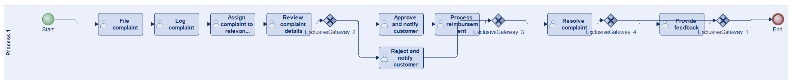
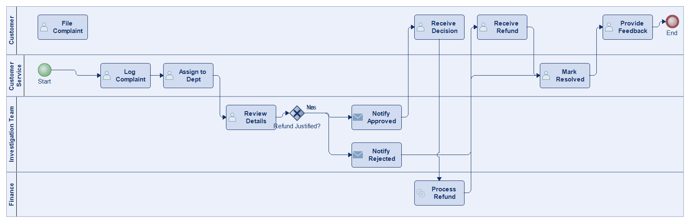
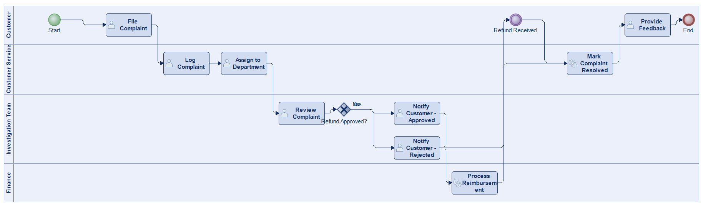
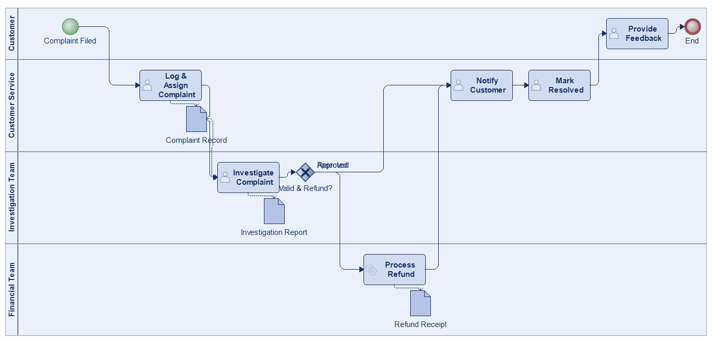
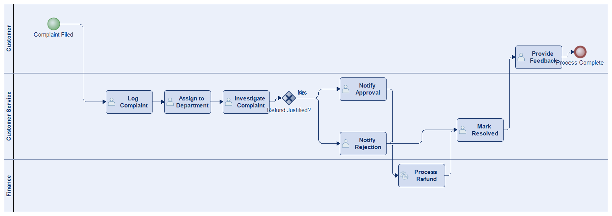
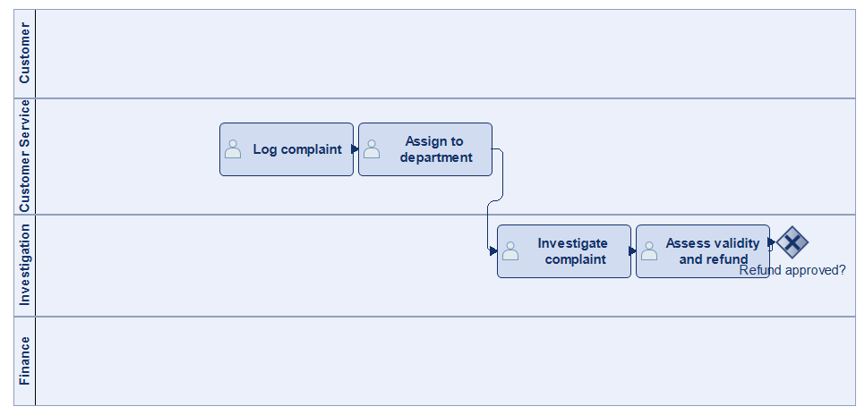
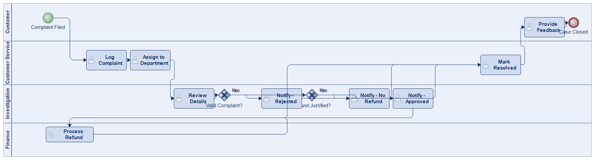

# Scenario 13

**Complexity:** Complex

[← back to comparisons index](README.md)

## Input scenario

> The process begins when a customer files a complaint about a product or service.
> Customer service logs the complaint and assigns it to the relevant department for investigation.
> After reviewing the details, the team determines whether the complaint is valid and whether a refund is justified and notifies the customer with the decision.
> If a refund is approved, the financial team processes the reimbursement.
> The complaint is marked as resolved once the customer receives the refund or directly after notifying the customer in case the refund was rejected.
> After resolving the case, customers can provide feedback on their satisfaction.

## Reference BPMN (ground truth)

| Lanes | Elements | Gateways | Flows | Data obj. | Data assoc. |
|--:|--:|--:|--:|--:|--:|
| 1 | 15 | 4 | 16 | 0 | 0 |

## Generated BPMN — 6 (approach × LLM) cells

Δ values in parentheses are `(generated − ground_truth)`.

### config-helpers / Claude Opus 4.5  ✅ executed

| metric | ground truth | generated | Δ |
|---|---:|---:|---:|
| Lanes | 1 | 4 | +3 |
| Elements | 15 | 14 | -1 |
| Gateways | 4 | 1 | -3 |
| Flows | 16 | 13 | -3 |
| Data obj. | 0 | — |  |
| Data assoc. | 0 | — |  |

**Generation:** 4,772 tokens · 15.8s · $0.048

### config-helpers / GPT-5.2  ✅ executed

| metric | ground truth | generated | Δ |
|---|---:|---:|---:|
| Lanes | 1 | 4 | +3 |
| Elements | 15 | 13 | -2 |
| Gateways | 4 | 1 | -3 |
| Flows | 16 | 13 | -3 |
| Data obj. | 0 | 0 | 0 |
| Data assoc. | 0 | 0 | 0 |

**Generation:** 5,005 tokens · 24.9s · $0.032

### config-helpers / GLM5  ✅ executed

| metric | ground truth | generated | Δ |
|---|---:|---:|---:|
| Lanes | 1 | 4 | +3 |
| Elements | 15 | 12 | -3 |
| Gateways | 4 | 1 | -3 |
| Flows | 16 | 9 | -7 |
| Data obj. | 0 | 3 | +3 |
| Data assoc. | 0 | 4 | +4 |

**Generation:** 7,376 tokens · 60.8s · $0.012

### no-helper / Claude Opus 4.5  ✅ executed

| metric | ground truth | generated | Δ |
|---|---:|---:|---:|
| Lanes | 1 | 3 | +2 |
| Elements | 15 | 11 | -4 |
| Gateways | 4 | 1 | -3 |
| Flows | 16 | 11 | -5 |
| Data obj. | 0 | 0 | 0 |
| Data assoc. | 0 | 0 | 0 |

**Generation:** 18,854 tokens · 61.9s · $0.222

### no-helper / GPT-5.2  ✅ executed

| metric | ground truth | generated | Δ |
|---|---:|---:|---:|
| Lanes | 1 | 4 | +3 |
| Elements | 15 | 13 | -2 |
| Gateways | 4 | 2 | -2 |
| Flows | 16 | 14 | -2 |
| Data obj. | 0 | 0 | 0 |
| Data assoc. | 0 | 0 | 0 |

**Generation:** 15,963 tokens · 63.4s · $0.099

### no-helper / GLM5  ✅ executed

| metric | ground truth | generated | Δ |
|---|---:|---:|---:|
| Lanes | 1 | 4 | +3 |
| Elements | 15 | 13 | -2 |
| Gateways | 4 | 2 | -2 |
| Flows | 16 | 14 | -2 |
| Data obj. | 0 | 0 | 0 |
| Data assoc. | 0 | 0 | 0 |

**Generation:** 21,152 tokens · 174.0s · $0.033
