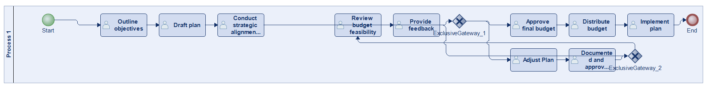
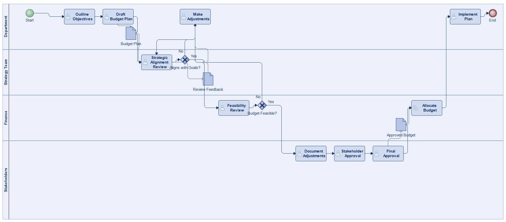
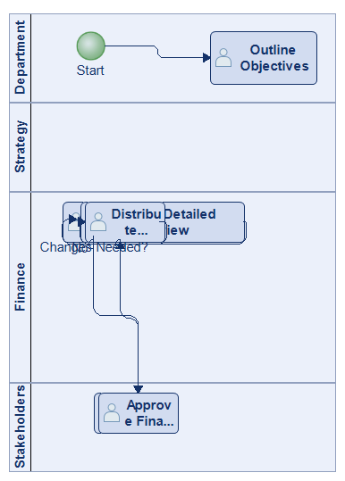
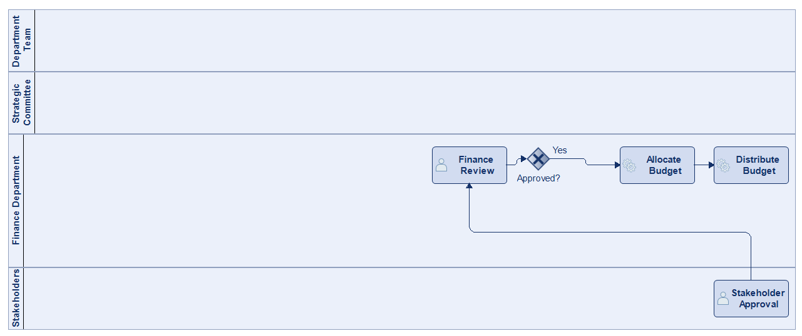
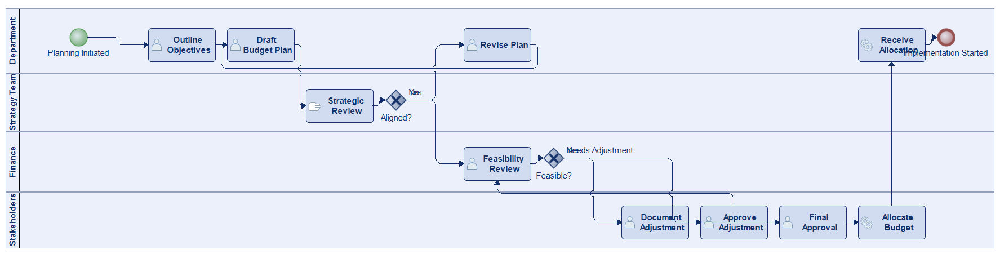
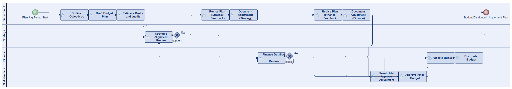
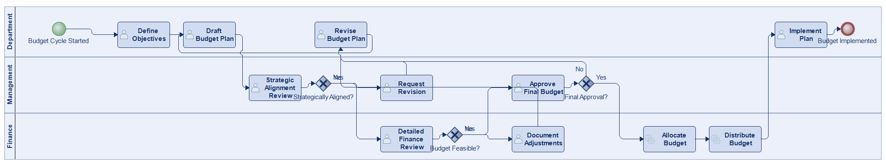

# Scenario 14

**Complexity:** Complex

[← back to comparisons index](README.md)

## Input scenario

> This process starts with a department outlining its objectives for the upcoming period, such as hiring, equipment needs, or marketing efforts.
> The team drafts a plan that includes cost estimates and justifications for the budget requested.
> The plan is first reviewed in a strategic alignment meeting to ensure it aligns with broader organizational goals.
> Following this, the finance department performs a detailed review to assess the budget's feasibility.
> The plan may undergo several rounds of review and possible adjustments based on feedback from these reviews.
> Each adjustment is documented and approved by necessary stakeholders.
> Once the final version of the budget is approved, the budget is officially allocated to the department.
> The process ends when the budget is distributed, and the department begins implementing its plan.

## Reference BPMN (ground truth)

| Lanes | Elements | Gateways | Flows | Data obj. | Data assoc. |
|--:|--:|--:|--:|--:|--:|
| 1 | 14 | 2 | 14 | 0 | 0 |

## Generated BPMN — 6 (approach × LLM) cells

Δ values in parentheses are `(generated − ground_truth)`.

### config-helpers / Claude Opus 4.5  ✅ executed

| metric | ground truth | generated | Δ |
|---|---:|---:|---:|
| Lanes | 1 | 4 | +3 |
| Elements | 14 | 14 | 0 |
| Gateways | 2 | 2 | 0 |
| Flows | 14 | 15 | +1 |
| Data obj. | 0 | 3 | +3 |
| Data assoc. | 0 | 6 | +6 |

**Generation:** 5,009 tokens · 17.2s · $0.053

### config-helpers / GPT-5.2  ✅ executed

| metric | ground truth | generated | Δ |
|---|---:|---:|---:|
| Lanes | 1 | 4 | +3 |
| Elements | 14 | 14 | 0 |
| Gateways | 2 | 1 | -1 |
| Flows | 14 | 14 | 0 |
| Data obj. | 0 | 0 | 0 |
| Data assoc. | 0 | 0 | 0 |

**Generation:** 4,663 tokens · 20.3s · $0.027

### config-helpers / GLM5  ✅ executed

| metric | ground truth | generated | Δ |
|---|---:|---:|---:|
| Lanes | 1 | 4 | +3 |
| Elements | 14 | 13 | -1 |
| Gateways | 2 | 1 | -1 |
| Flows | 14 | 11 | -3 |
| Data obj. | 0 | 2 | +2 |
| Data assoc. | 0 | 4 | +4 |

**Generation:** 8,108 tokens · 388.3s · $0.014

### no-helper / Claude Opus 4.5  ✅ executed

| metric | ground truth | generated | Δ |
|---|---:|---:|---:|
| Lanes | 1 | 4 | +3 |
| Elements | 14 | 14 | 0 |
| Gateways | 2 | 2 | 0 |
| Flows | 14 | 15 | +1 |
| Data obj. | 0 | 0 | 0 |
| Data assoc. | 0 | 0 | 0 |

**Generation:** 19,926 tokens · 74.3s · $0.248

### no-helper / GPT-5.2  ✅ executed

| metric | ground truth | generated | Δ |
|---|---:|---:|---:|
| Lanes | 1 | 4 | +3 |
| Elements | 14 | 17 | +3 |
| Gateways | 2 | 2 | 0 |
| Flows | 14 | 18 | +4 |
| Data obj. | 0 | 0 | 0 |
| Data assoc. | 0 | 0 | 0 |

**Generation:** 18,022 tokens · 94.9s · $0.127

### no-helper / GLM5  ✅ executed

| metric | ground truth | generated | Δ |
|---|---:|---:|---:|
| Lanes | 1 | 3 | +2 |
| Elements | 14 | 16 | +2 |
| Gateways | 2 | 3 | +1 |
| Flows | 14 | 18 | +4 |
| Data obj. | 0 | 0 | 0 |
| Data assoc. | 0 | 0 | 0 |

**Generation:** 19,819 tokens · 139.4s · $0.030
