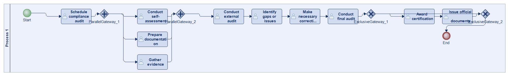
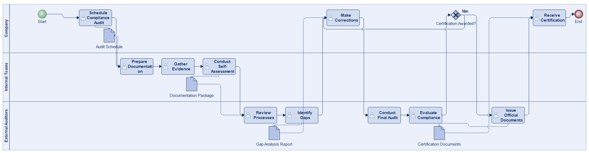
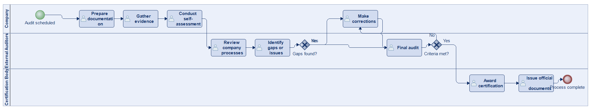
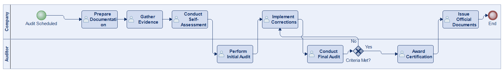
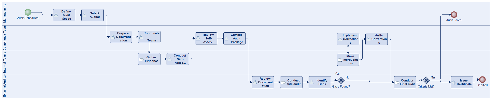
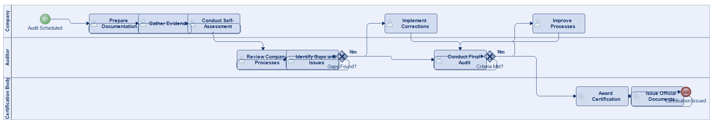
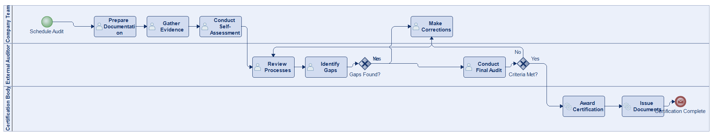

# Scenario 15

**Complexity:** Complex

[← back to comparisons index](README.md)

## Input scenario

> The process starts when a company schedules a compliance audit for regulations such as ISO standards, safety protocols, or environmental guidelines.
> Internal teams prepare documentation, gather evidence, and conduct a self-assessment before the external audit.
> Auditors review the company's processes and identify any gaps or issues.
> After making the necessary corrections or improvements, the company undergoes a final audit.
> If all criteria are met, the company is awarded certification, and the process concludes with the issuance of official documents.

## Reference BPMN (ground truth)

| Lanes | Elements | Gateways | Flows | Data obj. | Data assoc. |
|--:|--:|--:|--:|--:|--:|
| 1 | 16 | 4 | 18 | 0 | 0 |

## Generated BPMN — 6 (approach × LLM) cells

Δ values in parentheses are `(generated − ground_truth)`.

### config-helpers / Claude Opus 4.5  ✅ executed

| metric | ground truth | generated | Δ |
|---|---:|---:|---:|
| Lanes | 1 | 3 | +2 |
| Elements | 16 | 14 | -2 |
| Gateways | 4 | 1 | -3 |
| Flows | 18 | 14 | -4 |
| Data obj. | 0 | 4 | +4 |
| Data assoc. | 0 | 8 | +8 |

**Generation:** 4,873 tokens · 14.9s · $0.051

### config-helpers / GPT-5.2  ✅ executed

| metric | ground truth | generated | Δ |
|---|---:|---:|---:|
| Lanes | 1 | 3 | +2 |
| Elements | 16 | 13 | -3 |
| Gateways | 4 | 2 | -2 |
| Flows | 18 | 14 | -4 |
| Data obj. | 0 | 0 | 0 |
| Data assoc. | 0 | 0 | 0 |

**Generation:** 4,549 tokens · 19.2s · $0.026

### config-helpers / GLM5  ✅ executed

| metric | ground truth | generated | Δ |
|---|---:|---:|---:|
| Lanes | 1 | 2 | +1 |
| Elements | 16 | 11 | -5 |
| Gateways | 4 | 1 | -3 |
| Flows | 18 | 11 | -7 |
| Data obj. | 0 | 0 | 0 |
| Data assoc. | 0 | 0 | 0 |

**Generation:** 6,979 tokens · 78.1s · $0.011

### no-helper / Claude Opus 4.5  ✅ executed

| metric | ground truth | generated | Δ |
|---|---:|---:|---:|
| Lanes | 1 | 4 | +3 |
| Elements | 16 | 21 | +5 |
| Gateways | 4 | 2 | -2 |
| Flows | 18 | 21 | +3 |
| Data obj. | 0 | 0 | 0 |
| Data assoc. | 0 | 0 | 0 |

**Generation:** 19,360 tokens · 65.4s · $0.235

### no-helper / GPT-5.2  ✅ executed

| metric | ground truth | generated | Δ |
|---|---:|---:|---:|
| Lanes | 1 | 3 | +2 |
| Elements | 16 | 14 | -2 |
| Gateways | 4 | 2 | -2 |
| Flows | 18 | 15 | -3 |
| Data obj. | 0 | 0 | 0 |
| Data assoc. | 0 | 0 | 0 |

**Generation:** 16,331 tokens · 66.8s · $0.104

### no-helper / GLM5  ✅ executed

| metric | ground truth | generated | Δ |
|---|---:|---:|---:|
| Lanes | 1 | 3 | +2 |
| Elements | 16 | 13 | -3 |
| Gateways | 4 | 2 | -2 |
| Flows | 18 | 14 | -4 |
| Data obj. | 0 | 0 | 0 |
| Data assoc. | 0 | 0 | 0 |

**Generation:** 16,820 tokens · 101.9s · $0.023
