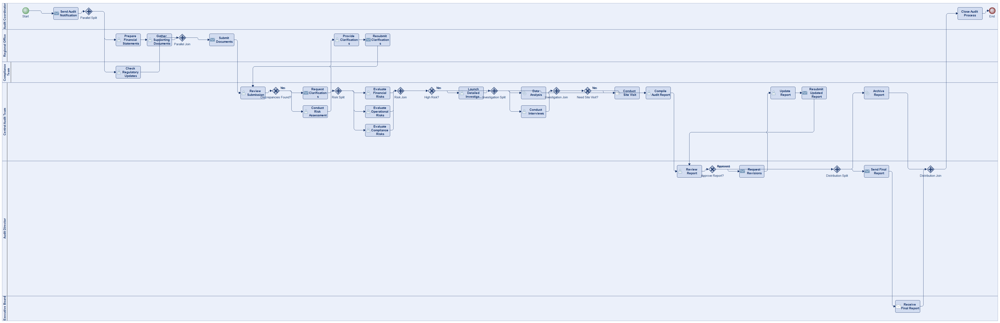
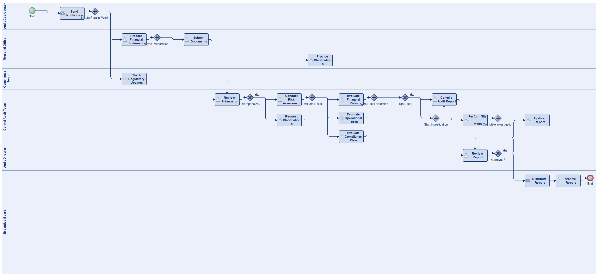
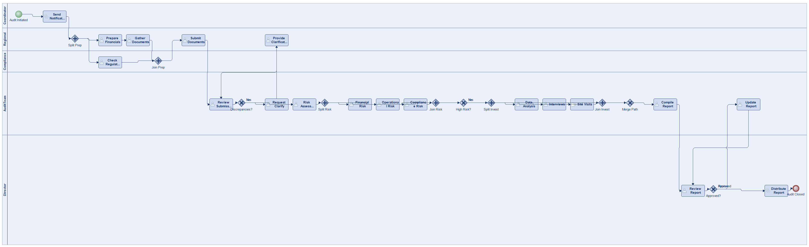
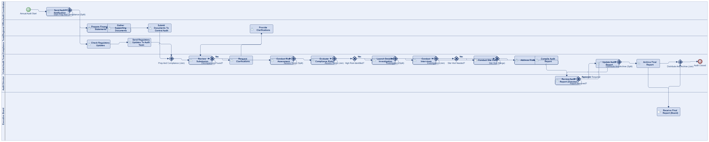
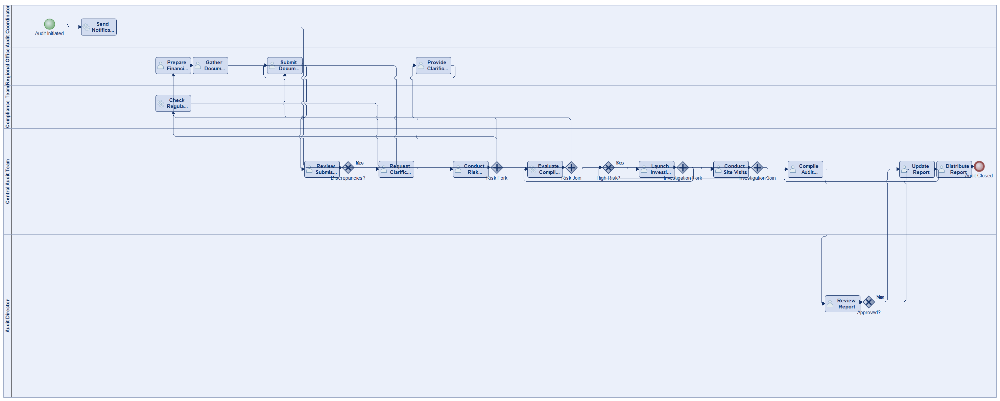

# Scenario 16

**Complexity:** Complex

[← back to comparisons index](README.md)

## Input scenario

> In a multinational company's annual audit process, the audit coordinator initiates the audit process by sending a notification to the regional office.
> The regional office prepares financial statements and gathers necessary documents.
> Concurrently, the compliance team checks for any regulatory updates that might affect the audit.
> Afterward, the regional office submits the documents to the central audit team.
> The central audit team reviews the submission.
> If discrepancies are found, they request clarifications from the regional office.
> The regional office provides the necessary clarifications.
> Once all documents are reviewed without issues, the audit team conducts a risk assessment.
> The risk assessment includes evaluating financial risks, operational risks, and compliance risks, which can be done in any order but must all be completed.
> If high risk is identified, then a detailed investigation is launched.
> The investigation includes data analysis, interviews, and, in certain cases, site visits.
> After all risks are addressed, the audit team compiles the audit report.
> The report is reviewed by the audit director.
> The audit director may approve the report or send it back for revisions.
> If revisions are required, the audit team updates the report accordingly and resubmits it to be reviewed again by the audit director.
> Once approved, the final report is distributed to the executive board and archived.
> The entire audit process is then closed.

## Reference BPMN (ground truth)

| Lanes | Elements | Gateways | Flows | Data obj. | Data assoc. |
|--:|--:|--:|--:|--:|--:|
| 1 | 40 | 14 | 49 | 0 | 0 |

## Generated BPMN — 6 (approach × LLM) cells

Δ values in parentheses are `(generated − ground_truth)`.

### config-helpers / Claude Opus 4.5  ⚠️ executed at experiment time, render failed today

_Render failed: `ERROR: org.modelio.vcore.smkernel.IllegalModelManipulationException: IllegalModelManipulationException [Error: -1, object=null, closure=org.`_  ([log](../runs/config-helpers/claude_opus_4_5/scenario_16/diagram_render_error.txt))

| metric | ground truth | generated | Δ |
|---|---:|---:|---:|
| Lanes | 1 | 6 | +5 |
| Elements | 40 | 32 | -8 |
| Gateways | 14 | 11 | -3 |
| Flows | 49 | 40 | -9 |
| Data obj. | 0 | 7 | +7 |
| Data assoc. | 0 | 12 | +12 |

**Generation:** 6,650 tokens · 31.8s · $0.091

### config-helpers / GPT-5.2  ✅ executed

| metric | ground truth | generated | Δ |
|---|---:|---:|---:|
| Lanes | 1 | 6 | +5 |
| Elements | 40 | 40 | 0 |
| Gateways | 14 | 12 | -2 |
| Flows | 49 | 48 | -1 |
| Data obj. | 0 | 0 | 0 |
| Data assoc. | 0 | 0 | 0 |

**Generation:** 7,503 tokens · 55.2s · $0.065

### config-helpers / GLM5  ✅ executed

| metric | ground truth | generated | Δ |
|---|---:|---:|---:|
| Lanes | 1 | 6 | +5 |
| Elements | 40 | 30 | -10 |
| Gateways | 14 | 9 | -5 |
| Flows | 49 | 37 | -12 |
| Data obj. | 0 | 0 | 0 |
| Data assoc. | 0 | 0 | 0 |

**Generation:** 17,651 tokens · 471.6s · $0.036

### no-helper / Claude Opus 4.5  ✅ executed

| metric | ground truth | generated | Δ |
|---|---:|---:|---:|
| Lanes | 1 | 5 | +4 |
| Elements | 40 | 31 | -9 |
| Gateways | 14 | 10 | -4 |
| Flows | 49 | 38 | -11 |
| Data obj. | 0 | 0 | 0 |
| Data assoc. | 0 | 0 | 0 |

**Generation:** 20,600 tokens · 79.3s · $0.263

### no-helper / GPT-5.2  ✅ executed

| metric | ground truth | generated | Δ |
|---|---:|---:|---:|
| Lanes | 1 | 6 | +5 |
| Elements | 40 | 39 | -1 |
| Gateways | 14 | 13 | -1 |
| Flows | 49 | 47 | -2 |
| Data obj. | 0 | 0 | 0 |
| Data assoc. | 0 | 0 | 0 |

**Generation:** 20,104 tokens · 115.4s · $0.155

### no-helper / GLM5  ✅ executed

| metric | ground truth | generated | Δ |
|---|---:|---:|---:|
| Lanes | 1 | 5 | +4 |
| Elements | 40 | 29 | -11 |
| Gateways | 14 | 7 | -7 |
| Flows | 49 | 36 | -13 |
| Data obj. | 0 | 0 | 0 |
| Data assoc. | 0 | 0 | 0 |

**Generation:** 23,361 tokens · 227.6s · $0.037
