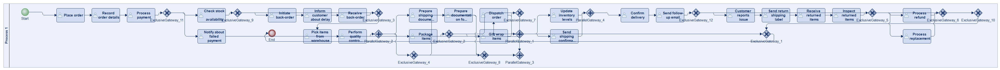
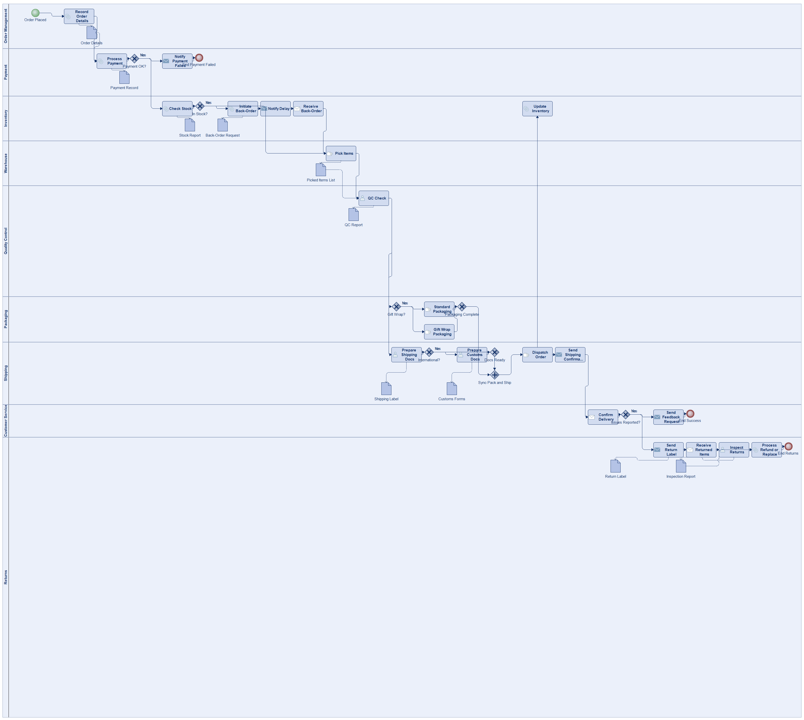
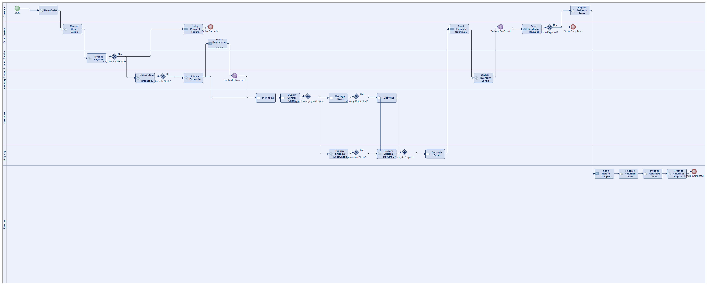
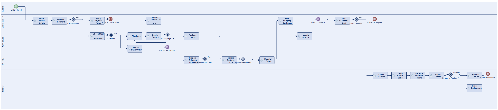
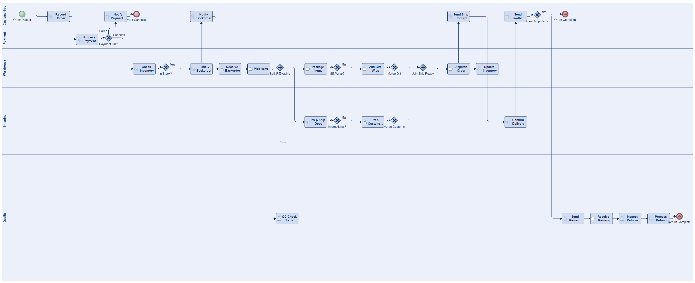
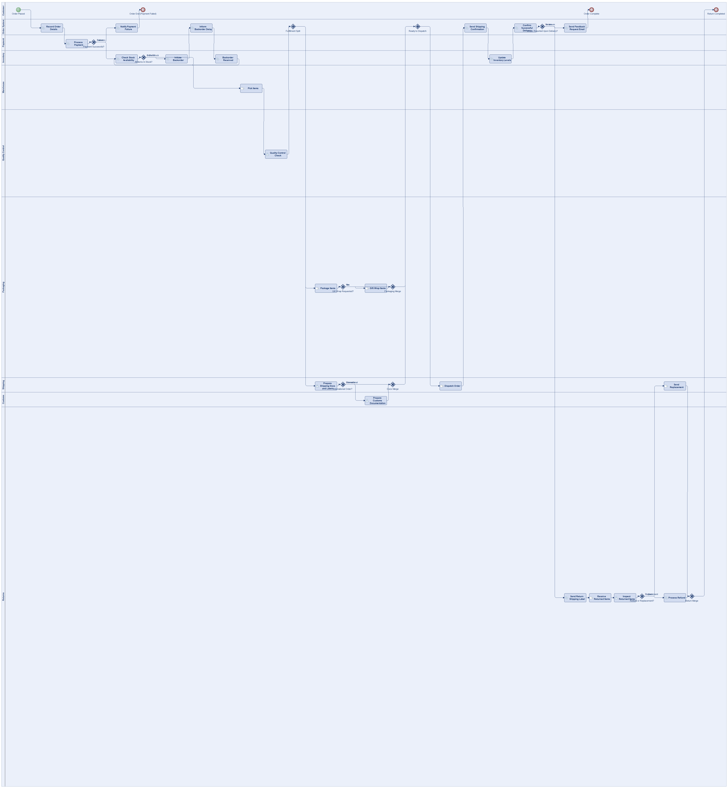
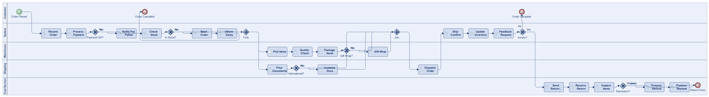

# Scenario 17

**Complexity:** Complex

[← back to comparisons index](README.md)

## Input scenario

> An e-commerce company has a comprehensive order fulfillment process:
> When a customer places an order, the system records the order details.
> Payment processing begins.
> If the payment fails, the customer is notified, and the process ends.
> Upon successful payment, the inventory system checks stock availability.
> If items are out of stock, a back-order is initiated, and the customer is informed about the delay.
> The process continues once the back-order is received and all required items are available in stock.
> In-stock items are picked from the warehouse.
> Quality control checks are performed on the picked items.
> Packaging is done, including gift wrapping if the customer requested it.
> Meanwhile, the shipping department prepares shipping documents and labels.
> If the order is international, customs documentation is prepared.
> Once packaging and shipping documents are ready, the order is dispatched.
> The system sends a shipping confirmation to the customer.
> After dispatch, the system updates the inventory levels.
> A follow-up email for feedback is sent directly after confirming the successful delivery.
> If the customer reports any issues upon delivery, a returns process is initiated, which includes:
> Sending a return shipping label.
> Receiving returned items.
> Inspecting returned items.
> Processing a refund or replacement.

## Reference BPMN (ground truth)

| Lanes | Elements | Gateways | Flows | Data obj. | Data assoc. |
|--:|--:|--:|--:|--:|--:|
| 1 | 43 | 16 | 51 | 0 | 0 |

## Generated BPMN — 6 (approach × LLM) cells

Δ values in parentheses are `(generated − ground_truth)`.

### config-helpers / Claude Opus 4.5  ✅ executed

| metric | ground truth | generated | Δ |
|---|---:|---:|---:|
| Lanes | 1 | 9 | +8 |
| Elements | 43 | 34 | -9 |
| Gateways | 16 | 8 | -8 |
| Flows | 51 | 37 | -14 |
| Data obj. | 0 | 10 | +10 |
| Data assoc. | 0 | 13 | +13 |

**Generation:** 6,495 tokens · 30.6s · $0.088

### config-helpers / GPT-5.2  ✅ executed

| metric | ground truth | generated | Δ |
|---|---:|---:|---:|
| Lanes | 1 | 7 | +6 |
| Elements | 43 | 35 | -8 |
| Gateways | 16 | 7 | -9 |
| Flows | 51 | 38 | -13 |
| Data obj. | 0 | 0 | 0 |
| Data assoc. | 0 | 0 | 0 |

**Generation:** 9,435 tokens · 84.3s · $0.093

### config-helpers / GLM5  ✅ executed

| metric | ground truth | generated | Δ |
|---|---:|---:|---:|
| Lanes | 1 | 5 | +4 |
| Elements | 43 | 34 | -9 |
| Gateways | 16 | 7 | -9 |
| Flows | 51 | 37 | -14 |
| Data obj. | 0 | 0 | 0 |
| Data assoc. | 0 | 0 | 0 |

**Generation:** 20,906 tokens · 375.0s · $0.043

### no-helper / Claude Opus 4.5  ✅ executed

| metric | ground truth | generated | Δ |
|---|---:|---:|---:|
| Lanes | 1 | 5 | +4 |
| Elements | 43 | 35 | -8 |
| Gateways | 16 | 9 | -7 |
| Flows | 51 | 38 | -13 |
| Data obj. | 0 | 0 | 0 |
| Data assoc. | 0 | 0 | 0 |

**Generation:** 20,674 tokens · 79.8s · $0.265

### no-helper / GPT-5.2  ✅ executed

| metric | ground truth | generated | Δ |
|---|---:|---:|---:|
| Lanes | 1 | 10 | +9 |
| Elements | 43 | 38 | -5 |
| Gateways | 16 | 11 | -5 |
| Flows | 51 | 42 | -9 |
| Data obj. | 0 | 0 | 0 |
| Data assoc. | 0 | 0 | 0 |

**Generation:** 19,316 tokens · 109.6s · $0.144

### no-helper / GLM5  ✅ executed

| metric | ground truth | generated | Δ |
|---|---:|---:|---:|
| Lanes | 1 | 5 | +4 |
| Elements | 43 | 33 | -10 |
| Gateways | 16 | 8 | -8 |
| Flows | 51 | 37 | -14 |
| Data obj. | 0 | 0 | 0 |
| Data assoc. | 0 | 0 | 0 |

**Generation:** 20,794 tokens · 154.2s · $0.032
