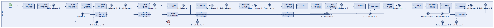
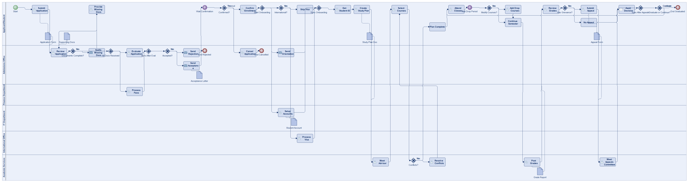
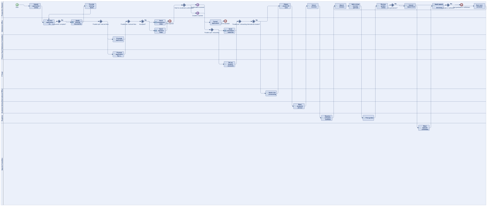
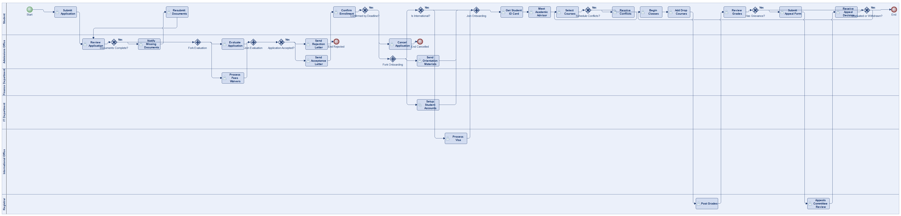
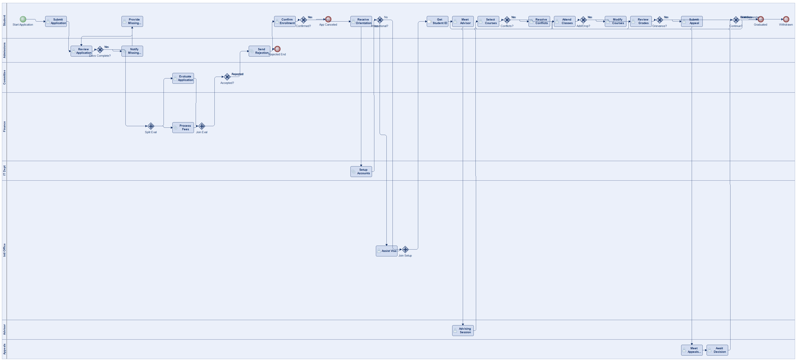
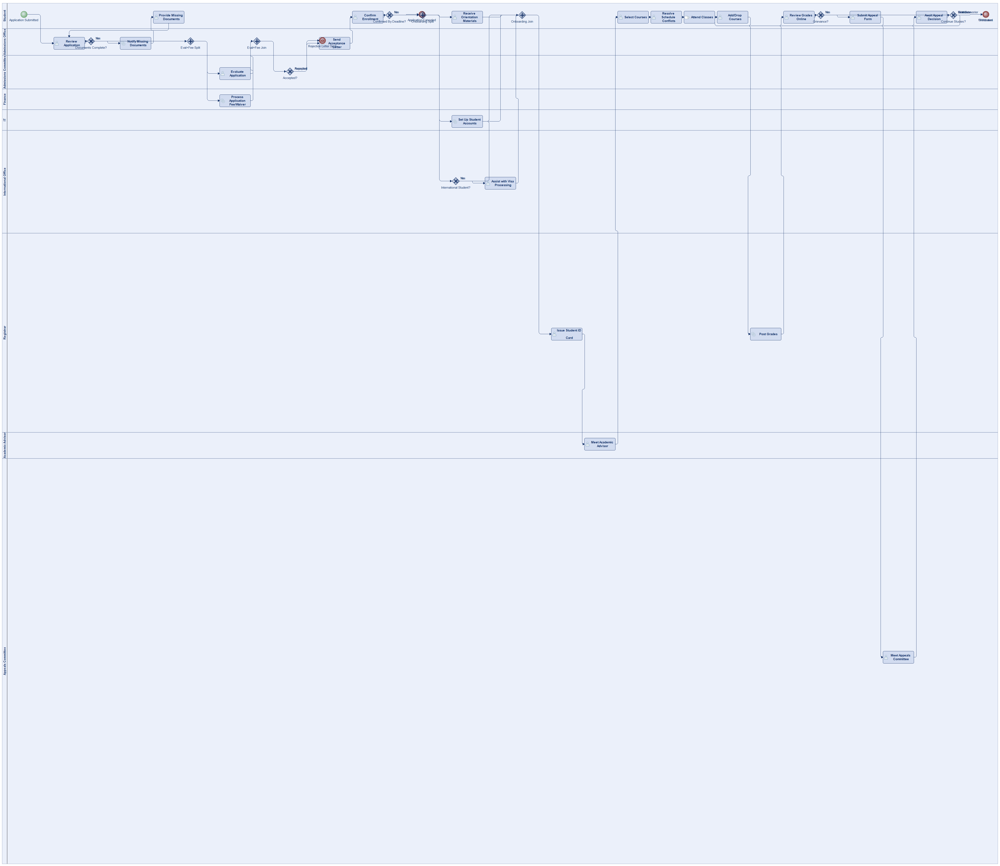
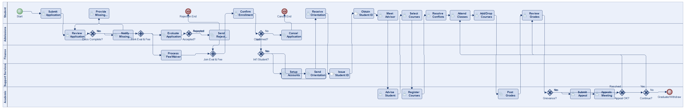

# Scenario 18

**Complexity:** Complex

[← back to comparisons index](README.md)

## Input scenario

> A university enrollment system involves the following steps:
> Prospective students submit an application online.
> The admissions office reviews the application and supporting documents.
> If documents are missing, the applicant is notified to provide the missing items.
> Upon receiving all documents, the application is evaluated by the admissions committee.
> Concurrently, the finance department processes any application fees or waivers.
> If the application is accepted, an acceptance letter is sent.
> Otherwise, a rejection letter is sent and the process ends.
> After being accepted, the student must then confirm enrollment by a specified deadline; otherwise the application will be canceled.
> If the student confirms, they receive orientation materials and the IT department sets up student accounts for email, online portals, and library access.
> If the student is international, the international student office assists with visa processing.
> The student obtains a student ID card and starts creating their study plan, which includes:
> Meeting with an academic advisor.
> Selecting courses.
> Resolving any schedule conflicts.
> The student begins attending classes.
> Throughout each semester, the student may add or drop courses within the add/drop period.
> At the end of the semester, grades are posted, and the student can review them online.
> If the student has any grievances, they can file an appeal, which includes:
> Submitting an appeal form.
> Meeting with the appeals committee.
> Awaiting a decision.
> The process repeats each semester until the student graduates or withdraws.

## Reference BPMN (ground truth)

| Lanes | Elements | Gateways | Flows | Data obj. | Data assoc. |
|--:|--:|--:|--:|--:|--:|
| 1 | 50 | 22 | 60 | 0 | 0 |

## Generated BPMN — 6 (approach × LLM) cells

Δ values in parentheses are `(generated − ground_truth)`.

### config-helpers / Claude Opus 4.5  ✅ executed

| metric | ground truth | generated | Δ |
|---|---:|---:|---:|
| Lanes | 1 | 6 | +5 |
| Elements | 50 | 48 | -2 |
| Gateways | 22 | 13 | -9 |
| Flows | 60 | 56 | -4 |
| Data obj. | 0 | 7 | +7 |
| Data assoc. | 0 | 11 | +11 |

**Generation:** 7,743 tokens · 44.9s · $0.118

### config-helpers / GPT-5.2  ✅ executed

| metric | ground truth | generated | Δ |
|---|---:|---:|---:|
| Lanes | 1 | 9 | +8 |
| Elements | 50 | 40 | -10 |
| Gateways | 22 | 10 | -12 |
| Flows | 60 | 45 | -15 |
| Data obj. | 0 | 0 | 0 |
| Data assoc. | 0 | 0 | 0 |

**Generation:** 7,371 tokens · 54.4s · $0.063

### config-helpers / GLM5  ✅ executed

| metric | ground truth | generated | Δ |
|---|---:|---:|---:|
| Lanes | 1 | 6 | +5 |
| Elements | 50 | 39 | -11 |
| Gateways | 22 | 11 | -11 |
| Flows | 60 | 46 | -14 |
| Data obj. | 0 | 0 | 0 |
| Data assoc. | 0 | 0 | 0 |

**Generation:** 14,706 tokens · 834.5s · $0.029

### no-helper / Claude Opus 4.5  ✅ executed

| metric | ground truth | generated | Δ |
|---|---:|---:|---:|
| Lanes | 1 | 8 | +7 |
| Elements | 50 | 39 | -11 |
| Gateways | 22 | 11 | -11 |
| Flows | 60 | 45 | -15 |
| Data obj. | 0 | 0 | 0 |
| Data assoc. | 0 | 0 | 0 |

**Generation:** 20,976 tokens · 81.9s · $0.271

### no-helper / GPT-5.2  ✅ executed

| metric | ground truth | generated | Δ |
|---|---:|---:|---:|
| Lanes | 1 | 9 | +8 |
| Elements | 50 | 36 | -14 |
| Gateways | 22 | 10 | -12 |
| Flows | 60 | 42 | -18 |
| Data obj. | 0 | 0 | 0 |
| Data assoc. | 0 | 0 | 0 |

**Generation:** 19,626 tokens · 117.5s · $0.148

### no-helper / GLM5  ✅ executed

| metric | ground truth | generated | Δ |
|---|---:|---:|---:|
| Lanes | 1 | 5 | +4 |
| Elements | 50 | 40 | -10 |
| Gateways | 22 | 9 | -13 |
| Flows | 60 | 44 | -16 |
| Data obj. | 0 | 0 | 0 |
| Data assoc. | 0 | 0 | 0 |

**Generation:** 18,187 tokens · 106.1s · $0.026
