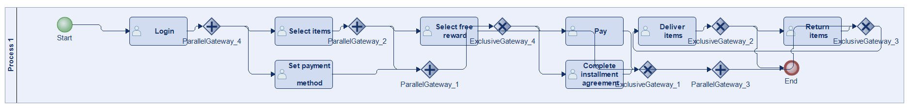
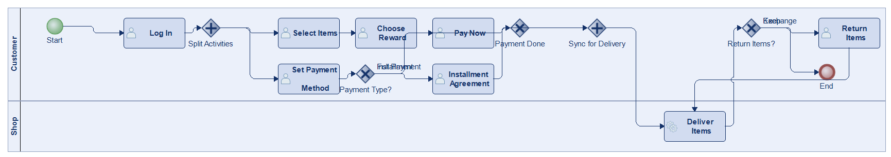
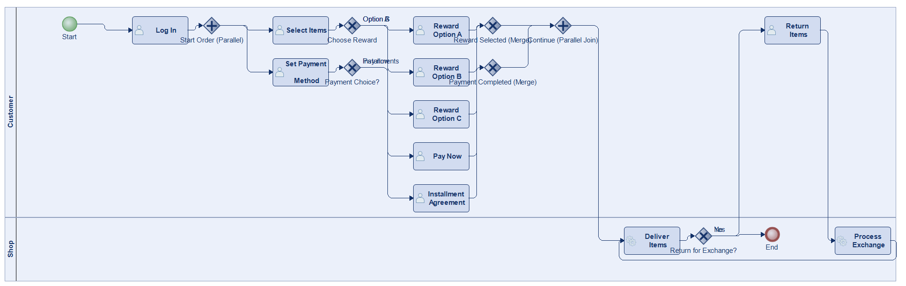
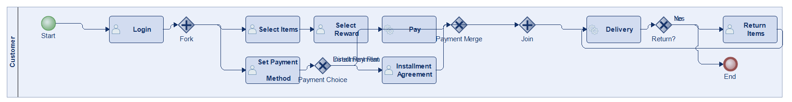
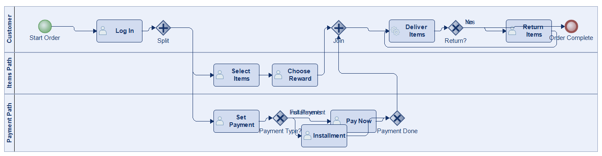
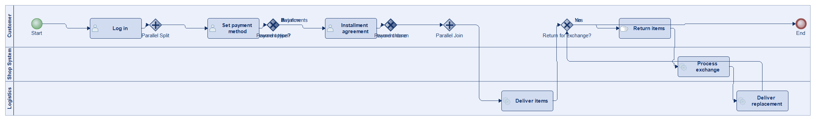
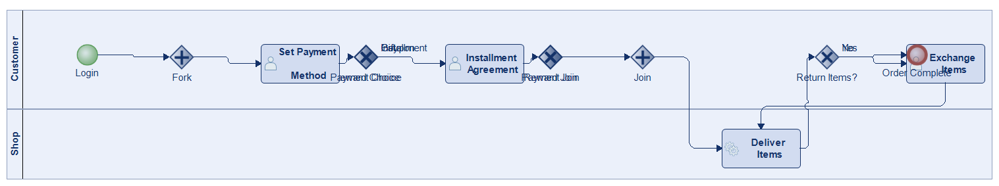

# Scenario 19

**Complexity:** Complex

[← back to comparisons index](README.md)

## Input scenario

> Consider a process for purchasing items from an online shop.
> The user starts an order by logging in to their account.
> Then, the user simultaneously selects the items to purchase and sets a payment method.
> Afterward, the user either pays or completes an installment agreement.
> After selecting the items, the user chooses between multiple options for a free reward.
> Since the reward value depends on the purchase value, this step is done after selecting the items, but it is independent of the payment activities.
> Finally, the items are delivered.
> The user has the right to return items for exchange.
> Every time items are returned, a new delivery is made.

## Reference BPMN (ground truth)

| Lanes | Elements | Gateways | Flows | Data obj. | Data assoc. |
|--:|--:|--:|--:|--:|--:|
| 1 | 18 | 8 | 21 | 0 | 0 |

## Generated BPMN — 6 (approach × LLM) cells

Δ values in parentheses are `(generated − ground_truth)`.

### config-helpers / Claude Opus 4.5  ✅ executed

| metric | ground truth | generated | Δ |
|---|---:|---:|---:|
| Lanes | 1 | 2 | +1 |
| Elements | 18 | 15 | -3 |
| Gateways | 8 | 5 | -3 |
| Flows | 21 | 17 | -4 |
| Data obj. | 0 | — |  |
| Data assoc. | 0 | — |  |

**Generation:** 5,011 tokens · 20.0s · $0.053

### config-helpers / GPT-5.2  ✅ executed

| metric | ground truth | generated | Δ |
|---|---:|---:|---:|
| Lanes | 1 | 2 | +1 |
| Elements | 18 | 20 | +2 |
| Gateways | 8 | 7 | -1 |
| Flows | 21 | 24 | +3 |
| Data obj. | 0 | 0 | 0 |
| Data assoc. | 0 | 0 | 0 |

**Generation:** 5,170 tokens · 27.1s · $0.034

### config-helpers / GLM5  ✅ executed

| metric | ground truth | generated | Δ |
|---|---:|---:|---:|
| Lanes | 1 | 1 | 0 |
| Elements | 18 | 15 | -3 |
| Gateways | 8 | 5 | -3 |
| Flows | 21 | 17 | -4 |
| Data obj. | 0 | 0 | 0 |
| Data assoc. | 0 | 0 | 0 |

**Generation:** 13,814 tokens · 201.2s · $0.027

### no-helper / Claude Opus 4.5  ✅ executed

| metric | ground truth | generated | Δ |
|---|---:|---:|---:|
| Lanes | 1 | 3 | +2 |
| Elements | 18 | 15 | -3 |
| Gateways | 8 | 5 | -3 |
| Flows | 21 | 17 | -4 |
| Data obj. | 0 | 0 | 0 |
| Data assoc. | 0 | 0 | 0 |

**Generation:** 19,525 tokens · 74.1s · $0.239

### no-helper / GPT-5.2  ✅ executed

| metric | ground truth | generated | Δ |
|---|---:|---:|---:|
| Lanes | 1 | 3 | +2 |
| Elements | 18 | 21 | +3 |
| Gateways | 8 | 7 | -1 |
| Flows | 21 | 25 | +4 |
| Data obj. | 0 | 0 | 0 |
| Data assoc. | 0 | 0 | 0 |

**Generation:** 17,789 tokens · 95.5s · $0.124

### no-helper / GLM5  ✅ executed

| metric | ground truth | generated | Δ |
|---|---:|---:|---:|
| Lanes | 1 | 2 | +1 |
| Elements | 18 | 17 | -1 |
| Gateways | 8 | 7 | -1 |
| Flows | 21 | 20 | -1 |
| Data obj. | 0 | 0 | 0 |
| Data assoc. | 0 | 0 | 0 |

**Generation:** 18,110 tokens · 119.7s · $0.026
