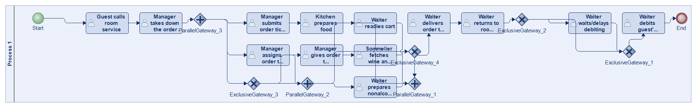
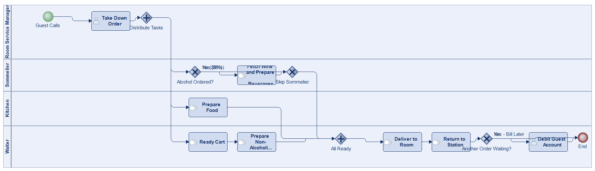
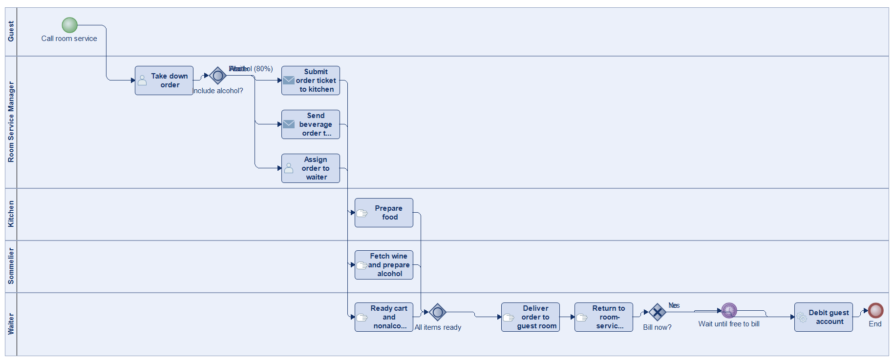
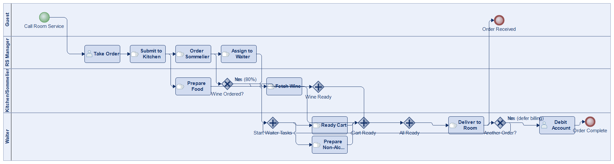
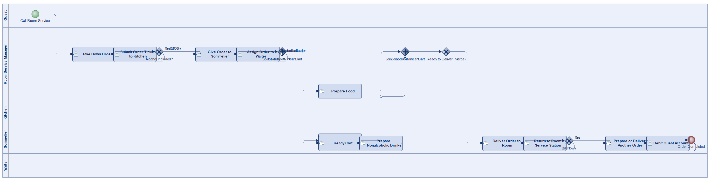
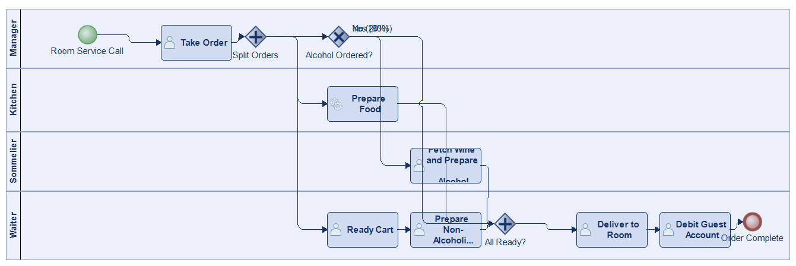

# Scenario 20

**Complexity:** Complex

[← back to comparisons index](README.md)

## Input scenario

> The Evanstonian is an upscale independent hotel.
> When a guest calls room service at The Evanstonian, the room-service manager takes down the order.
> She then submits an order ticket to the kitchen to begin preparing the food.
> She also gives an order to the sommelier (i.e., the wine waiter) to fetch wine from the cellar and to prepare any other alcoholic beverages.
> Eighty percent of room-service orders include wine or some other alcoholic beverage.
> Finally, she assigns the order to the waiter.
> While the kitchen and the sommelier are doing their tasks, the waiter readies a cart (i.e., puts a tablecloth on the cart and gathers silverware).
> The waiter is also responsible for nonalcoholic drinks.
> Once the food, wine, and cart are ready, the waiter delivers it to the guest's room.
> After returning to the room-service station, the waiter debits the guest's account.
> The waiter may wait to do the billing if he has another order to prepare or deliver.

## Reference BPMN (ground truth)

| Lanes | Elements | Gateways | Flows | Data obj. | Data assoc. |
|--:|--:|--:|--:|--:|--:|
| 1 | 22 | 7 | 26 | 0 | 0 |

## Generated BPMN — 6 (approach × LLM) cells

Δ values in parentheses are `(generated − ground_truth)`.

### config-helpers / Claude Opus 4.5  ✅ executed

| metric | ground truth | generated | Δ |
|---|---:|---:|---:|
| Lanes | 1 | 4 | +3 |
| Elements | 22 | 15 | -7 |
| Gateways | 7 | 5 | -2 |
| Flows | 26 | 18 | -8 |
| Data obj. | 0 | — |  |
| Data assoc. | 0 | — |  |

**Generation:** 5,135 tokens · 18.6s · $0.054

### config-helpers / GPT-5.2  ✅ executed

| metric | ground truth | generated | Δ |
|---|---:|---:|---:|
| Lanes | 1 | 5 | +4 |
| Elements | 22 | 16 | -6 |
| Gateways | 7 | 3 | -4 |
| Flows | 26 | 18 | -8 |
| Data obj. | 0 | 0 | 0 |
| Data assoc. | 0 | 0 | 0 |

**Generation:** 6,089 tokens · 55.1s · $0.046

### config-helpers / GLM5  ✅ executed

| metric | ground truth | generated | Δ |
|---|---:|---:|---:|
| Lanes | 1 | 5 | +4 |
| Elements | 22 | 11 | -11 |
| Gateways | 7 | 2 | -5 |
| Flows | 26 | 11 | -15 |
| Data obj. | 0 | 1 | +1 |
| Data assoc. | 0 | 4 | +4 |

**Generation:** 15,954 tokens · 266.8s · $0.032

### no-helper / Claude Opus 4.5  ✅ executed

| metric | ground truth | generated | Δ |
|---|---:|---:|---:|
| Lanes | 1 | 4 | +3 |
| Elements | 22 | 19 | -3 |
| Gateways | 7 | 6 | -1 |
| Flows | 26 | 23 | -3 |
| Data obj. | 0 | 0 | 0 |
| Data assoc. | 0 | 0 | 0 |

**Generation:** 19,754 tokens · 71.1s · $0.242

### no-helper / GPT-5.2  ✅ executed

| metric | ground truth | generated | Δ |
|---|---:|---:|---:|
| Lanes | 1 | 5 | +4 |
| Elements | 22 | 21 | -1 |
| Gateways | 7 | 7 | 0 |
| Flows | 26 | 28 | +2 |
| Data obj. | 0 | 0 | 0 |
| Data assoc. | 0 | 0 | 0 |

**Generation:** 17,680 tokens · 87.0s · $0.122

### no-helper / GLM5  ✅ executed

| metric | ground truth | generated | Δ |
|---|---:|---:|---:|
| Lanes | 1 | 4 | +3 |
| Elements | 22 | 12 | -10 |
| Gateways | 7 | 3 | -4 |
| Flows | 26 | 14 | -12 |
| Data obj. | 0 | 0 | 0 |
| Data assoc. | 0 | 0 | 0 |

**Generation:** 21,614 tokens · 247.7s · $0.034
