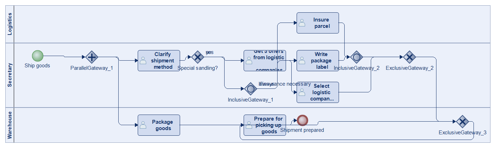
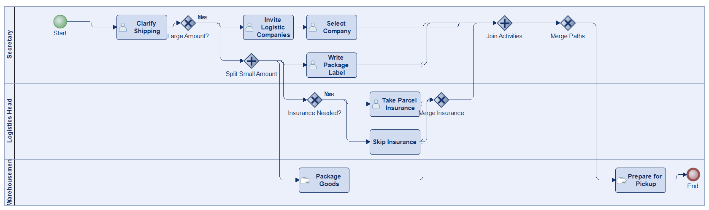
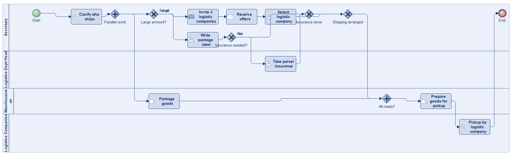
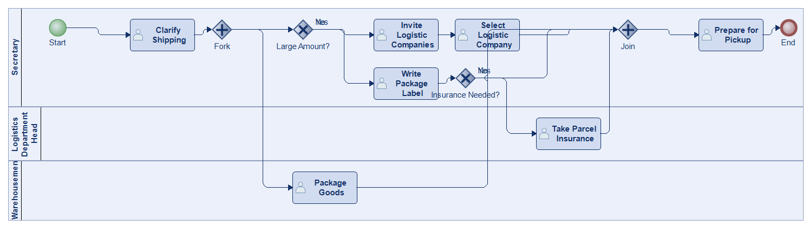
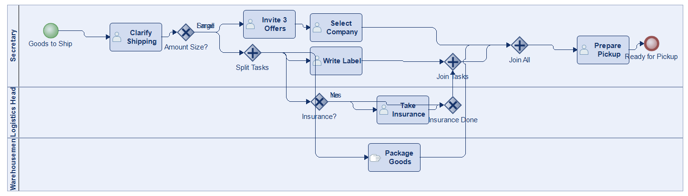
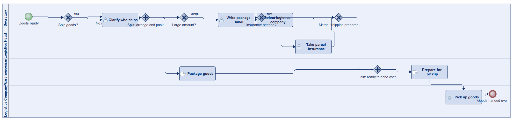
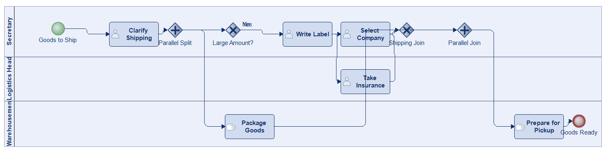

# Scenario 21

**Complexity:** Complex

[← back to comparisons index](README.md)

## Input scenario

> If goods shall be shipped, the secretary clarifies who will do the shipping. 
> If you have large amounts, special shipping will be necessary. 
> In these cases the secretary invites three logistic companies to make offers and she selects one of them. 
> In case of small amounts, normal post shipment is used. 
> Therefore a package label is written by the secretary and a parcel insurance taken by the logistics department head if necessary. 
> In the meantime the goods can be already packaged by the warehousemen. 
> If everything is ready, the packaged goods are prepared for being picked up by the logistic company.

## Reference BPMN (ground truth)

| Lanes | Elements | Gateways | Flows | Data obj. | Data assoc. |
|--:|--:|--:|--:|--:|--:|
| 3 | 15 | 6 | 17 | 0 | 0 |

## Generated BPMN — 6 (approach × LLM) cells

Δ values in parentheses are `(generated − ground_truth)`.

### config-helpers / Claude Opus 4.5  ✅ executed

| metric | ground truth | generated | Δ |
|---|---:|---:|---:|
| Lanes | 3 | 3 | 0 |
| Elements | 15 | 16 | +1 |
| Gateways | 6 | 6 | 0 |
| Flows | 17 | 19 | +2 |
| Data obj. | 0 | — |  |
| Data assoc. | 0 | — |  |

**Generation:** 4,808 tokens · 15.6s · $0.048

### config-helpers / GPT-5.2  ✅ executed

| metric | ground truth | generated | Δ |
|---|---:|---:|---:|
| Lanes | 3 | 4 | +1 |
| Elements | 15 | 17 | +2 |
| Gateways | 6 | 6 | 0 |
| Flows | 17 | 19 | +2 |
| Data obj. | 0 | 0 | 0 |
| Data assoc. | 0 | 0 | 0 |

**Generation:** 6,055 tokens · 42.1s · $0.047

### config-helpers / GLM5  ✅ executed

| metric | ground truth | generated | Δ |
|---|---:|---:|---:|
| Lanes | 3 | 3 | 0 |
| Elements | 15 | 13 | -2 |
| Gateways | 6 | 4 | -2 |
| Flows | 17 | 15 | -2 |
| Data obj. | 0 | 0 | 0 |
| Data assoc. | 0 | 0 | 0 |

**Generation:** 16,385 tokens · 302.1s · $0.033

### no-helper / Claude Opus 4.5  ✅ executed

| metric | ground truth | generated | Δ |
|---|---:|---:|---:|
| Lanes | 3 | 3 | 0 |
| Elements | 15 | 15 | 0 |
| Gateways | 6 | 6 | 0 |
| Flows | 17 | 18 | +1 |
| Data obj. | 0 | 0 | 0 |
| Data assoc. | 0 | 0 | 0 |

**Generation:** 19,574 tokens · 70.2s · $0.240

### no-helper / GPT-5.2  ✅ executed

| metric | ground truth | generated | Δ |
|---|---:|---:|---:|
| Lanes | 3 | 4 | +1 |
| Elements | 15 | 17 | +2 |
| Gateways | 6 | 6 | 0 |
| Flows | 17 | 19 | +2 |
| Data obj. | 0 | 0 | 0 |
| Data assoc. | 0 | 0 | 0 |

**Generation:** 17,846 tokens · 94.5s · $0.125

### no-helper / GLM5  ✅ executed

| metric | ground truth | generated | Δ |
|---|---:|---:|---:|
| Lanes | 3 | 3 | 0 |
| Elements | 15 | 13 | -2 |
| Gateways | 6 | 4 | -2 |
| Flows | 17 | 14 | -3 |
| Data obj. | 0 | 0 | 0 |
| Data assoc. | 0 | 0 | 0 |

**Generation:** 18,007 tokens · 183.0s · $0.025
