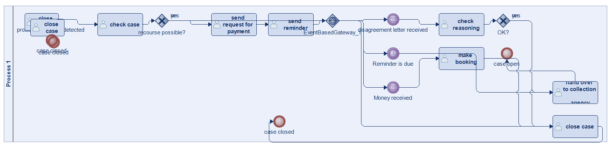
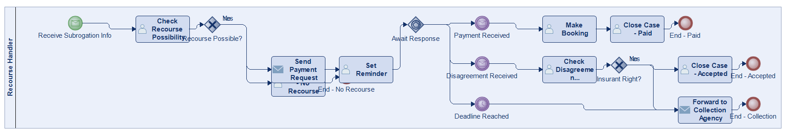
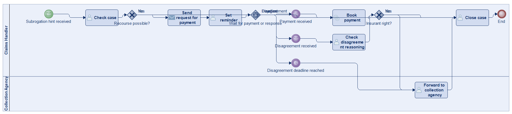
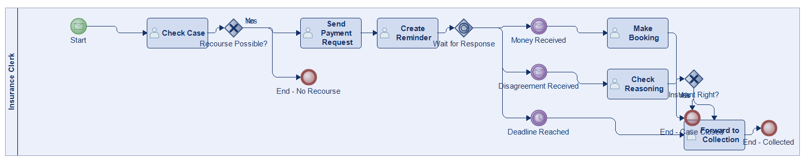
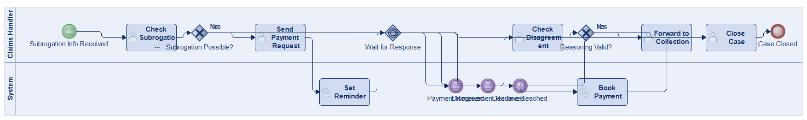
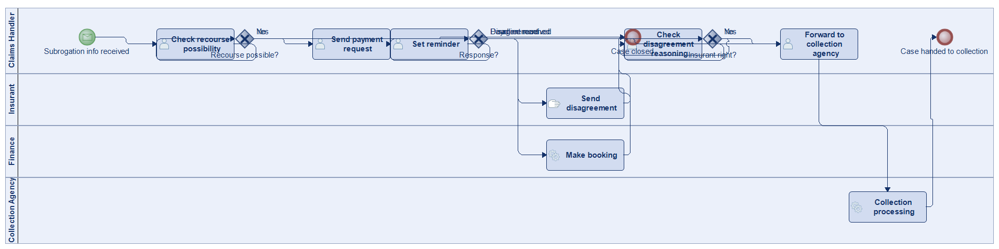

# Scenario 22

**Complexity:** Complex

[← back to comparisons index](README.md)

## Input scenario

> If an insurant could be possibly subrogated against, I get information about that. 
> I check that case and if the possibility is really there, I send a request for payment to the insurant and make me a reminder. 
> If recourse is not possible, I close the case. 
> When we receive the money, I make a booking and close the case. 
> If the insurant disagrees with the recourse, I'll have to check the reasoning of that. 
> If he is right, I simply close the case. 
> If he is wrong, I forward the case to a collection agency. It the deadline for disagreement is reached and we haven't received any money, I forward the case to the collection agency as well.

## Reference BPMN (ground truth)

| Lanes | Elements | Gateways | Flows | Data obj. | Data assoc. |
|--:|--:|--:|--:|--:|--:|
| 1 | 20 | 3 | 20 | 0 | 0 |

## Generated BPMN — 6 (approach × LLM) cells

Δ values in parentheses are `(generated − ground_truth)`.

### config-helpers / Claude Opus 4.5  ✅ executed

| metric | ground truth | generated | Δ |
|---|---:|---:|---:|
| Lanes | 1 | 1 | 0 |
| Elements | 20 | 20 | 0 |
| Gateways | 3 | 3 | 0 |
| Flows | 20 | 20 | 0 |
| Data obj. | 0 | — |  |
| Data assoc. | 0 | — |  |

**Generation:** 5,461 tokens · 24.3s · $0.064

### config-helpers / GPT-5.2  ✅ executed

| metric | ground truth | generated | Δ |
|---|---:|---:|---:|
| Lanes | 1 | 2 | +1 |
| Elements | 20 | 15 | -5 |
| Gateways | 3 | 3 | 0 |
| Flows | 20 | 18 | -2 |
| Data obj. | 0 | 0 | 0 |
| Data assoc. | 0 | 0 | 0 |

**Generation:** 5,203 tokens · 27.9s · $0.035

### config-helpers / GLM5  ✅ executed

| metric | ground truth | generated | Δ |
|---|---:|---:|---:|
| Lanes | 1 | 1 | 0 |
| Elements | 20 | 16 | -4 |
| Gateways | 3 | 3 | 0 |
| Flows | 20 | 17 | -3 |
| Data obj. | 0 | 0 | 0 |
| Data assoc. | 0 | 0 | 0 |

**Generation:** 15,522 tokens · 231.2s · $0.031

### no-helper / Claude Opus 4.5  ✅ executed

| metric | ground truth | generated | Δ |
|---|---:|---:|---:|
| Lanes | 1 | 2 | +1 |
| Elements | 20 | 15 | -5 |
| Gateways | 3 | 3 | 0 |
| Flows | 20 | 18 | -2 |
| Data obj. | 0 | 0 | 0 |
| Data assoc. | 0 | 0 | 0 |

**Generation:** 19,919 tokens · 72.6s · $0.248

### no-helper / GPT-5.2  ✅ executed

| metric | ground truth | generated | Δ |
|---|---:|---:|---:|
| Lanes | 1 | 4 | +3 |
| Elements | 20 | 14 | -6 |
| Gateways | 3 | 3 | 0 |
| Flows | 20 | 16 | -4 |
| Data obj. | 0 | 0 | 0 |
| Data assoc. | 0 | 0 | 0 |

**Generation:** 17,352 tokens · 80.8s · $0.118

### no-helper / GLM5  ❌ execution failed

_Render failed: `ERROR: org.modelio.vcore.smkernel.IllegalModelManipulationException: IllegalModelManipulationException [Error: -1, object=null, closure=org.`_  ([log](../runs/no-helper/glm5/scenario_22/diagram_render_error.txt))

| metric | ground truth | generated | Δ |
|---|---:|---:|---:|
| Lanes | 1 | — |  |
| Elements | 20 | — |  |
| Gateways | 3 | — |  |
| Flows | 20 | — |  |
| Data obj. | 0 | — |  |
| Data assoc. | 0 | — |  |

**Generation:** 22,971 tokens · 189.6s · $0.037

> Original experiment-time error: `Script execution failed - check output`
