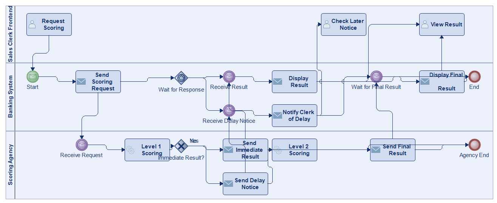
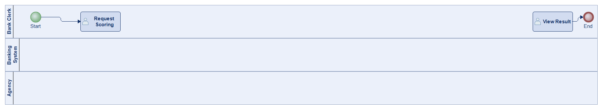
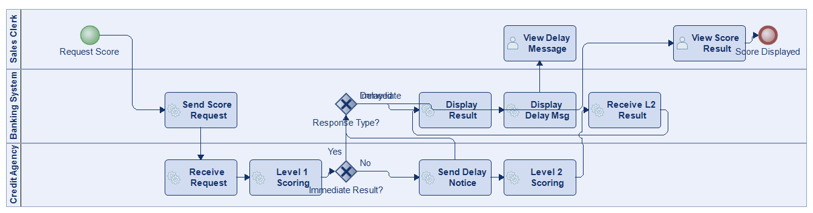
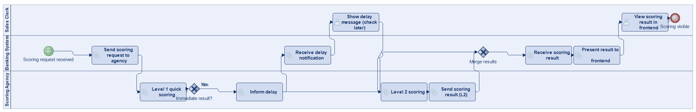
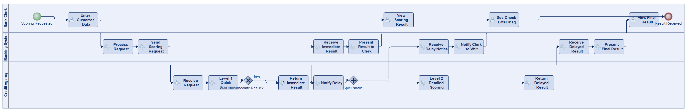

# Scenario 23

**Complexity:** Complex

[← back to comparisons index](README.md)

## Input scenario

> The sales clerks in a bank can use their software frontend to receive the credit-scoring for a certain customer. 
> This starts a process in the banking system which communicates with the agency in the background. 
> This process sends a scoring request to the agency right after the beginning. 
> Then, the Agency does a first quick scoring (level 1). 
> This will often lead to an immediate result which is then returned directly to the banking system within seconds. 
> The banking process presents the result to the clerk sitting at the frontend. 
> Sometimes the scoring cannot be determined immediately and takes longer. 
> In this case the agency informs the banking process of the delay and then starts the level 2 scoring (which can take up to a couple of minutes). 
> After the scoring result is determined, the information is sent back to the banking process. 
> The banking process displays a message to the clerk when he receives information about the delay to check again later. 
> As soon as the result arrives, it can be seen at the frontend.

## Reference BPMN (ground truth)

_No reference diagram available — `ground_truth.py` is empty in the source JSONL (`modelio_config: None`)._

| Lanes | Elements | Gateways | Flows | Data obj. | Data assoc. |
|--:|--:|--:|--:|--:|--:|
| 1 | 16 | 4 | 16 | 0 | 0 |

## Generated BPMN — 6 (approach × LLM) cells

Δ values in parentheses are `(generated − ground_truth)`.

### config-helpers / Claude Opus 4.5  ✅ executed

| metric | ground truth | generated | Δ |
|---|---:|---:|---:|
| Lanes | 1 | 3 | +2 |
| Elements | 16 | 21 | +5 |
| Gateways | 4 | 2 | -2 |
| Flows | 16 | 26 | +10 |
| Data obj. | 0 | — |  |
| Data assoc. | 0 | — |  |

**Generation:** 5,601 tokens · 24.6s · $0.067

### config-helpers / GPT-5.2  ✅ executed

| metric | ground truth | generated | Δ |
|---|---:|---:|---:|
| Lanes | 1 | 3 | +2 |
| Elements | 16 | 18 | +2 |
| Gateways | 4 | 1 | -3 |
| Flows | 16 | 19 | +3 |
| Data obj. | 0 | 0 | 0 |
| Data assoc. | 0 | 0 | 0 |

**Generation:** 8,823 tokens · 77.2s · $0.085

### config-helpers / GLM5  ✅ executed

| metric | ground truth | generated | Δ |
|---|---:|---:|---:|
| Lanes | 1 | 3 | +2 |
| Elements | 16 | 16 | 0 |
| Gateways | 4 | 1 | -3 |
| Flows | 16 | 17 | +1 |
| Data obj. | 0 | 0 | 0 |
| Data assoc. | 0 | 0 | 0 |

**Generation:** 9,778 tokens · 330.8s · $0.017

### no-helper / Claude Opus 4.5  ✅ executed

| metric | ground truth | generated | Δ |
|---|---:|---:|---:|
| Lanes | 1 | 3 | +2 |
| Elements | 16 | 14 | -2 |
| Gateways | 4 | 2 | -2 |
| Flows | 16 | 15 | -1 |
| Data obj. | 0 | 0 | 0 |
| Data assoc. | 0 | 0 | 0 |

**Generation:** 19,311 tokens · 68.0s · $0.232

### no-helper / GPT-5.2  ✅ executed

| metric | ground truth | generated | Δ |
|---|---:|---:|---:|
| Lanes | 1 | 3 | +2 |
| Elements | 16 | 15 | -1 |
| Gateways | 4 | 2 | -2 |
| Flows | 16 | 15 | -1 |
| Data obj. | 0 | 0 | 0 |
| Data assoc. | 0 | 0 | 0 |

**Generation:** 18,944 tokens · 107.7s · $0.139

### no-helper / GLM5  ✅ executed

| metric | ground truth | generated | Δ |
|---|---:|---:|---:|
| Lanes | 1 | 3 | +2 |
| Elements | 16 | 22 | +6 |
| Gateways | 4 | 2 | -2 |
| Flows | 16 | 22 | +6 |
| Data obj. | 0 | 0 | 0 |
| Data assoc. | 0 | 0 | 0 |

**Generation:** 21,702 tokens · 1110.7s · $0.034
