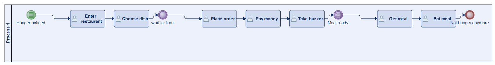
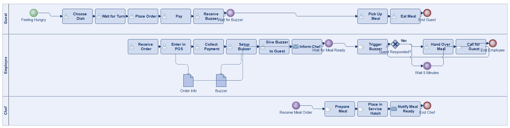
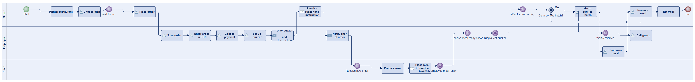
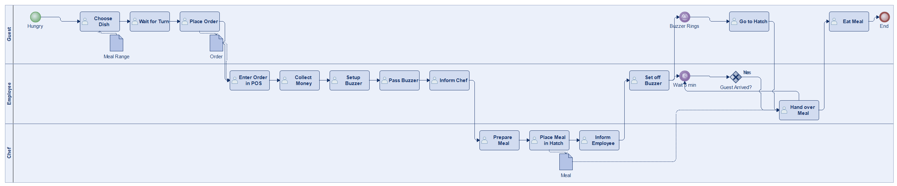
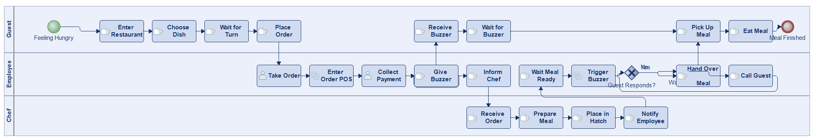
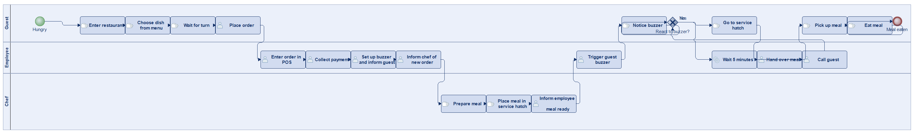
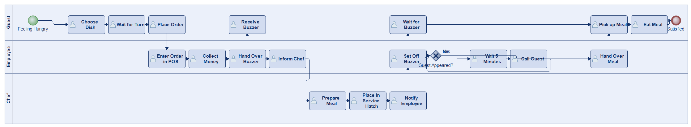

# Scenario 24

**Complexity:** Complex

[← back to comparisons index](README.md)

## Input scenario

> A guest enters the restaurant when feeling hungry. 
> He chooses a dish from the changing meal range and waits until it is his turn. 
> Following this he places his order with the employee. The employee enters the order into the POS system and collects the money from the guest. 
> After the payment, the employee sets up a buzzer and passes it on to the guest with the following information: 
> "When the buzzer rings, your dinner is ready". 
> Afterwards the employee informs the chef of the new meal order. 
> The chef prepares the meal and places it in the service hatch. 
> He then informs the employee that he has placed the finished meal in the service hatch. 
> As soon as the employee is aware that the meal is ready he sets off the guest's buzzer. 
> This is how the guest finds out that his meal is ready for collection. 
> He can pick up his meal and eat it. 
> As soon as the guest appears at the service hatch, the employee hands over his meal. 
> Should a guest not react to the buzzer, the employee calls for him after 5 minutes, if necessary several times in a row.

## Reference BPMN (ground truth)

| Lanes | Elements | Gateways | Flows | Data obj. | Data assoc. |
|--:|--:|--:|--:|--:|--:|
| 1 | 30 | 1 | 28 | 0 | 0 |

## Generated BPMN — 6 (approach × LLM) cells

Δ values in parentheses are `(generated − ground_truth)`.

### config-helpers / Claude Opus 4.5  ✅ executed

| metric | ground truth | generated | Δ |
|---|---:|---:|---:|
| Lanes | 1 | 3 | +2 |
| Elements | 30 | 28 | -2 |
| Gateways | 1 | 1 | 0 |
| Flows | 28 | 26 | -2 |
| Data obj. | 0 | 2 | +2 |
| Data assoc. | 0 | 4 | +4 |

**Generation:** 5,789 tokens · 24.1s · $0.070

### config-helpers / GPT-5.2  ✅ executed

| metric | ground truth | generated | Δ |
|---|---:|---:|---:|
| Lanes | 1 | 3 | +2 |
| Elements | 30 | 27 | -3 |
| Gateways | 1 | 1 | 0 |
| Flows | 28 | 27 | -1 |
| Data obj. | 0 | 0 | 0 |
| Data assoc. | 0 | 0 | 0 |

**Generation:** 12,823 tokens · 113.4s · $0.140

### config-helpers / GLM5  ✅ executed

| metric | ground truth | generated | Δ |
|---|---:|---:|---:|
| Lanes | 1 | 3 | +2 |
| Elements | 30 | 24 | -6 |
| Gateways | 1 | 1 | 0 |
| Flows | 28 | 22 | -6 |
| Data obj. | 0 | 3 | +3 |
| Data assoc. | 0 | 5 | +5 |

**Generation:** 12,237 tokens · 187.3s · $0.023

### no-helper / Claude Opus 4.5  ✅ executed

| metric | ground truth | generated | Δ |
|---|---:|---:|---:|
| Lanes | 1 | 3 | +2 |
| Elements | 30 | 26 | -4 |
| Gateways | 1 | 1 | 0 |
| Flows | 28 | 27 | -1 |
| Data obj. | 0 | 0 | 0 |
| Data assoc. | 0 | 0 | 0 |

**Generation:** 20,518 tokens · 76.8s · $0.261

### no-helper / GPT-5.2  ✅ executed

| metric | ground truth | generated | Δ |
|---|---:|---:|---:|
| Lanes | 1 | 3 | +2 |
| Elements | 30 | 22 | -8 |
| Gateways | 1 | 1 | 0 |
| Flows | 28 | 22 | -6 |
| Data obj. | 0 | 0 | 0 |
| Data assoc. | 0 | 0 | 0 |

**Generation:** 18,323 tokens · 93.6s · $0.130

### no-helper / GLM5  ✅ executed

| metric | ground truth | generated | Δ |
|---|---:|---:|---:|
| Lanes | 1 | 3 | +2 |
| Elements | 30 | 21 | -9 |
| Gateways | 1 | 1 | 0 |
| Flows | 28 | 22 | -6 |
| Data obj. | 0 | 0 | 0 |
| Data assoc. | 0 | 0 | 0 |

**Generation:** 22,208 tokens · 821.7s · $0.035
