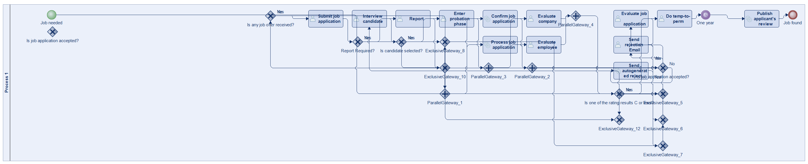
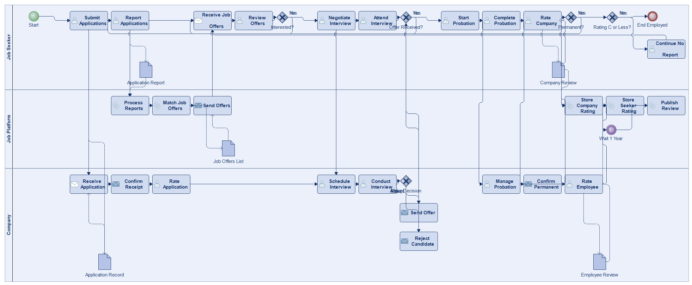
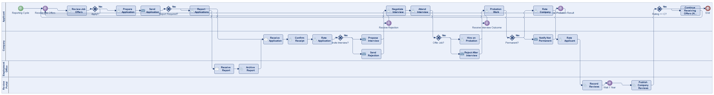
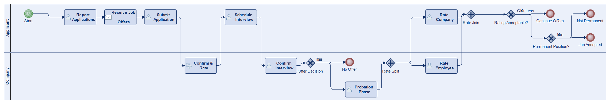
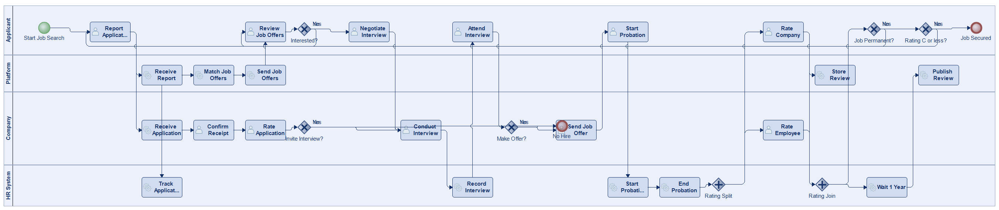
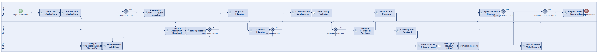

# Scenario 25

**Complexity:** Complex

[← back to comparisons index](README.md)

## Input scenario

> Title: Find a Job
>
> You have to regularly report, to which companies you wrote job applications.
> Based on your job applications, new potential job offers are sent to you.
> Companies have to confirm that they received job applications and rate the application.
> A job interview can be negotiated.
> When a company wants you to work for them, you enter the probation phase.
> After probation phase, you can rate the company and the company can rate you.
> Reviews for a company can only be seen (by job applicants) after 1 year.
> If a job becomes permanent, the process ends, unless you rated the company C or less, then you continue to receive job offers, but no longer have to report.

## Reference BPMN (ground truth)

| Lanes | Elements | Gateways | Flows | Data obj. | Data assoc. |
|--:|--:|--:|--:|--:|--:|
| 1 | 32 | 16 | 39 | 0 | 0 |

## Generated BPMN — 6 (approach × LLM) cells

Δ values in parentheses are `(generated − ground_truth)`.

### config-helpers / Claude Opus 4.5  ✅ executed

| metric | ground truth | generated | Δ |
|---|---:|---:|---:|
| Lanes | 1 | 3 | +2 |
| Elements | 32 | 34 | +2 |
| Gateways | 16 | 5 | -11 |
| Flows | 39 | 42 | +3 |
| Data obj. | 0 | 5 | +5 |
| Data assoc. | 0 | 10 | +10 |

**Generation:** 6,164 tokens · 30.3s · $0.082

### config-helpers / GPT-5.2  ✅ executed

| metric | ground truth | generated | Δ |
|---|---:|---:|---:|
| Lanes | 1 | 4 | +3 |
| Elements | 32 | 35 | +3 |
| Gateways | 16 | 6 | -10 |
| Flows | 39 | 40 | +1 |
| Data obj. | 0 | 0 | 0 |
| Data assoc. | 0 | 0 | 0 |

**Generation:** 12,524 tokens · 132.2s · $0.137

### config-helpers / GLM5  ✅ executed

| metric | ground truth | generated | Δ |
|---|---:|---:|---:|
| Lanes | 1 | 2 | +1 |
| Elements | 32 | 19 | -13 |
| Gateways | 16 | 5 | -11 |
| Flows | 39 | 19 | -20 |
| Data obj. | 0 | 0 | 0 |
| Data assoc. | 0 | 0 | 0 |

**Generation:** 17,128 tokens · 258.3s · $0.034

### no-helper / Claude Opus 4.5  ✅ executed

| metric | ground truth | generated | Δ |
|---|---:|---:|---:|
| Lanes | 1 | 4 | +3 |
| Elements | 32 | 32 | 0 |
| Gateways | 16 | 7 | -9 |
| Flows | 39 | 37 | -2 |
| Data obj. | 0 | 0 | 0 |
| Data assoc. | 0 | 0 | 0 |

**Generation:** 19,828 tokens · 70.2s · $0.246

### no-helper / GPT-5.2  ✅ executed

| metric | ground truth | generated | Δ |
|---|---:|---:|---:|
| Lanes | 1 | 3 | +2 |
| Elements | 32 | 29 | -3 |
| Gateways | 16 | 6 | -10 |
| Flows | 39 | 33 | -6 |
| Data obj. | 0 | 0 | 0 |
| Data assoc. | 0 | 0 | 0 |

**Generation:** 19,265 tokens · 115.7s · $0.145

### no-helper / GLM5  ❌ execution failed

_Render failed: `ERROR: ImportError: cannot import name BpmnTimerEvent in <script> at line number 81`_  ([log](../runs/no-helper/glm5/scenario_25/diagram_render_error.txt))

| metric | ground truth | generated | Δ |
|---|---:|---:|---:|
| Lanes | 1 | — |  |
| Elements | 32 | — |  |
| Gateways | 16 | — |  |
| Flows | 39 | — |  |
| Data obj. | 0 | — |  |
| Data assoc. | 0 | — |  |

**Generation:** 18,337 tokens · 115.9s · $0.026

> Original experiment-time error: `Script execution failed - check output`
