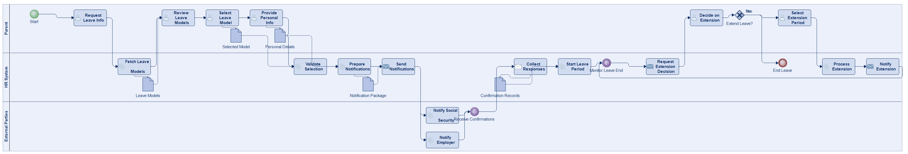
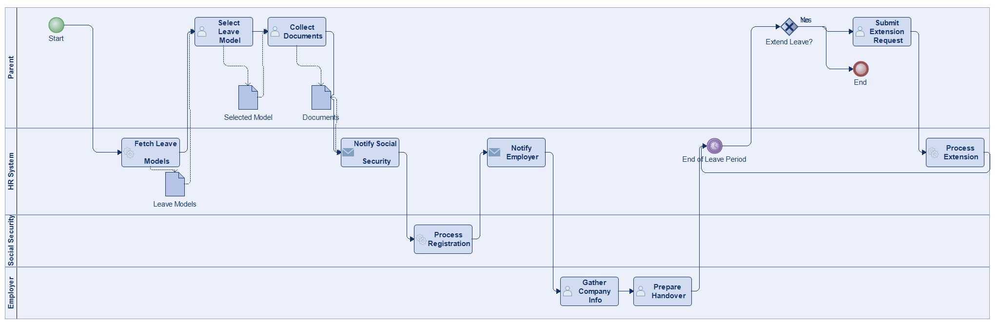
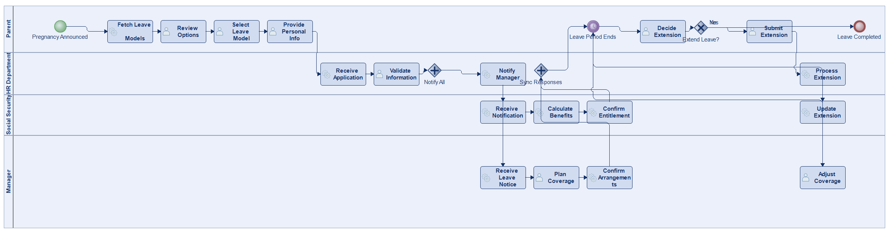
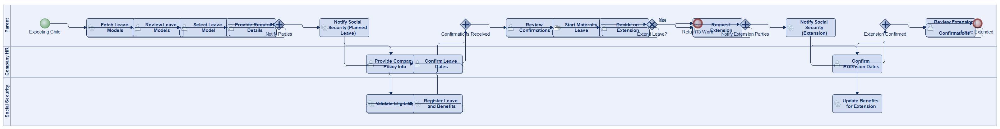
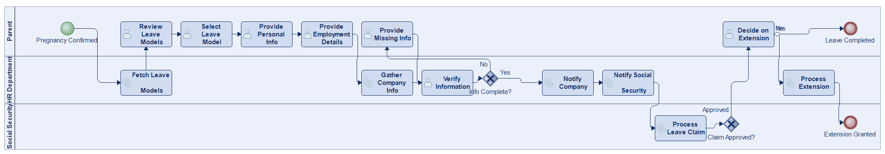

# Scenario 26

**Complexity:** Complex

[← back to comparisons index](README.md)

## Input scenario

> Title: Becoming A Parent
>
> Create a process that support in planning, taking and extending a maternity leave.  
> * Fetch information about potential models (months duration, split between parents) 
> * Let parent select 
> * Collect relevant information 
> * Notify Social Security, Company in time 
> * Gather information from companies 
> * At the end of the period let parent decide about extension.

## Reference BPMN (ground truth)

| Lanes | Elements | Gateways | Flows | Data obj. | Data assoc. |
|--:|--:|--:|--:|--:|--:|
| 1 | 22 | 8 | 26 | 0 | 0 |

## Generated BPMN — 6 (approach × LLM) cells

Δ values in parentheses are `(generated − ground_truth)`.

### config-helpers / Claude Opus 4.5  ✅ executed

| metric | ground truth | generated | Δ |
|---|---:|---:|---:|
| Lanes | 1 | 3 | +2 |
| Elements | 22 | 22 | 0 |
| Gateways | 8 | 1 | -7 |
| Flows | 26 | 23 | -3 |
| Data obj. | 0 | 5 | +5 |
| Data assoc. | 0 | 10 | +10 |

**Generation:** 5,851 tokens · 30.4s · $0.075

### config-helpers / GPT-5.2  ✅ executed

| metric | ground truth | generated | Δ |
|---|---:|---:|---:|
| Lanes | 1 | 3 | +2 |
| Elements | 22 | 41 | +19 |
| Gateways | 8 | 5 | -3 |
| Flows | 26 | 37 | +11 |
| Data obj. | 0 | 6 | +6 |
| Data assoc. | 0 | 14 | +14 |

**Generation:** 7,374 tokens · 64.7s · $0.066

### config-helpers / GLM5  ✅ executed

| metric | ground truth | generated | Δ |
|---|---:|---:|---:|
| Lanes | 1 | 4 | +3 |
| Elements | 22 | 17 | -5 |
| Gateways | 8 | 1 | -7 |
| Flows | 26 | 14 | -12 |
| Data obj. | 0 | 3 | +3 |
| Data assoc. | 0 | 6 | +6 |

**Generation:** 11,477 tokens · 181.6s · $0.022

### no-helper / Claude Opus 4.5  ✅ executed

| metric | ground truth | generated | Δ |
|---|---:|---:|---:|
| Lanes | 1 | 4 | +3 |
| Elements | 22 | 25 | +3 |
| Gateways | 8 | 3 | -5 |
| Flows | 26 | 27 | +1 |
| Data obj. | 0 | 0 | 0 |
| Data assoc. | 0 | 0 | 0 |

**Generation:** 19,787 tokens · 74.4s · $0.246

### no-helper / GPT-5.2  ✅ executed

| metric | ground truth | generated | Δ |
|---|---:|---:|---:|
| Lanes | 1 | 3 | +2 |
| Elements | 22 | 27 | +5 |
| Gateways | 8 | 5 | -3 |
| Flows | 26 | 28 | +2 |
| Data obj. | 0 | 0 | 0 |
| Data assoc. | 0 | 0 | 0 |

**Generation:** 17,574 tokens · 94.3s · $0.122

### no-helper / GLM5  ✅ executed

| metric | ground truth | generated | Δ |
|---|---:|---:|---:|
| Lanes | 1 | 3 | +2 |
| Elements | 22 | 18 | -4 |
| Gateways | 8 | 2 | -6 |
| Flows | 26 | 18 | -8 |
| Data obj. | 0 | 0 | 0 |
| Data assoc. | 0 | 0 | 0 |

**Generation:** 18,666 tokens · 138.6s · $0.027
