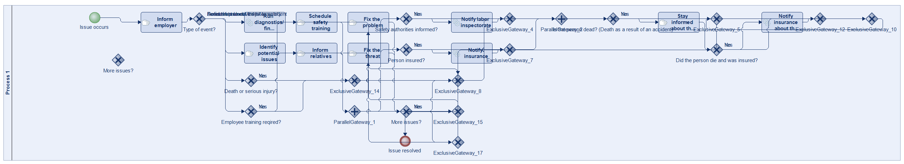
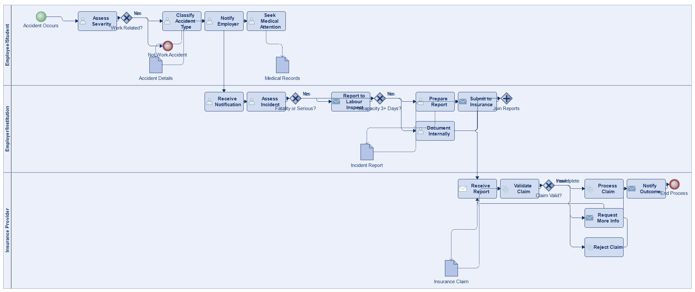
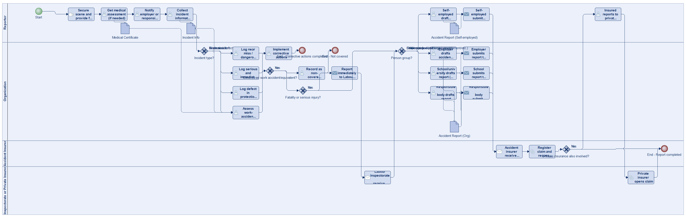
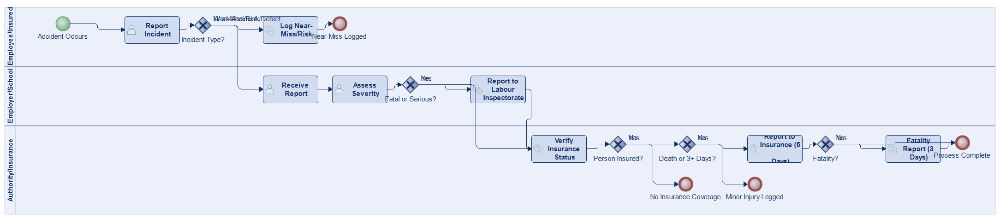
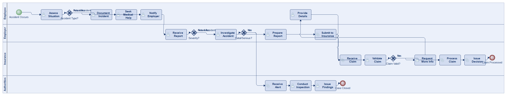
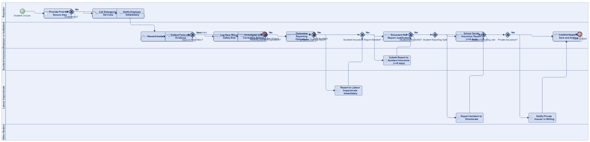
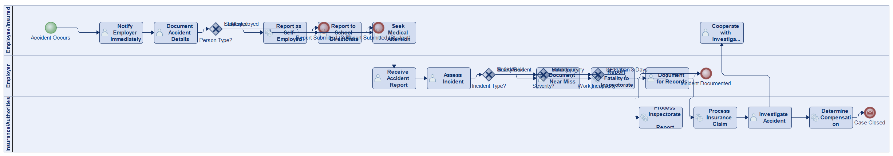

# Scenario 27

**Complexity:** Complex

[← back to comparisons index](README.md)

## Input scenario

> Title: Work Accident
>
> Create a process that helps in gathering information about work accidents (and almost work accidents):
> For insured gainful employment, a work accident is considered to be an accident that occurs in the following circumstances, by way of example:
> * the accident occurs in a location, at a time and with a cause that correlates to the insured employment
> * when working from home
> * on the direct route from the permanent place of residence to work, to lunch or on the way home, whereby carpools are also protected
> * for training sessions that serve to provide specific professional knowledge, whereby an accident on to way to or from the training centre is considered a work accident
> * on the direct route from home, or from the workplace or training centre to a doctor and back, if this interrupts the direct route from the permanent place of residence to work or the route home (the doctor's visit must be notified to the employer in advance)
> * on the way to or from the workplace or training centre with the purpose of taking a child to or collecting them from a childcare facility, a daycare facility, external care or a school, insofar as they have a supervisory responsibility for the child
> * when making use of advocacy groups or professional associations (e.g. Chamber of Labour, trade union federation, guild etc.)
>
> For kindergarten children, schoolchildren and students, an accident is considered to be a work accident if, amongst other things
> * the accident occurs in a location, at a time and with a cause that correlates to the school or university education or the compulsory kindergarten year that forms the basis of the insurance
> * when taking part in a school event or school-related event 
> * on the direct route from the child's place of residence or permanent accommodation to kindergarten or a school visit or on the way home
> * when performing a practical task prescribed as part of the curriculum and/or the study regulations or 
> * in certain professional (training) orientations.
>
> In an agricultural or forestry establishment, accidents can be considered work accidents if they do not occur directly while performing the insured employment.
> Depending on the protected group of people, the following tasks are covered by accident insurance:
> * working in the household of the owner of the company and/or the employee, if the household serves the company to a considerable extent
> * working in connection with providing accommodation for guests 
> * secondary occupations for the sale of agricultural products from the farm
> * working in the context of erecting, converting and repairing buildings that serve the agricultural and forestry establishment
> * working in the context of neighbourhood assistance for another agricultural and forestry establishment  
>
> Certain accidents are considered the same as work accidents and in many cases can also affect people who do not have accident insurance.
> Accidents that occur in one of the following situations, among others, are considered to be work accidents outside of professional activity:
> * for activities with which services from the Unemployment Insurance Act / Labor Market Promotion Act are being made use of (e.g. on the way to an arranged job interview)
> * when assisting with an accident or donating blood
> * when receiving training, taking part in exercises or serving as a member of one of the following aid organisations:
>     * Volunteer fire brigade
>     * Volunteer water rescue service
>     * Volunteer rescue organisations
>     * Austrian Red Cross
>     * Austrian Alpine Rescue Service
>     * Austrian Water Rescue
>     * Austrian Rescue Dog Brigade
>     * Avalanche warning committees
>     * Air rescue service
>     * Radiation detection and survey crews
>
> The employees must inform the employer immediately of:
> * any work accident
> * any incident that would almost have led to an accident
> * any serious and immediate risk to safety and health that they discover
> * any defect discovered in protection systems.
>
> The employer must, in turn, immediately report any work accident that leads to a fatality or serious injury to the Labour Inspectorate, if it has not been reported to the emergency services.
>
> Independent of this, every work accident in which a person with accident insurance has been killed, or injured in such a way that they are unable to work for three days, in full or in part, must be reported to the responsible accident insurance provider within five days.
>
> As a self-employed person, please ensure that you not only report accidents involving people you employ but also those that involve you to the accident insurance provider in good time.
>
> Students and schoolchildren should report accidents to the competent directorate.
> Schools, educational facilities and universities are obliged to report every work accident through which a person with accident insurance is physically injured or killed within a maximum of five days to the responsible accident insurance provider in triplicate.
>
> In the case of private insurance, the insured party must report an accident in writing immediately in line with the conditions and to avoid the provider from being released from the obligation to perform.
> If there are fatalities, this must be reported within three days, even if the accident has already been reported.

## Reference BPMN (ground truth)

| Lanes | Elements | Gateways | Flows | Data obj. | Data assoc. |
|--:|--:|--:|--:|--:|--:|
| 1 | 33 | 20 | 44 | 0 | 0 |

## Generated BPMN — 6 (approach × LLM) cells

Δ values in parentheses are `(generated − ground_truth)`.

### config-helpers / Claude Opus 4.5  ✅ executed

| metric | ground truth | generated | Δ |
|---|---:|---:|---:|
| Lanes | 1 | 3 | +2 |
| Elements | 33 | 24 | -9 |
| Gateways | 20 | 5 | -15 |
| Flows | 44 | 27 | -17 |
| Data obj. | 0 | 4 | +4 |
| Data assoc. | 0 | 7 | +7 |

**Generation:** 6,791 tokens · 34.6s · $0.079

### config-helpers / GPT-5.2  ✅ executed

| metric | ground truth | generated | Δ |
|---|---:|---:|---:|
| Lanes | 1 | 4 | +3 |
| Elements | 33 | 37 | +4 |
| Gateways | 20 | 5 | -15 |
| Flows | 44 | 39 | -5 |
| Data obj. | 0 | 4 | +4 |
| Data assoc. | 0 | 12 | +12 |

**Generation:** 12,979 tokens · 123.8s · $0.133

### config-helpers / GLM5  ✅ executed

| metric | ground truth | generated | Δ |
|---|---:|---:|---:|
| Lanes | 1 | 3 | +2 |
| Elements | 33 | 18 | -15 |
| Gateways | 20 | 5 | -15 |
| Flows | 44 | 19 | -25 |
| Data obj. | 0 | 0 | 0 |
| Data assoc. | 0 | 0 | 0 |

**Generation:** 13,125 tokens · 146.3s · $0.024

### no-helper / Claude Opus 4.5  ✅ executed

| metric | ground truth | generated | Δ |
|---|---:|---:|---:|
| Lanes | 1 | 4 | +3 |
| Elements | 33 | 25 | -8 |
| Gateways | 20 | 4 | -16 |
| Flows | 44 | 27 | -17 |
| Data obj. | 0 | 0 | 0 |
| Data assoc. | 0 | 0 | 0 |

**Generation:** 20,425 tokens · 66.2s · $0.243

### no-helper / GPT-5.2  ✅ executed

| metric | ground truth | generated | Δ |
|---|---:|---:|---:|
| Lanes | 1 | 5 | +4 |
| Elements | 33 | 29 | -4 |
| Gateways | 20 | 9 | -11 |
| Flows | 44 | 34 | -10 |
| Data obj. | 0 | 0 | 0 |
| Data assoc. | 0 | 0 | 0 |

**Generation:** 20,299 tokens · 100.8s · $0.149

### no-helper / GLM5  ✅ executed

| metric | ground truth | generated | Δ |
|---|---:|---:|---:|
| Lanes | 1 | 3 | +2 |
| Elements | 33 | 27 | -6 |
| Gateways | 20 | 4 | -16 |
| Flows | 44 | 30 | -14 |
| Data obj. | 0 | 0 | 0 |
| Data assoc. | 0 | 0 | 0 |

**Generation:** 19,782 tokens · 181.7s · $0.028
