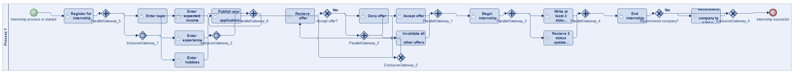
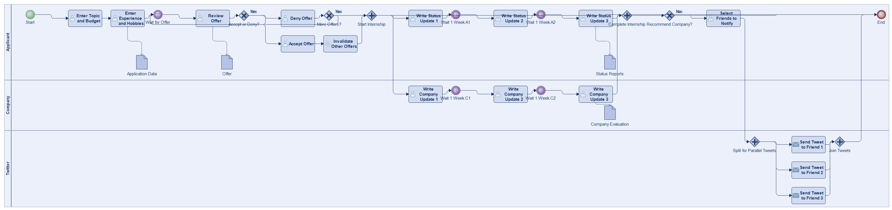
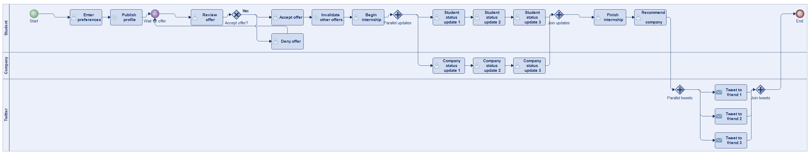
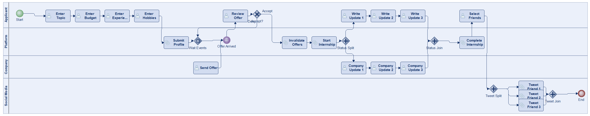
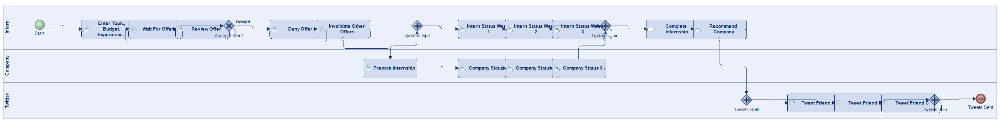

# Scenario 28

**Complexity:** Complex

[← back to comparisons index](README.md)

## Input scenario

> Title: Internship
>
> You can enter a topic that interests you, and how much money you want.
> You can also enter experience and hobbies.
> Several offers will arrive (at arbitrary points in time).
> You can accept or deny offers.
> As soon as an offer is accepted, all other offers become invalid.
> You have to write at least 3 status updates about your internship (every week).
> The company has to write 3 status updates about you.
> After the internship is finished you can recommend the company to a list of friends (via twitter).
> Separate tweets are sent in parallel.

## Reference BPMN (ground truth)

| Lanes | Elements | Gateways | Flows | Data obj. | Data assoc. |
|--:|--:|--:|--:|--:|--:|
| 1 | 29 | 12 | 35 | 0 | 0 |

## Generated BPMN — 6 (approach × LLM) cells

Δ values in parentheses are `(generated − ground_truth)`.

### config-helpers / Claude Opus 4.5  ✅ executed

| metric | ground truth | generated | Δ |
|---|---:|---:|---:|
| Lanes | 1 | 3 | +2 |
| Elements | 29 | 30 | +1 |
| Gateways | 12 | 7 | -5 |
| Flows | 35 | 35 | 0 |
| Data obj. | 0 | 4 | +4 |
| Data assoc. | 0 | 4 | +4 |

**Generation:** 6,071 tokens · 31.4s · $0.080

### config-helpers / GPT-5.2  ✅ executed

| metric | ground truth | generated | Δ |
|---|---:|---:|---:|
| Lanes | 1 | 3 | +2 |
| Elements | 29 | 26 | -3 |
| Gateways | 12 | 5 | -7 |
| Flows | 35 | 29 | -6 |
| Data obj. | 0 | 0 | 0 |
| Data assoc. | 0 | 0 | 0 |

**Generation:** 5,382 tokens · 33.2s · $0.038

### config-helpers / GLM5  ❌ execution failed

_Render failed: `ERROR: SyntaxError: no viable alternative at input '.' in <script> at line number 101 at column number 18`_  ([log](../runs/config-helpers/glm5/scenario_28/diagram_render_error.txt))

| metric | ground truth | generated | Δ |
|---|---:|---:|---:|
| Lanes | 1 | — |  |
| Elements | 29 | — |  |
| Gateways | 12 | — |  |
| Flows | 35 | — |  |
| Data obj. | 0 | — |  |
| Data assoc. | 0 | — |  |

**Generation:** 16,671 tokens · 484.0s · $0.033

> Original experiment-time error: `Script execution failed - check output`

### no-helper / Claude Opus 4.5  ✅ executed

| metric | ground truth | generated | Δ |
|---|---:|---:|---:|
| Lanes | 1 | 4 | +3 |
| Elements | 29 | 29 | 0 |
| Gateways | 12 | 6 | -6 |
| Flows | 35 | 32 | -3 |
| Data obj. | 0 | 0 | 0 |
| Data assoc. | 0 | 0 | 0 |

**Generation:** 19,873 tokens · 67.7s · $0.248

### no-helper / GPT-5.2  ✅ executed

| metric | ground truth | generated | Δ |
|---|---:|---:|---:|
| Lanes | 1 | 3 | +2 |
| Elements | 29 | 25 | -4 |
| Gateways | 12 | 5 | -7 |
| Flows | 35 | 28 | -7 |
| Data obj. | 0 | 0 | 0 |
| Data assoc. | 0 | 0 | 0 |

**Generation:** 18,308 tokens · 89.3s · $0.132

### no-helper / GLM5  ❌ execution failed

_Render failed: `ERROR: ImportError: cannot import name BpmnMessageEndEvent in <script> at line number 77`_  ([log](../runs/no-helper/glm5/scenario_28/diagram_render_error.txt))

| metric | ground truth | generated | Δ |
|---|---:|---:|---:|
| Lanes | 1 | — |  |
| Elements | 29 | — |  |
| Gateways | 12 | — |  |
| Flows | 35 | — |  |
| Data obj. | 0 | — |  |
| Data assoc. | 0 | — |  |

**Generation:** 20,467 tokens · 134.5s · $0.031

> Original experiment-time error: `Script execution failed - check output`
