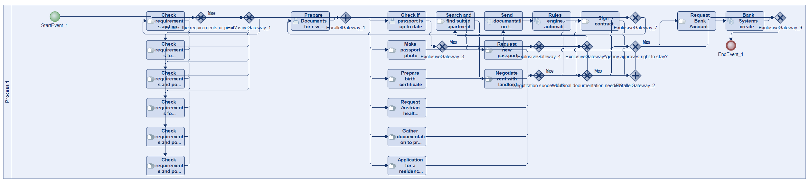
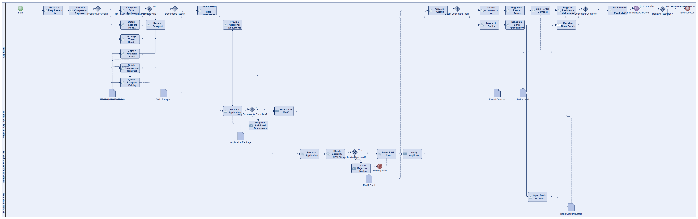
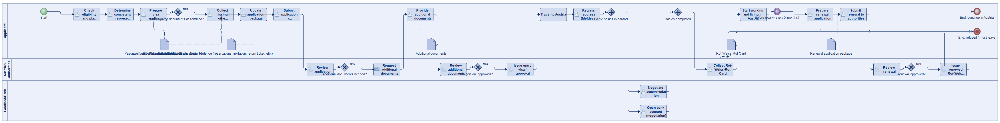
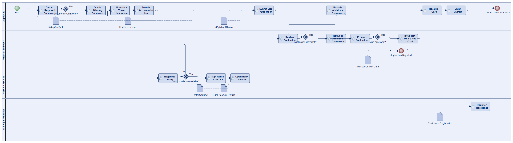
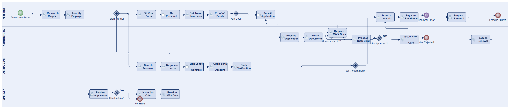
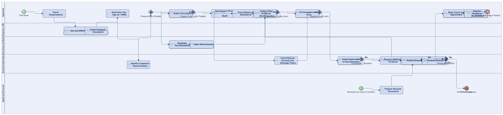

# Scenario 29

**Complexity:** Complex

[← back to comparisons index](README.md)

## Input scenario

> Title: Work and Live in Austria
>
> Please check the requirements for working and living in austria.
> Create a process that assists you for a combination of the steps.
>
> Include:
> * Organizing accomodation and bank account (negotiation)
> * Visa (every x amount of months) - Rot-Weiss-Rot Card  
>
> Requirements  
> General principles and requirements for the issue of Visas:  
> * visa application form 
> * a travel document valid in Austria, with a validity period exceeding the duration of the visa by at least three months and with at least two empty pages, that was issued within the last ten years 
> * a passport photo (portrait format, 35 x 45 mm) in accordance with the specified passport photo criteria 
> * presentation of an fully comprehensive travel health insurance policy for the planned duration of the stay (amount of cover: 30.000 Euro, valid for the entire Schengen area) 
> * proof of sufficient means of subsistence for the duration of the intended stay and for the return journey to the country of origin or residence 
> * other evidence requested by the relevant authorities (hotel reservations, invitations, booking confirmations, return flight ticket, proof of gainful employment etc.) - as these are adapted to local standards and coordinated with other Schengen representations, the evidence to be provided may vary depending on location 
> * absence of other grounds for refusal (residence prohibition, alert issued by a Schengen country)  
>
> Depending on the circumstances, additional documents may be requested.
> Please contact the representation in advance for more information.
>
> Generally speaking, all visa types are issued by representation offices (→ BMEIA) abroad or, in specific exceptional cases, by certain border control posts or, where extension of the visa is permitted, by the state police headquarters.
>
> Schengen visas must be issued by the representation office of the country in which the main travel destination of the visa applicant is located.
> If the applicant intends to spend an equal amount of time in several countries (for example, when touring), the competent representation office is that of the country in whose territory the main travel destination is located, on the basis of the length and purpose of the stay.
> If it is not possible to determine a main travel destination, the member country of first entry into the Schengen area is responsible for issuing the visa.
>
> Territorial competence for applications for category A and C visas falls to the representation office in the consular district where the legal place of residence of the applicant is located.
> A representation office may claim exceptional competence for applications from third‑country nationals legally residing but not registered in their district if the applicant can provide justification as to why they had to submit their application to that particular consulate.
>
> Type D visas, however, must be applied for at the competent Austrian representation.
> The provisions of Section 8 of the FPG apply to type D visas.
> In accordance with these provisions, the territorial competence for carrying out official actions in relation to visas is determined on the basis of the foreign national's the place of residence (i.e. their centre of interest, verifiable by means of e.g. registration forms, residence permit, visa).
>
> A list of all representation offices (addresses, telephone numbers, opening hours, special requirements for issuing visas etc.) can be found on the website of the Federal Ministry of European and International Affairs.

## Reference BPMN (ground truth)

| Lanes | Elements | Gateways | Flows | Data obj. | Data assoc. |
|--:|--:|--:|--:|--:|--:|
| 1 | 35 | 12 | 50 | 0 | 0 |

## Generated BPMN — 6 (approach × LLM) cells

Δ values in parentheses are `(generated − ground_truth)`.

### config-helpers / Claude Opus 4.5  ✅ executed

| metric | ground truth | generated | Δ |
|---|---:|---:|---:|
| Lanes | 1 | 4 | +3 |
| Elements | 35 | 41 | +6 |
| Gateways | 12 | 8 | -4 |
| Flows | 50 | 49 | -1 |
| Data obj. | 0 | 11 | +11 |
| Data assoc. | 0 | 16 | +16 |

**Generation:** 7,674 tokens · 41.1s · $0.108

### config-helpers / GPT-5.2  ✅ executed

| metric | ground truth | generated | Δ |
|---|---:|---:|---:|
| Lanes | 1 | 3 | +2 |
| Elements | 35 | 40 | +5 |
| Gateways | 12 | 6 | -6 |
| Flows | 50 | 34 | -16 |
| Data obj. | 0 | 9 | +9 |
| Data assoc. | 0 | 18 | +18 |

**Generation:** 8,574 tokens · 67.9s · $0.075

### config-helpers / GLM5  ❌ execution failed

| metric | ground truth | generated | Δ |
|---|---:|---:|---:|
| Lanes | 1 | 4 | +3 |
| Elements | 35 | 32 | -3 |
| Gateways | 12 | 4 | -8 |
| Flows | 50 | 25 | -25 |
| Data obj. | 0 | 9 | +9 |
| Data assoc. | 0 | 13 | +13 |

**Generation:** 14,314 tokens · 200.4s · $0.027

> Original experiment-time error: `Script execution failed - check output`

### no-helper / Claude Opus 4.5  ✅ executed

| metric | ground truth | generated | Δ |
|---|---:|---:|---:|
| Lanes | 1 | 4 | +3 |
| Elements | 35 | 35 | 0 |
| Gateways | 12 | 6 | -6 |
| Flows | 50 | 36 | -14 |
| Data obj. | 0 | 0 | 0 |
| Data assoc. | 0 | 0 | 0 |

**Generation:** 20,825 tokens · 76.8s · $0.259

### no-helper / GPT-5.2  ✅ executed

| metric | ground truth | generated | Δ |
|---|---:|---:|---:|
| Lanes | 1 | 5 | +4 |
| Elements | 35 | 36 | +1 |
| Gateways | 12 | 7 | -5 |
| Flows | 50 | 41 | -9 |
| Data obj. | 0 | 0 | 0 |
| Data assoc. | 0 | 0 | 0 |

**Generation:** 20,055 tokens · 100.0s · $0.149

### no-helper / GLM5  ❌ execution failed

_Render failed: `ERROR: ImportError: cannot import name BpmnTimerStartEvent in <script> at line number 74`_  ([log](../runs/no-helper/glm5/scenario_29/diagram_render_error.txt))

| metric | ground truth | generated | Δ |
|---|---:|---:|---:|
| Lanes | 1 | — |  |
| Elements | 35 | — |  |
| Gateways | 12 | — |  |
| Flows | 50 | — |  |
| Data obj. | 0 | — |  |
| Data assoc. | 0 | — |  |

**Generation:** 20,544 tokens · 145.3s · $0.030

> Original experiment-time error: `Script execution failed - check output`
