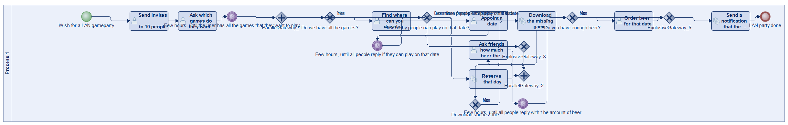
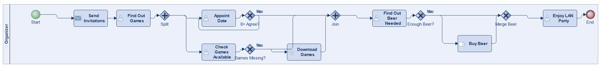
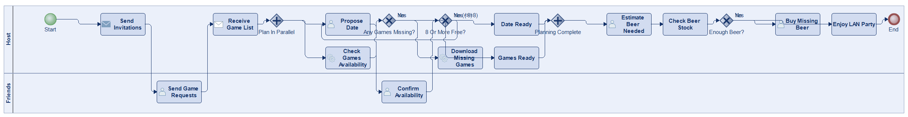
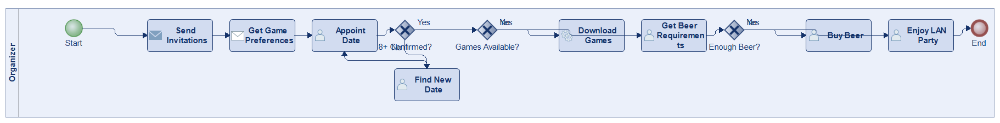
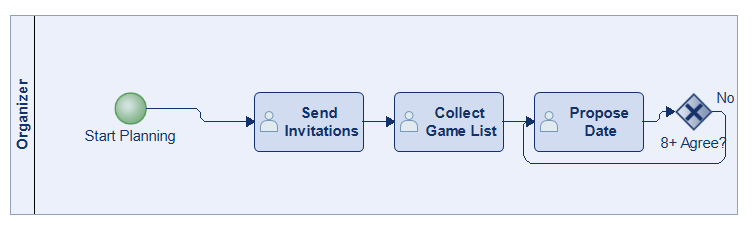
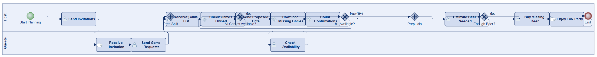
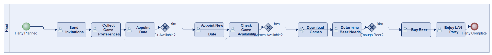

# Scenario 30

**Complexity:** Complex

[← back to comparisons index](README.md)

## Input scenario

> Title: LAN Party
>
> You are planning a LAN party for 10 friends, so the first thing you have to do is to send invitations to these 10 friends.
> Next, you have to find out which games they want to play.
> As soon as you have received a list of games, you can appoint a date when the LAN party is going to happen.
> If 8 or more people agree on this date, you are good to continue.
> Else, you have to appoint another date, until 8 people are free to join you.
> While you find a date, you can find out if you have all the games your guests want to play.
> If some are missing, download them.
> Next, you should find out how much beer your friends will require.
> If you do not have enough, buy what's missing.
> After that, you can enjoy the LAN party.

## Reference BPMN (ground truth)

| Lanes | Elements | Gateways | Flows | Data obj. | Data assoc. |
|--:|--:|--:|--:|--:|--:|
| 1 | 22 | 8 | 26 | 0 | 0 |

## Generated BPMN — 6 (approach × LLM) cells

Δ values in parentheses are `(generated − ground_truth)`.

### config-helpers / Claude Opus 4.5  ✅ executed

| metric | ground truth | generated | Δ |
|---|---:|---:|---:|
| Lanes | 1 | 1 | 0 |
| Elements | 22 | 16 | -6 |
| Gateways | 8 | 6 | -2 |
| Flows | 26 | 19 | -7 |
| Data obj. | 0 | — |  |
| Data assoc. | 0 | — |  |

**Generation:** 4,876 tokens · 15.3s · $0.049

### config-helpers / GPT-5.2  ✅ executed

| metric | ground truth | generated | Δ |
|---|---:|---:|---:|
| Lanes | 1 | 2 | +1 |
| Elements | 22 | 20 | -2 |
| Gateways | 8 | 5 | -3 |
| Flows | 26 | 23 | -3 |
| Data obj. | 0 | 0 | 0 |
| Data assoc. | 0 | 0 | 0 |

**Generation:** 6,211 tokens · 44.6s · $0.048

### config-helpers / GLM5  ✅ executed

| metric | ground truth | generated | Δ |
|---|---:|---:|---:|
| Lanes | 1 | 1 | 0 |
| Elements | 22 | 13 | -9 |
| Gateways | 8 | 3 | -5 |
| Flows | 26 | 15 | -11 |
| Data obj. | 0 | 0 | 0 |
| Data assoc. | 0 | 0 | 0 |

**Generation:** 12,604 tokens · 193.3s · $0.024

### no-helper / Claude Opus 4.5  ✅ executed

| metric | ground truth | generated | Δ |
|---|---:|---:|---:|
| Lanes | 1 | 1 | 0 |
| Elements | 22 | 17 | -5 |
| Gateways | 8 | 7 | -1 |
| Flows | 26 | 20 | -6 |
| Data obj. | 0 | 0 | 0 |
| Data assoc. | 0 | 0 | 0 |

**Generation:** 18,408 tokens · 54.5s · $0.210

### no-helper / GPT-5.2  ✅ executed

| metric | ground truth | generated | Δ |
|---|---:|---:|---:|
| Lanes | 1 | 2 | +1 |
| Elements | 22 | 20 | -2 |
| Gateways | 8 | 5 | -3 |
| Flows | 26 | 23 | -3 |
| Data obj. | 0 | 0 | 0 |
| Data assoc. | 0 | 0 | 0 |

**Generation:** 16,880 tokens · 66.3s · $0.111

### no-helper / GLM5  ✅ executed

| metric | ground truth | generated | Δ |
|---|---:|---:|---:|
| Lanes | 1 | 1 | 0 |
| Elements | 22 | 14 | -8 |
| Gateways | 8 | 3 | -5 |
| Flows | 26 | 16 | -10 |
| Data obj. | 0 | 0 | 0 |
| Data assoc. | 0 | 0 | 0 |

**Generation:** 17,475 tokens · 105.1s · $0.024
