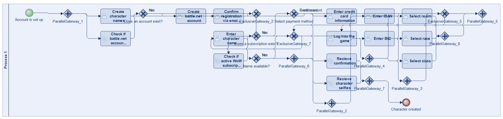
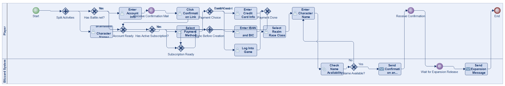
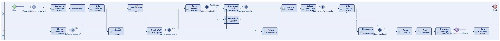
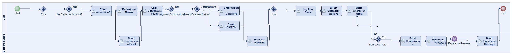
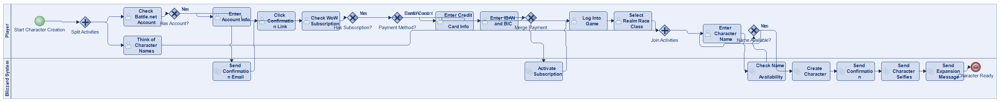
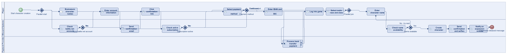
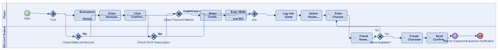

# Scenario 31

**Complexity:** Complex

[← back to comparisons index](README.md)

## Input scenario

> Title: Blizzard Online Character Generator
>
> Blizzard creates a cool online tool for creating characters for their new WoW expansion.
> When creating a World of Warcraft character, you can start doing two things: 
> While you are setting up your account, you can already come up with good character names.
> The setup of your account starts with checking whether you have a battle.net account.
> If you do not have one yet, you enter the account information and click the link you receive in the confirmation mail.
> As soon as you have a battle.net account, you can check if you have an active WoW subscription.
> If not, you can select the payment method.
> If you choose credit card, enter your credit card information.
> If you choose your bank account, enter your IBAN and BIC numbers.
> After that you can log into the game and select realm, race and class of your character.
> Until now, you should have come up with some good names.
> You enter them one by one until a name is still available.
> You get a confirmation, and some selfies of your character, as soon as a expansion is released you get another message.

## Reference BPMN (ground truth)

| Lanes | Elements | Gateways | Flows | Data obj. | Data assoc. |
|--:|--:|--:|--:|--:|--:|
| 1 | 32 | 15 | 40 | 0 | 0 |

## Generated BPMN — 6 (approach × LLM) cells

Δ values in parentheses are `(generated − ground_truth)`.

### config-helpers / Claude Opus 4.5  ✅ executed

| metric | ground truth | generated | Δ |
|---|---:|---:|---:|
| Lanes | 1 | 2 | +1 |
| Elements | 32 | 26 | -6 |
| Gateways | 15 | 9 | -6 |
| Flows | 40 | 30 | -10 |
| Data obj. | 0 | — |  |
| Data assoc. | 0 | — |  |

**Generation:** 5,836 tokens · 27.9s · $0.072

### config-helpers / GPT-5.2  ✅ executed

| metric | ground truth | generated | Δ |
|---|---:|---:|---:|
| Lanes | 1 | 2 | +1 |
| Elements | 32 | 29 | -3 |
| Gateways | 15 | 7 | -8 |
| Flows | 40 | 33 | -7 |
| Data obj. | 0 | 0 | 0 |
| Data assoc. | 0 | 0 | 0 |

**Generation:** 7,259 tokens · 52.4s · $0.062

### config-helpers / GLM5  ✅ executed

| metric | ground truth | generated | Δ |
|---|---:|---:|---:|
| Lanes | 1 | 2 | +1 |
| Elements | 32 | 22 | -10 |
| Gateways | 15 | 6 | -9 |
| Flows | 40 | 26 | -14 |
| Data obj. | 0 | 0 | 0 |
| Data assoc. | 0 | 0 | 0 |

**Generation:** 14,305 tokens · 405.2s · $0.028

### no-helper / Claude Opus 4.5  ✅ executed

| metric | ground truth | generated | Δ |
|---|---:|---:|---:|
| Lanes | 1 | 2 | +1 |
| Elements | 32 | 26 | -6 |
| Gateways | 15 | 7 | -8 |
| Flows | 40 | 30 | -10 |
| Data obj. | 0 | 0 | 0 |
| Data assoc. | 0 | 0 | 0 |

**Generation:** 19,623 tokens · 68.7s · $0.239

### no-helper / GPT-5.2  ✅ executed

| metric | ground truth | generated | Δ |
|---|---:|---:|---:|
| Lanes | 1 | 3 | +2 |
| Elements | 32 | 26 | -6 |
| Gateways | 15 | 6 | -9 |
| Flows | 40 | 30 | -10 |
| Data obj. | 0 | 0 | 0 |
| Data assoc. | 0 | 0 | 0 |

**Generation:** 18,244 tokens · 81.4s · $0.129

### no-helper / GLM5  ✅ executed

| metric | ground truth | generated | Δ |
|---|---:|---:|---:|
| Lanes | 1 | 2 | +1 |
| Elements | 32 | 20 | -12 |
| Gateways | 15 | 6 | -9 |
| Flows | 40 | 24 | -16 |
| Data obj. | 0 | 0 | 0 |
| Data assoc. | 0 | 0 | 0 |

**Generation:** 23,483 tokens · 863.6s · $0.038
