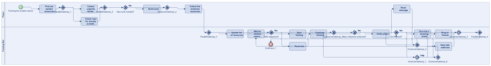
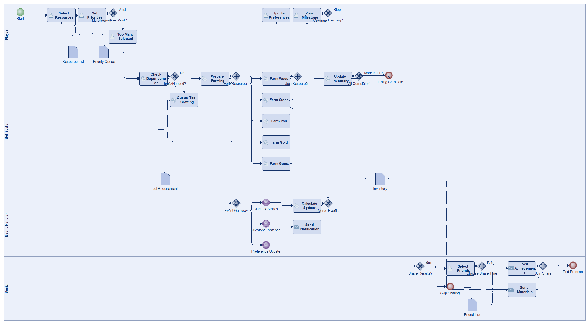
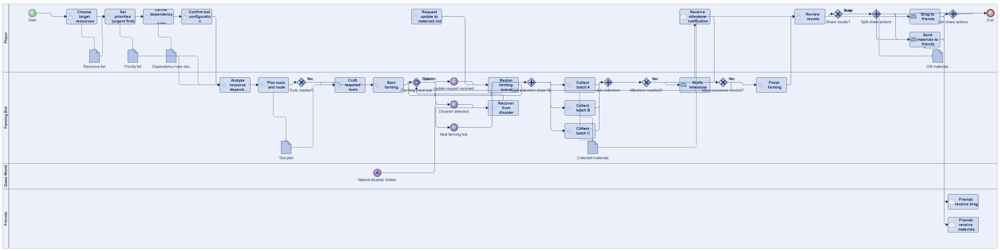
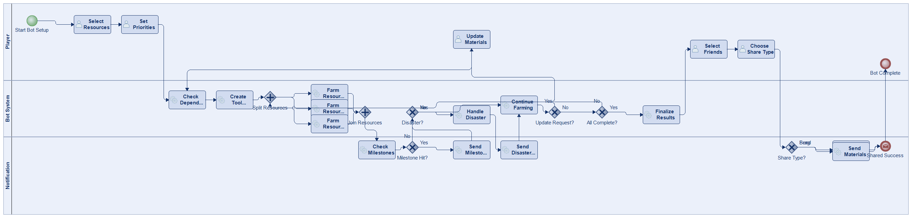
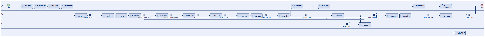

# Scenario 32

**Complexity:** Complex

[← back to comparisons index](README.md)

## Input scenario

> Title: Farming Bot
>
> Players want to create custom farming bots, that help them gather resources.
> First you have to find out which resources you want.
> Up to 10 resources in parallel can be collected, some resources are more urgently needed than others.
> Some resources are required to create tools that are needed to gather other resources (create a custom logic of the dependencies in your game).
> After all preferences are collected, your bot starts farming.
> Sometimes,  random natural disasters strike and set your bot back.
> Whenever some milestones are reached, you are notified.
> During farming it is possible to update the list of to be farmed materials (at all times).
> After the bot is finished, you should be able to brag to selected friends and/or send them materials.

## Reference BPMN (ground truth)

| Lanes | Elements | Gateways | Flows | Data obj. | Data assoc. |
|--:|--:|--:|--:|--:|--:|
| 2 | 31 | 14 | 37 | 0 | 0 |

## Generated BPMN — 6 (approach × LLM) cells

Δ values in parentheses are `(generated − ground_truth)`.

### config-helpers / Claude Opus 4.5  ✅ executed

| metric | ground truth | generated | Δ |
|---|---:|---:|---:|
| Lanes | 2 | 4 | +2 |
| Elements | 31 | 37 | +6 |
| Gateways | 14 | 11 | -3 |
| Flows | 37 | 47 | +10 |
| Data obj. | 0 | 5 | +5 |
| Data assoc. | 0 | 11 | +11 |

**Generation:** 6,501 tokens · 34.2s · $0.090

### config-helpers / GPT-5.2  ✅ executed

| metric | ground truth | generated | Δ |
|---|---:|---:|---:|
| Lanes | 2 | 4 | +2 |
| Elements | 31 | 43 | +12 |
| Gateways | 14 | 9 | -5 |
| Flows | 37 | 47 | +10 |
| Data obj. | 0 | 6 | +6 |
| Data assoc. | 0 | 14 | +14 |

**Generation:** 9,529 tokens · 93.2s · $0.095

### config-helpers / GLM5  ❌ execution failed

_Render failed: `ERROR: ImportError: cannot import name BpmnProcess in <script> at line number 61`_  ([log](../runs/config-helpers/glm5/scenario_32/diagram_render_error.txt))

| metric | ground truth | generated | Δ |
|---|---:|---:|---:|
| Lanes | 2 | — |  |
| Elements | 31 | — |  |
| Gateways | 14 | — |  |
| Flows | 37 | — |  |
| Data obj. | 0 | — |  |
| Data assoc. | 0 | — |  |

**Generation:** 12,527 tokens · 146.4s · $0.024

> Original experiment-time error: `Script execution failed - check output`

### no-helper / Claude Opus 4.5  ✅ executed

| metric | ground truth | generated | Δ |
|---|---:|---:|---:|
| Lanes | 2 | 3 | +1 |
| Elements | 31 | 28 | -3 |
| Gateways | 14 | 7 | -7 |
| Flows | 37 | 34 | -3 |
| Data obj. | 0 | 0 | 0 |
| Data assoc. | 0 | 0 | 0 |

**Generation:** 19,413 tokens · 66.9s · $0.235

### no-helper / GPT-5.2  ✅ executed

| metric | ground truth | generated | Δ |
|---|---:|---:|---:|
| Lanes | 2 | 4 | +2 |
| Elements | 31 | 40 | +9 |
| Gateways | 14 | 11 | -3 |
| Flows | 37 | 47 | +10 |
| Data obj. | 0 | 0 | 0 |
| Data assoc. | 0 | 0 | 0 |

**Generation:** 20,383 tokens · 108.9s · $0.160

### no-helper / GLM5  ❌ execution failed

_Render failed: `ERROR: ImportError: cannot import name BpmnTimerEvent in <script> at line number 84`_  ([log](../runs/no-helper/glm5/scenario_32/diagram_render_error.txt))

| metric | ground truth | generated | Δ |
|---|---:|---:|---:|
| Lanes | 2 | — |  |
| Elements | 31 | — |  |
| Gateways | 14 | — |  |
| Flows | 37 | — |  |
| Data obj. | 0 | — |  |
| Data assoc. | 0 | — |  |

**Generation:** 19,860 tokens · 141.2s · $0.030

> Original experiment-time error: `Script execution failed - check output`
