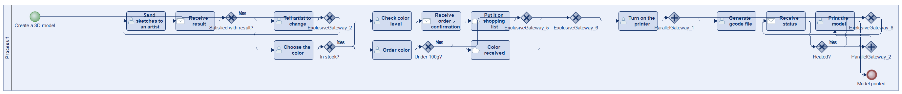
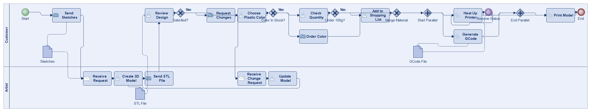
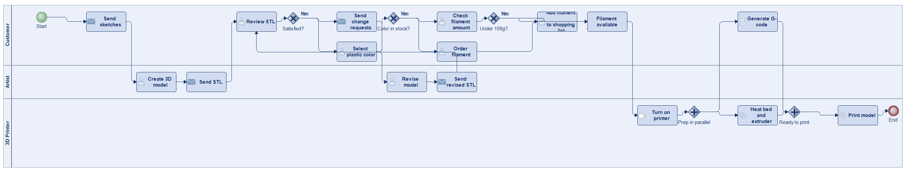
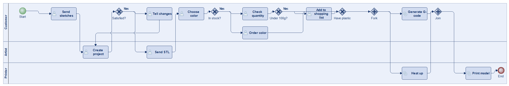
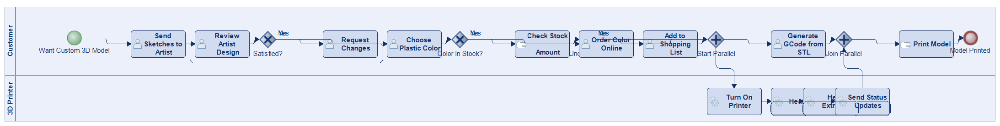
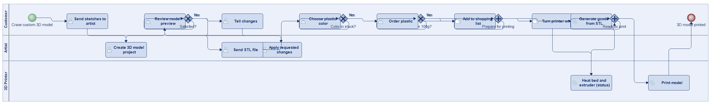
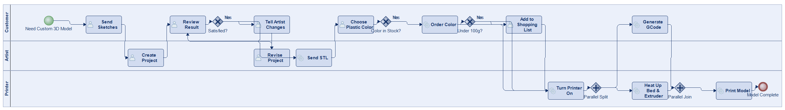

# Scenario 33

**Complexity:** Complex

[← back to comparisons index](README.md)

## Input scenario

> Title: Instruct an artist to create a 3D model print it on a 3D printer
>
> When craving a custom 3D model, as a first step you have to instruct an artist to create a project for you.
> First you have to send him several sketches, and then tell him what to change until you are satisfied with the result.
> After that, you choose a plastic color you want to use for 3D printing.
> If you have the color at home (in stock), you check how much color you have left.
> If it's under 100 grams, you put it on your shopping list.
> If you do not have the color at home, you order it.
> When you have the plastic, you can turn the printer on and heat up the bed and the extruder (it continuously sends you back its status).
> While doing that, you can generate the gcode file for your printer out of the STL sent to you by the artist.
> After that you print the model.

## Reference BPMN (ground truth)

| Lanes | Elements | Gateways | Flows | Data obj. | Data assoc. |
|--:|--:|--:|--:|--:|--:|
| 1 | 25 | 10 | 29 | 0 | 0 |

## Generated BPMN — 6 (approach × LLM) cells

Δ values in parentheses are `(generated − ground_truth)`.

### config-helpers / Claude Opus 4.5  ✅ executed

| metric | ground truth | generated | Δ |
|---|---:|---:|---:|
| Lanes | 1 | 2 | +1 |
| Elements | 25 | 24 | -1 |
| Gateways | 10 | 6 | -4 |
| Flows | 29 | 28 | -1 |
| Data obj. | 0 | 3 | +3 |
| Data assoc. | 0 | 6 | +6 |

**Generation:** 5,575 tokens · 25.5s · $0.066

### config-helpers / GPT-5.2  ✅ executed

| metric | ground truth | generated | Δ |
|---|---:|---:|---:|
| Lanes | 1 | 3 | +2 |
| Elements | 25 | 23 | -2 |
| Gateways | 10 | 5 | -5 |
| Flows | 29 | 26 | -3 |
| Data obj. | 0 | 0 | 0 |
| Data assoc. | 0 | 0 | 0 |

**Generation:** 6,959 tokens · 59.6s · $0.059

### config-helpers / GLM5  ✅ executed

| metric | ground truth | generated | Δ |
|---|---:|---:|---:|
| Lanes | 1 | 3 | +2 |
| Elements | 25 | 19 | -6 |
| Gateways | 10 | 6 | -4 |
| Flows | 29 | 22 | -7 |
| Data obj. | 0 | 0 | 0 |
| Data assoc. | 0 | 0 | 0 |

**Generation:** 15,874 tokens · 192.3s · $0.032

### no-helper / Claude Opus 4.5  ✅ executed

| metric | ground truth | generated | Δ |
|---|---:|---:|---:|
| Lanes | 1 | 2 | +1 |
| Elements | 25 | 20 | -5 |
| Gateways | 10 | 5 | -5 |
| Flows | 29 | 23 | -6 |
| Data obj. | 0 | 0 | 0 |
| Data assoc. | 0 | 0 | 0 |

**Generation:** 19,405 tokens · 64.8s · $0.234

### no-helper / GPT-5.2  ✅ executed

| metric | ground truth | generated | Δ |
|---|---:|---:|---:|
| Lanes | 1 | 3 | +2 |
| Elements | 25 | 21 | -4 |
| Gateways | 10 | 5 | -5 |
| Flows | 29 | 24 | -5 |
| Data obj. | 0 | 0 | 0 |
| Data assoc. | 0 | 0 | 0 |

**Generation:** 17,865 tokens · 81.9s · $0.124

### no-helper / GLM5  ✅ executed

| metric | ground truth | generated | Δ |
|---|---:|---:|---:|
| Lanes | 1 | 3 | +2 |
| Elements | 25 | 21 | -4 |
| Gateways | 10 | 5 | -5 |
| Flows | 29 | 24 | -5 |
| Data obj. | 0 | 0 | 0 |
| Data assoc. | 0 | 0 | 0 |

**Generation:** 20,729 tokens · 861.3s · $0.032
