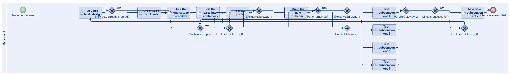
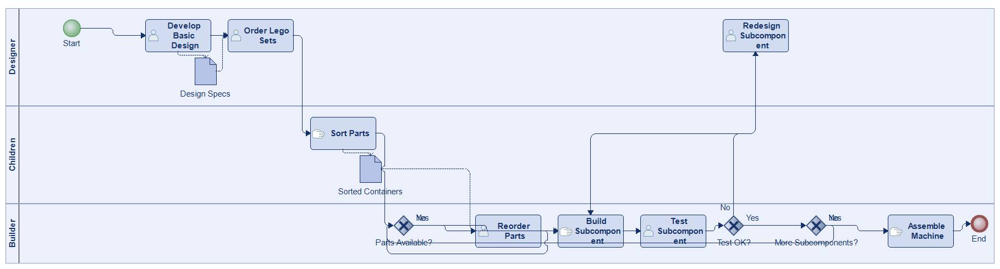
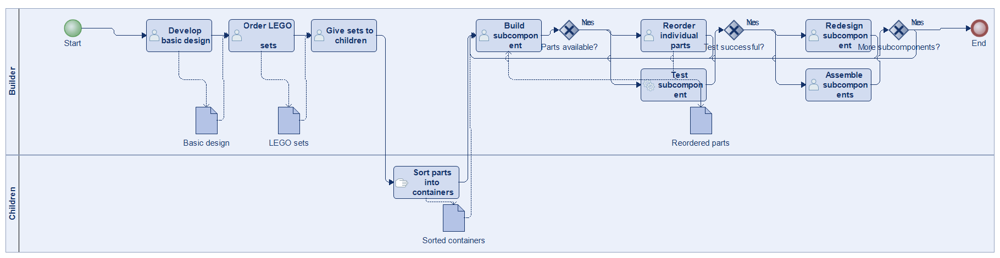
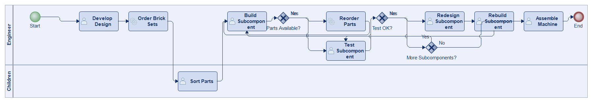
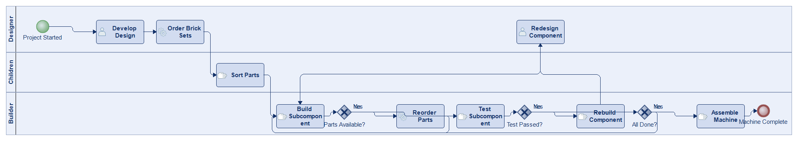
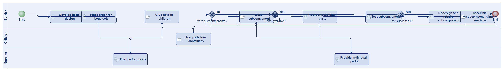
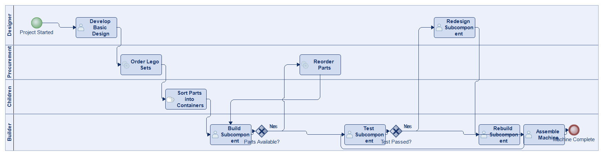

# Scenario 34

**Complexity:** Complex

[← back to comparisons index](README.md)

## Input scenario

> Title: Building a custom machine out of Lego bricks
>
> When building a custom machine out of Lego bricks, you first need to develop the basic design.
> After that, you order certain Lego brick sets.
> You give the lego sets to a group of children which should sort the parts for you (into a number of containers).
> Your machine is built out of a number of subcomponents.
> You build them individually, using parts from the sorted containers.
> If there are no more parts in a container, you reorder individual parts.
> After building each subcomponent, you have to test them individually and (if each test is successful) assemble them.
> If subcomponents are not tested successfully, you have to redesign and rebuild them.

## Reference BPMN (ground truth)

| Lanes | Elements | Gateways | Flows | Data obj. | Data assoc. |
|--:|--:|--:|--:|--:|--:|
| 1 | 23 | 10 | 29 | 0 | 0 |

## Generated BPMN — 6 (approach × LLM) cells

Δ values in parentheses are `(generated − ground_truth)`.

### config-helpers / Claude Opus 4.5  ✅ executed

| metric | ground truth | generated | Δ |
|---|---:|---:|---:|
| Lanes | 1 | 3 | +2 |
| Elements | 23 | 13 | -10 |
| Gateways | 10 | 3 | -7 |
| Flows | 29 | 15 | -14 |
| Data obj. | 0 | 2 | +2 |
| Data assoc. | 0 | 4 | +4 |

**Generation:** 4,834 tokens · 14.6s · $0.048

### config-helpers / GPT-5.2  ✅ executed

| metric | ground truth | generated | Δ |
|---|---:|---:|---:|
| Lanes | 1 | 2 | +1 |
| Elements | 23 | 18 | -5 |
| Gateways | 10 | 3 | -7 |
| Flows | 29 | 16 | -13 |
| Data obj. | 0 | 4 | +4 |
| Data assoc. | 0 | 8 | +8 |

**Generation:** 5,941 tokens · 41.1s · $0.045

### config-helpers / GLM5  ✅ executed

| metric | ground truth | generated | Δ |
|---|---:|---:|---:|
| Lanes | 1 | 2 | +1 |
| Elements | 23 | 14 | -9 |
| Gateways | 10 | 3 | -7 |
| Flows | 29 | 16 | -13 |
| Data obj. | 0 | 0 | 0 |
| Data assoc. | 0 | 0 | 0 |

**Generation:** 8,988 tokens · 113.1s · $0.016

### no-helper / Claude Opus 4.5  ✅ executed

| metric | ground truth | generated | Δ |
|---|---:|---:|---:|
| Lanes | 1 | 3 | +2 |
| Elements | 23 | 14 | -9 |
| Gateways | 10 | 3 | -7 |
| Flows | 29 | 16 | -13 |
| Data obj. | 0 | 0 | 0 |
| Data assoc. | 0 | 0 | 0 |

**Generation:** 18,980 tokens · 60.8s · $0.225

### no-helper / GPT-5.2  ✅ executed

| metric | ground truth | generated | Δ |
|---|---:|---:|---:|
| Lanes | 1 | 3 | +2 |
| Elements | 23 | 16 | -7 |
| Gateways | 10 | 3 | -7 |
| Flows | 29 | 18 | -11 |
| Data obj. | 0 | 0 | 0 |
| Data assoc. | 0 | 0 | 0 |

**Generation:** 16,789 tokens · 69.7s · $0.110

### no-helper / GLM5  ✅ executed

| metric | ground truth | generated | Δ |
|---|---:|---:|---:|
| Lanes | 1 | 4 | +3 |
| Elements | 23 | 13 | -10 |
| Gateways | 10 | 2 | -8 |
| Flows | 29 | 14 | -15 |
| Data obj. | 0 | 0 | 0 |
| Data assoc. | 0 | 0 | 0 |

**Generation:** 21,974 tokens · 169.5s · $0.034
