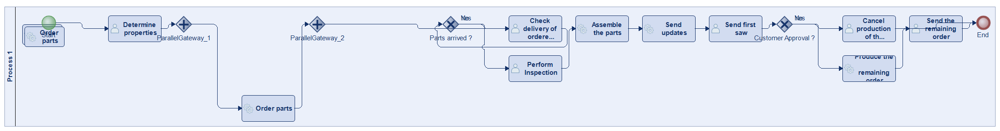
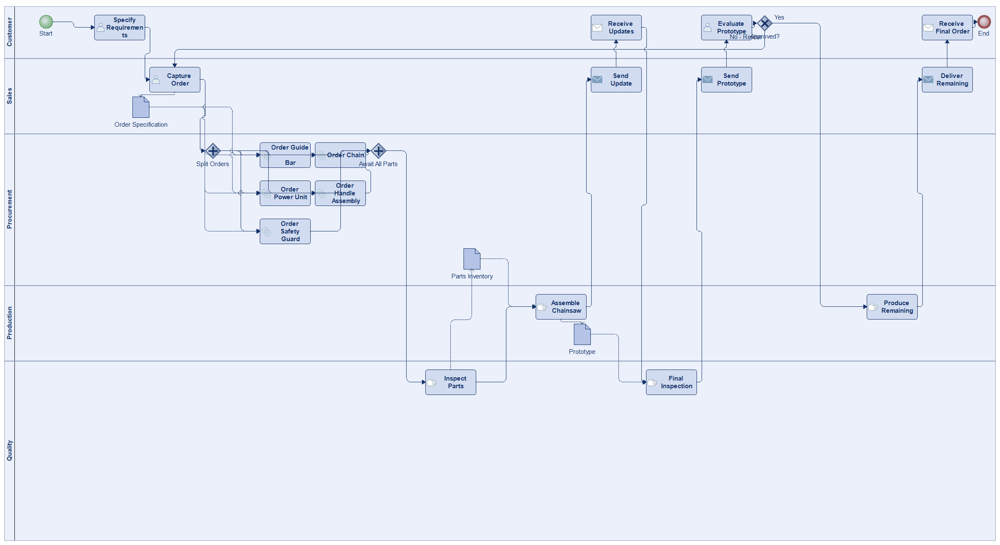
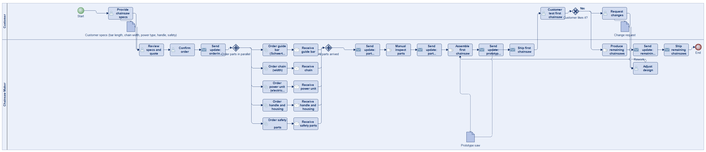
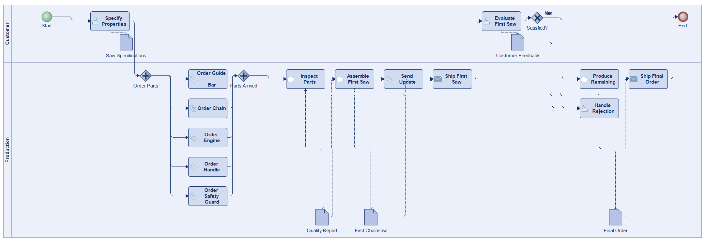
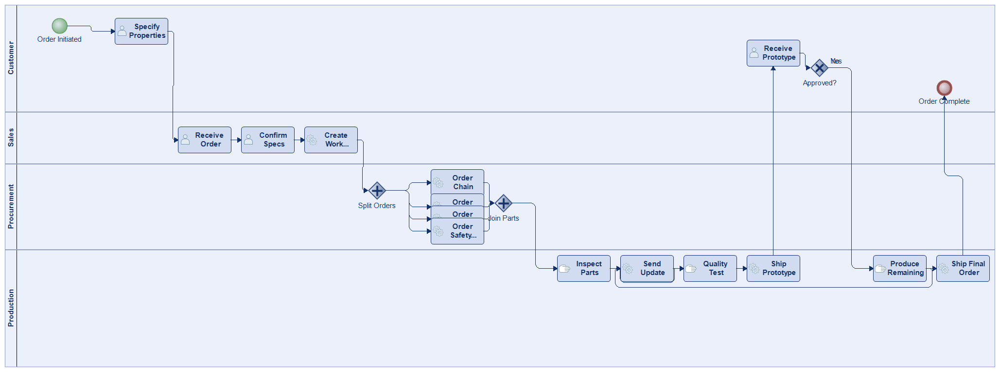
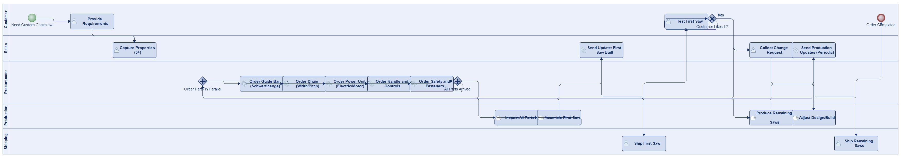
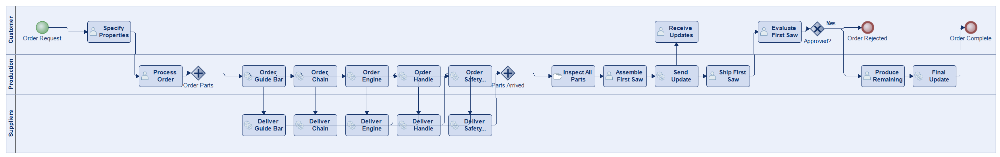

# Scenario 35

**Complexity:** Complex

[← back to comparisons index](README.md)

## Input scenario

> Title: Chainsaw
>
> You produce custom chainsaws on demand.
> Your chainsaws have at least 5 properties such as length of the "guide bar" (Schwertlaenge), chain width, electric or motor chainsaw.
> After your customer told you the properties, you can start ordering the parts from various online sources (in parallel).
> After the parts arrive you have to do a manual inspection of all parts, and then assemble the parts.
> During production, you regularly send updates to your customer.
> After producing the first saw you send it to your customer.
> If he likes it, the rest of his order are produced.

## Reference BPMN (ground truth)

| Lanes | Elements | Gateways | Flows | Data obj. | Data assoc. |
|--:|--:|--:|--:|--:|--:|
| 1 | 18 | 4 | 21 | 0 | 0 |

## Generated BPMN — 6 (approach × LLM) cells

Δ values in parentheses are `(generated − ground_truth)`.

### config-helpers / Claude Opus 4.5  ✅ executed

| metric | ground truth | generated | Δ |
|---|---:|---:|---:|
| Lanes | 1 | 5 | +4 |
| Elements | 18 | 22 | +4 |
| Gateways | 4 | 3 | -1 |
| Flows | 21 | 26 | +5 |
| Data obj. | 0 | 3 | +3 |
| Data assoc. | 0 | 10 | +10 |

**Generation:** 5,503 tokens · 25.5s · $0.066

### config-helpers / GPT-5.2  ✅ executed

| metric | ground truth | generated | Δ |
|---|---:|---:|---:|
| Lanes | 1 | 2 | +1 |
| Elements | 18 | 34 | +16 |
| Gateways | 4 | 3 | -1 |
| Flows | 21 | 35 | +14 |
| Data obj. | 0 | 3 | +3 |
| Data assoc. | 0 | 6 | +6 |

**Generation:** 9,639 tokens · 96.5s · $0.097

### config-helpers / GLM5  ✅ executed

| metric | ground truth | generated | Δ |
|---|---:|---:|---:|
| Lanes | 1 | 2 | +1 |
| Elements | 18 | 24 | +6 |
| Gateways | 4 | 3 | -1 |
| Flows | 21 | 23 | +2 |
| Data obj. | 0 | 5 | +5 |
| Data assoc. | 0 | 9 | +9 |

**Generation:** 10,482 tokens · 139.7s · $0.019

### no-helper / Claude Opus 4.5  ✅ executed

| metric | ground truth | generated | Δ |
|---|---:|---:|---:|
| Lanes | 1 | 4 | +3 |
| Elements | 18 | 23 | +5 |
| Gateways | 4 | 3 | -1 |
| Flows | 21 | 27 | +6 |
| Data obj. | 0 | 0 | 0 |
| Data assoc. | 0 | 0 | 0 |

**Generation:** 20,020 tokens · 72.3s · $0.251

### no-helper / GPT-5.2  ✅ executed

| metric | ground truth | generated | Δ |
|---|---:|---:|---:|
| Lanes | 1 | 5 | +4 |
| Elements | 18 | 23 | +5 |
| Gateways | 4 | 3 | -1 |
| Flows | 21 | 27 | +6 |
| Data obj. | 0 | 0 | 0 |
| Data assoc. | 0 | 0 | 0 |

**Generation:** 17,483 tokens · 77.7s · $0.120

### no-helper / GLM5  ✅ executed

| metric | ground truth | generated | Δ |
|---|---:|---:|---:|
| Lanes | 1 | 3 | +2 |
| Elements | 18 | 26 | +8 |
| Gateways | 4 | 3 | -1 |
| Flows | 21 | 29 | +8 |
| Data obj. | 0 | 0 | 0 |
| Data assoc. | 0 | 0 | 0 |

**Generation:** 20,117 tokens · 135.8s · $0.030
