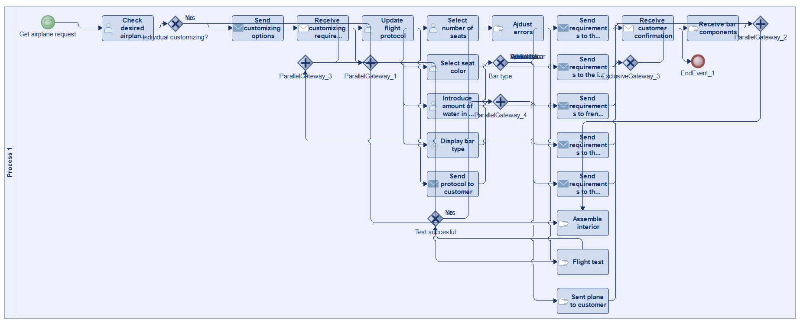
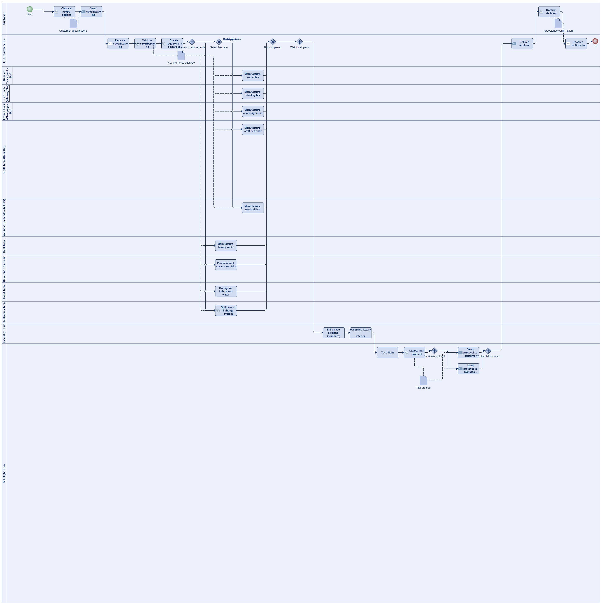
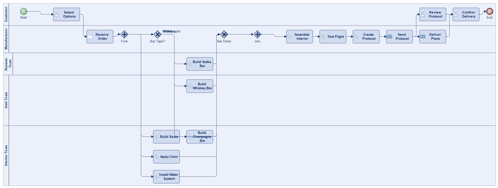
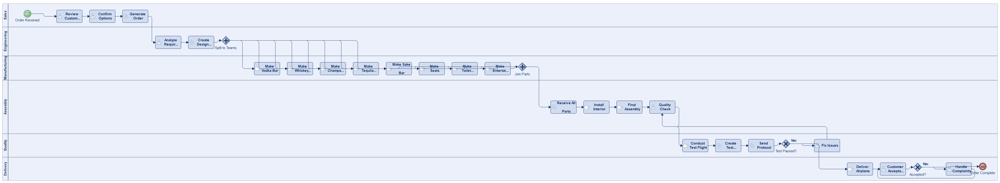
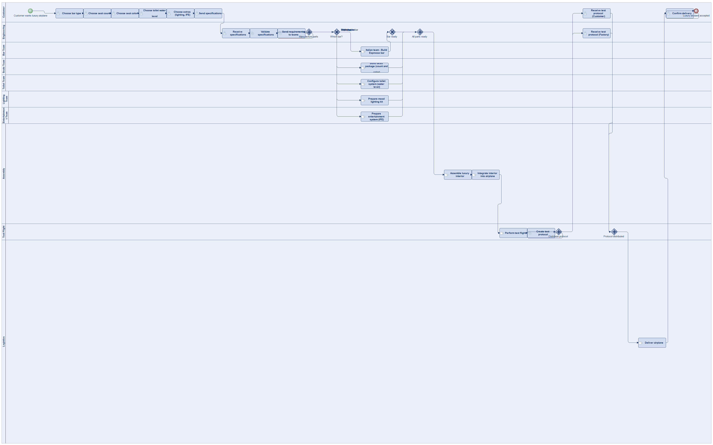

# Scenario 36

**Complexity:** Complex

[← back to comparisons index](README.md)

## Input scenario

> Title: Luxury Airplane
>
> You produce airplanes.
> While the base model is always the same, your customer likes to pimp their airplane with fancy interior.
> You let them decide between a number of 5 different bars, the number of seats, their color, and the amount of water in the toilets of their plane (you can come up with additional stuff).
> After you received the specifications you send the requirements to different teams to manufacture the parts.
> E.g. manufacturing the vodka bar is done by the Russian team, the whiskey bar is manufactured by an Irish team.
> After receiving the individual bits and pieces, the interior of the plane is assembled, and the plane is sent on a test flight.
> During the flight you create a test protocol which is sent to you and the customer.
> The plane is delivered to the customer, which has to confirm.

## Reference BPMN (ground truth)

| Lanes | Elements | Gateways | Flows | Data obj. | Data assoc. |
|--:|--:|--:|--:|--:|--:|
| 1 | 30 | 8 | 39 | 0 | 0 |

## Generated BPMN — 6 (approach × LLM) cells

Δ values in parentheses are `(generated − ground_truth)`.

### config-helpers / Claude Opus 4.5  ⚠️ executed at experiment time, render failed today

_Render failed: `ERROR: org.modelio.vcore.smkernel.IllegalModelManipulationException: IllegalModelManipulationException [Error: -1, object=null, closure=org.`_  ([log](../runs/config-helpers/claude_opus_4_5/scenario_36/diagram_render_error.txt))

| metric | ground truth | generated | Δ |
|---|---:|---:|---:|
| Lanes | 1 | 9 | +8 |
| Elements | 30 | 29 | -1 |
| Gateways | 8 | 3 | -5 |
| Flows | 39 | 36 | -3 |
| Data obj. | 0 | 2 | +2 |
| Data assoc. | 0 | 3 | +3 |

**Generation:** 5,988 tokens · 28.5s · $0.077

### config-helpers / GPT-5.2  ✅ executed

| metric | ground truth | generated | Δ |
|---|---:|---:|---:|
| Lanes | 1 | 13 | +12 |
| Elements | 30 | 35 | +5 |
| Gateways | 8 | 6 | -2 |
| Flows | 39 | 39 | 0 |
| Data obj. | 0 | 4 | +4 |
| Data assoc. | 0 | 17 | +17 |

**Generation:** 8,435 tokens · 79.6s · $0.080

### config-helpers / GLM5  ✅ executed

| metric | ground truth | generated | Δ |
|---|---:|---:|---:|
| Lanes | 1 | 5 | +4 |
| Elements | 30 | 21 | -9 |
| Gateways | 8 | 4 | -4 |
| Flows | 39 | 26 | -13 |
| Data obj. | 0 | 0 | 0 |
| Data assoc. | 0 | 0 | 0 |

**Generation:** 18,555 tokens · 193.5s · $0.038

### no-helper / Claude Opus 4.5  ✅ executed

| metric | ground truth | generated | Δ |
|---|---:|---:|---:|
| Lanes | 1 | 6 | +5 |
| Elements | 30 | 30 | 0 |
| Gateways | 8 | 4 | -4 |
| Flows | 39 | 38 | -1 |
| Data obj. | 0 | 0 | 0 |
| Data assoc. | 0 | 0 | 0 |

**Generation:** 20,204 tokens · 71.8s · $0.255

### no-helper / GPT-5.2  ✅ executed

| metric | ground truth | generated | Δ |
|---|---:|---:|---:|
| Lanes | 1 | 10 | +9 |
| Elements | 30 | 34 | +4 |
| Gateways | 8 | 6 | -2 |
| Flows | 39 | 42 | +3 |
| Data obj. | 0 | 0 | 0 |
| Data assoc. | 0 | 0 | 0 |

**Generation:** 21,520 tokens · 127.5s · $0.176

### no-helper / GLM5  ❌ execution failed

_Render failed: `ERROR: ImportError: cannot import name BpmnMessageEndEvent in <script> at line number 71`_  ([log](../runs/no-helper/glm5/scenario_36/diagram_render_error.txt))

| metric | ground truth | generated | Δ |
|---|---:|---:|---:|
| Lanes | 1 | — |  |
| Elements | 30 | — |  |
| Gateways | 8 | — |  |
| Flows | 39 | — |  |
| Data obj. | 0 | — |  |
| Data assoc. | 0 | — |  |

**Generation:** 20,348 tokens · 157.3s · $0.031

> Original experiment-time error: `Script execution failed - check output`
