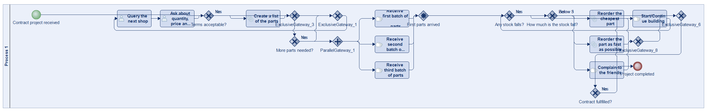
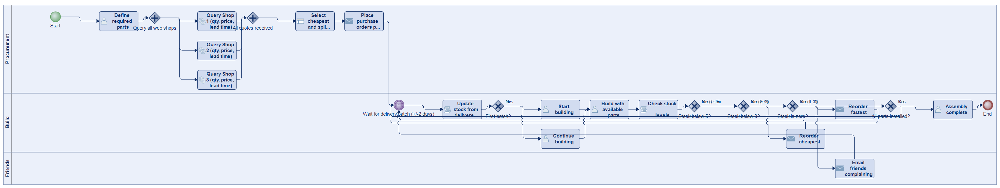
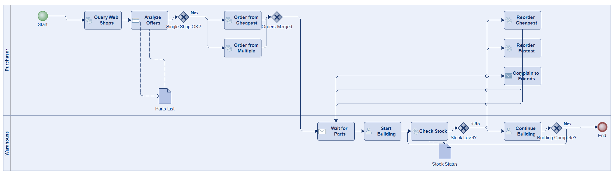
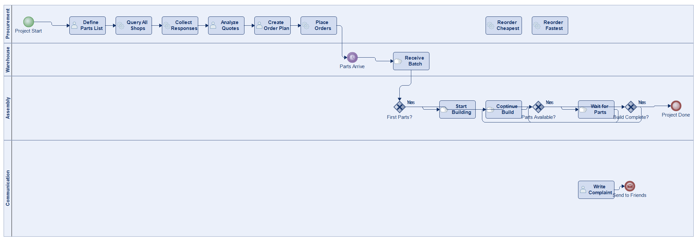
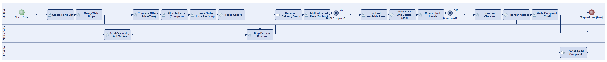
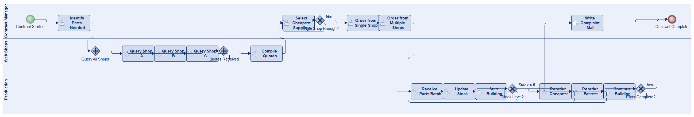

# Scenario 37

**Complexity:** Complex

[← back to comparisons index](README.md)

## Input scenario

> Title: Contract
>
> For your contract project you need parts from several web shops.
> In order to find out which web shop has the right parts, you have to query them all, and find out how much they can deliver, at which price, and how long it will take.
> Create a list of parts that you order from each shop.
> If one shop has not enough  parts, order from several shops.
> Always use the cheapest parts.
> The parts arrive in batches in a random order, typically they are +/- 2 days earlier/later.
> When the first parts arrive you start building.
> Sometimes you have to reorder parts.
> If your stock (for a single part) falls below 5, you reorder (the cheapest), if it falls below 3 you reorder again (the fastest).
> If it is zero, you write a mail to your friends, complaining about the webshops.

## Reference BPMN (ground truth)

| Lanes | Elements | Gateways | Flows | Data obj. | Data assoc. |
|--:|--:|--:|--:|--:|--:|
| 1 | 23 | 11 | 30 | 0 | 0 |

## Generated BPMN — 6 (approach × LLM) cells

Δ values in parentheses are `(generated − ground_truth)`.

### config-helpers / Claude Opus 4.5  ⚠️ executed at experiment time, render failed today

_Render failed: `ERROR: org.modelio.vcore.smkernel.IllegalModelManipulationException: IllegalModelManipulationException [Error: -1, object=null, closure=org.`_  ([log](../runs/config-helpers/claude_opus_4_5/scenario_37/diagram_render_error.txt))

| metric | ground truth | generated | Δ |
|---|---:|---:|---:|
| Lanes | 1 | 4 | +3 |
| Elements | 23 | 21 | -2 |
| Gateways | 11 | 4 | -7 |
| Flows | 30 | 26 | -4 |
| Data obj. | 0 | 5 | +5 |
| Data assoc. | 0 | 7 | +7 |

**Generation:** 5,754 tokens · 29.5s · $0.071

### config-helpers / GPT-5.2  ✅ executed

| metric | ground truth | generated | Δ |
|---|---:|---:|---:|
| Lanes | 1 | 3 | +2 |
| Elements | 23 | 25 | +2 |
| Gateways | 11 | 7 | -4 |
| Flows | 30 | 31 | +1 |
| Data obj. | 0 | 0 | 0 |
| Data assoc. | 0 | 0 | 0 |

**Generation:** 8,872 tokens · 83.9s · $0.086

### config-helpers / GLM5  ✅ executed

| metric | ground truth | generated | Δ |
|---|---:|---:|---:|
| Lanes | 1 | 2 | +1 |
| Elements | 23 | 19 | -4 |
| Gateways | 11 | 4 | -7 |
| Flows | 30 | 21 | -9 |
| Data obj. | 0 | 2 | +2 |
| Data assoc. | 0 | 3 | +3 |

**Generation:** 14,475 tokens · 244.6s · $0.028

### no-helper / Claude Opus 4.5  ✅ executed

| metric | ground truth | generated | Δ |
|---|---:|---:|---:|
| Lanes | 1 | 4 | +3 |
| Elements | 23 | 24 | +1 |
| Gateways | 11 | 6 | -5 |
| Flows | 30 | 30 | 0 |
| Data obj. | 0 | 0 | 0 |
| Data assoc. | 0 | 0 | 0 |

**Generation:** 19,659 tokens · 68.6s · $0.241

### no-helper / GPT-5.2  ✅ executed

| metric | ground truth | generated | Δ |
|---|---:|---:|---:|
| Lanes | 1 | 3 | +2 |
| Elements | 23 | 22 | -1 |
| Gateways | 11 | 2 | -9 |
| Flows | 30 | 24 | -6 |
| Data obj. | 0 | 0 | 0 |
| Data assoc. | 0 | 0 | 0 |

**Generation:** 22,093 tokens · 141.7s · $0.184

### no-helper / GLM5  ✅ executed

| metric | ground truth | generated | Δ |
|---|---:|---:|---:|
| Lanes | 1 | 3 | +2 |
| Elements | 23 | 22 | -1 |
| Gateways | 11 | 5 | -6 |
| Flows | 30 | 28 | -2 |
| Data obj. | 0 | 0 | 0 |
| Data assoc. | 0 | 0 | 0 |

**Generation:** 25,707 tokens · 207.3s · $0.043
