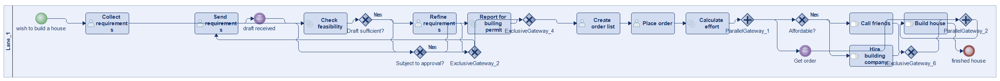
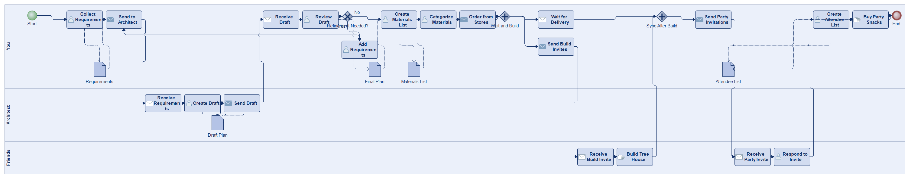
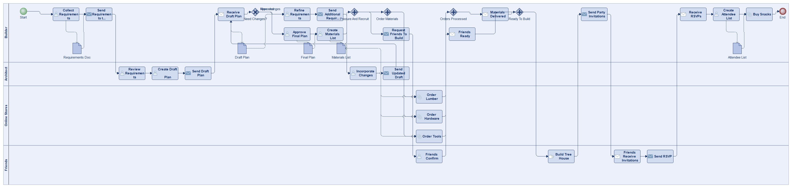
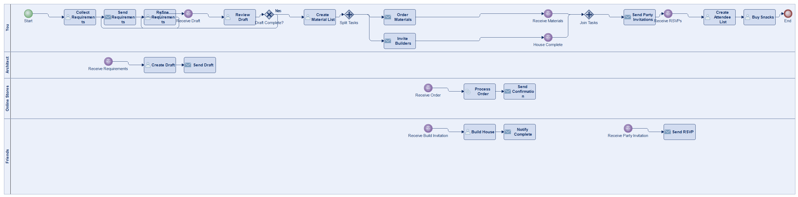
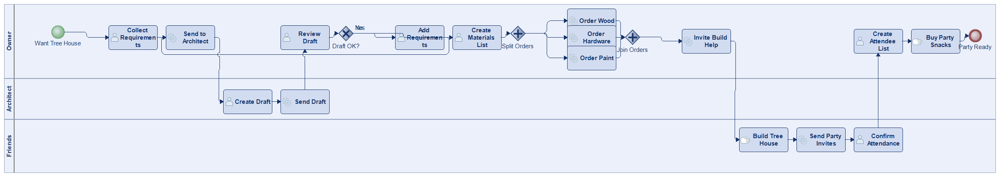
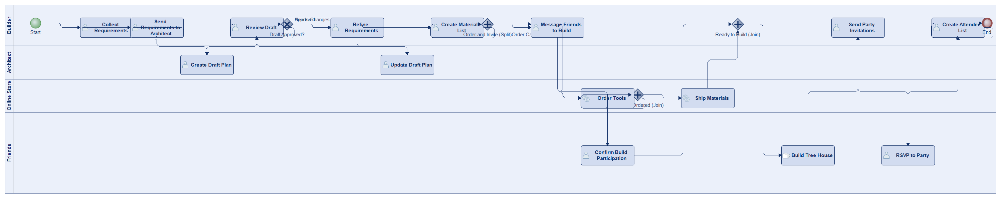
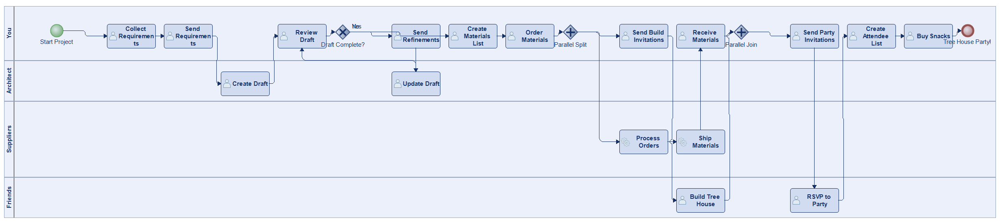

# Scenario 38

**Complexity:** Complex

[← back to comparisons index](README.md)

## Input scenario

> Title: Building a House
>
> You want to build a tree house.
> First you collect your requirements, and send them to a tree house architect.
> The architect sends you back a draft, which you refine multiple times with additional requirements.
> You then create the list of needed materials from the plan.
> These materials fall into several categories, you order them from several online stores.
> While the order is processed, you send messages to several of your friends to build the house.
> After the house is built, you send invitations for a tree house party to your friends.
> In order to buy the snacks for the party, a list of people that attend the party is created.

## Reference BPMN (ground truth)

| Lanes | Elements | Gateways | Flows | Data obj. | Data assoc. |
|--:|--:|--:|--:|--:|--:|
| 1 | 23 | 8 | 26 | 0 | 0 |

## Generated BPMN — 6 (approach × LLM) cells

Δ values in parentheses are `(generated − ground_truth)`.

### config-helpers / Claude Opus 4.5  ✅ executed

| metric | ground truth | generated | Δ |
|---|---:|---:|---:|
| Lanes | 1 | 3 | +2 |
| Elements | 23 | 25 | +2 |
| Gateways | 8 | 3 | -5 |
| Flows | 26 | 26 | 0 |
| Data obj. | 0 | 5 | +5 |
| Data assoc. | 0 | 10 | +10 |

**Generation:** 5,743 tokens · 26.8s · $0.072

### config-helpers / GPT-5.2  ✅ executed

| metric | ground truth | generated | Δ |
|---|---:|---:|---:|
| Lanes | 1 | 4 | +3 |
| Elements | 23 | 38 | +15 |
| Gateways | 8 | 5 | -3 |
| Flows | 26 | 36 | +10 |
| Data obj. | 0 | 5 | +5 |
| Data assoc. | 0 | 12 | +12 |

**Generation:** 8,307 tokens · 72.8s · $0.078

### config-helpers / GLM5  ✅ executed

| metric | ground truth | generated | Δ |
|---|---:|---:|---:|
| Lanes | 1 | 4 | +3 |
| Elements | 23 | 30 | +7 |
| Gateways | 8 | 3 | -5 |
| Flows | 26 | 27 | +1 |
| Data obj. | 0 | 0 | 0 |
| Data assoc. | 0 | 0 | 0 |

**Generation:** 17,532 tokens · 267.1s · $0.035

### no-helper / Claude Opus 4.5  ✅ executed

| metric | ground truth | generated | Δ |
|---|---:|---:|---:|
| Lanes | 1 | 3 | +2 |
| Elements | 23 | 21 | -2 |
| Gateways | 8 | 3 | -5 |
| Flows | 26 | 23 | -3 |
| Data obj. | 0 | 0 | 0 |
| Data assoc. | 0 | 0 | 0 |

**Generation:** 19,450 tokens · 67.4s · $0.237

### no-helper / GPT-5.2  ✅ executed

| metric | ground truth | generated | Δ |
|---|---:|---:|---:|
| Lanes | 1 | 4 | +3 |
| Elements | 23 | 24 | +1 |
| Gateways | 8 | 5 | -3 |
| Flows | 26 | 27 | +1 |
| Data obj. | 0 | 0 | 0 |
| Data assoc. | 0 | 0 | 0 |

**Generation:** 17,483 tokens · 71.3s · $0.120

### no-helper / GLM5  ✅ executed

| metric | ground truth | generated | Δ |
|---|---:|---:|---:|
| Lanes | 1 | 4 | +3 |
| Elements | 23 | 22 | -1 |
| Gateways | 8 | 3 | -5 |
| Flows | 26 | 23 | -3 |
| Data obj. | 0 | 0 | 0 |
| Data assoc. | 0 | 0 | 0 |

**Generation:** 21,348 tokens · 161.6s · $0.033
