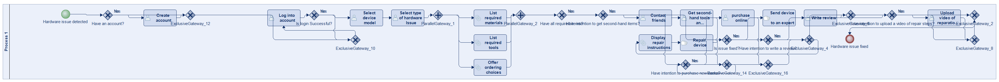
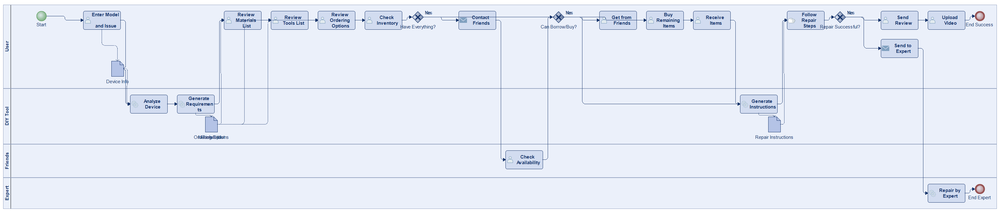
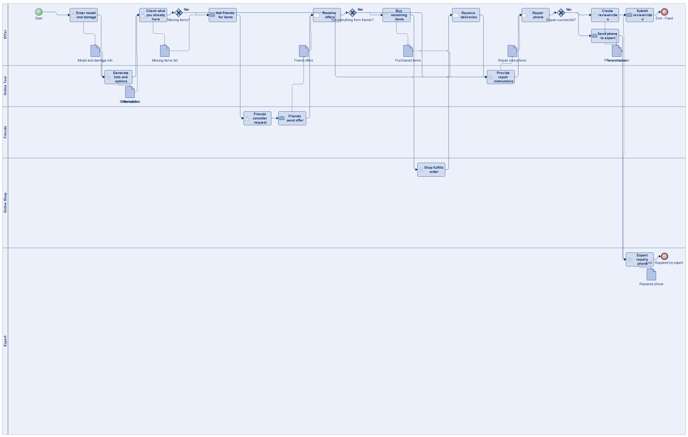
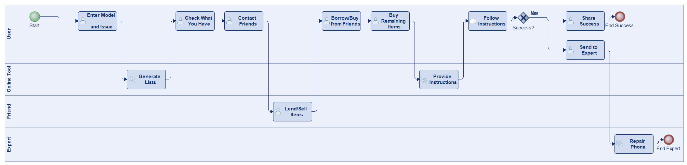
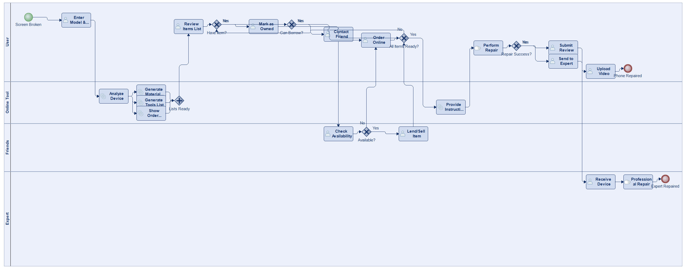
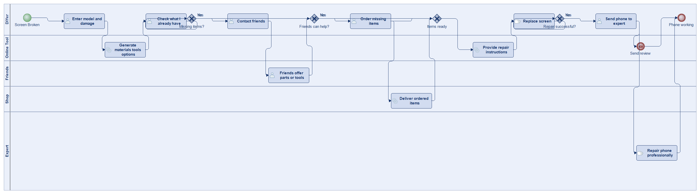
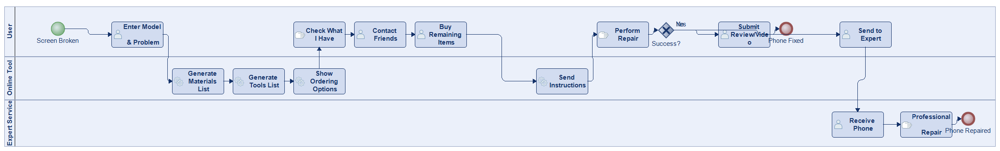

# Scenario 39

**Complexity:** Complex

[← back to comparisons index](README.md)

## Input scenario

> Title: DIY Repair of a Broken Smartphone Screen
>
> A nifty online tool helps you with repairing your Smartphone on your own.
> You start by entering the model and what is broken.
> The tool gives you the list of materials, the list of tools, and (for each part) several ordering choices.
> Some stuff you already have (e.g. some tools, screws).
> The tool also lets you contact friends if you can borrow / buy something for cheap from them.
> The rest you buy.
> Afterwards you receive instructions how to fix your phone.
> If it worked, send a review and/or video of you fixing it.
> If it hasn't worked out, you can send it to an expert.

## Reference BPMN (ground truth)

| Lanes | Elements | Gateways | Flows | Data obj. | Data assoc. |
|--:|--:|--:|--:|--:|--:|
| 1 | 35 | 18 | 44 | 0 | 0 |

## Generated BPMN — 6 (approach × LLM) cells

Δ values in parentheses are `(generated − ground_truth)`.

### config-helpers / Claude Opus 4.5  ✅ executed

| metric | ground truth | generated | Δ |
|---|---:|---:|---:|
| Lanes | 1 | 4 | +3 |
| Elements | 35 | 24 | -11 |
| Gateways | 18 | 3 | -15 |
| Flows | 44 | 25 | -19 |
| Data obj. | 0 | 5 | +5 |
| Data assoc. | 0 | 10 | +10 |

**Generation:** 5,540 tokens · 25.0s · $0.066

### config-helpers / GPT-5.2  ✅ executed

| metric | ground truth | generated | Δ |
|---|---:|---:|---:|
| Lanes | 1 | 5 | +4 |
| Elements | 35 | 33 | -2 |
| Gateways | 18 | 3 | -15 |
| Flows | 44 | 23 | -21 |
| Data obj. | 0 | 11 | +11 |
| Data assoc. | 0 | 21 | +21 |

**Generation:** 7,226 tokens · 57.5s · $0.063

### config-helpers / GLM5  ✅ executed

| metric | ground truth | generated | Δ |
|---|---:|---:|---:|
| Lanes | 1 | 4 | +3 |
| Elements | 35 | 16 | -19 |
| Gateways | 18 | 1 | -17 |
| Flows | 44 | 15 | -29 |
| Data obj. | 0 | 0 | 0 |
| Data assoc. | 0 | 0 | 0 |

**Generation:** 13,662 tokens · 210.3s · $0.027

### no-helper / Claude Opus 4.5  ✅ executed

| metric | ground truth | generated | Δ |
|---|---:|---:|---:|
| Lanes | 1 | 4 | +3 |
| Elements | 35 | 27 | -8 |
| Gateways | 18 | 6 | -12 |
| Flows | 44 | 32 | -12 |
| Data obj. | 0 | 0 | 0 |
| Data assoc. | 0 | 0 | 0 |

**Generation:** 19,810 tokens · 68.2s · $0.245

### no-helper / GPT-5.2  ✅ executed

| metric | ground truth | generated | Δ |
|---|---:|---:|---:|
| Lanes | 1 | 5 | +4 |
| Elements | 35 | 20 | -15 |
| Gateways | 18 | 4 | -14 |
| Flows | 44 | 22 | -22 |
| Data obj. | 0 | 0 | 0 |
| Data assoc. | 0 | 0 | 0 |

**Generation:** 17,448 tokens · 75.4s · $0.119

### no-helper / GLM5  ✅ executed

| metric | ground truth | generated | Δ |
|---|---:|---:|---:|
| Lanes | 1 | 3 | +2 |
| Elements | 35 | 17 | -18 |
| Gateways | 18 | 1 | -17 |
| Flows | 44 | 16 | -28 |
| Data obj. | 0 | 0 | 0 |
| Data assoc. | 0 | 0 | 0 |

**Generation:** 20,274 tokens · 149.0s · $0.031
