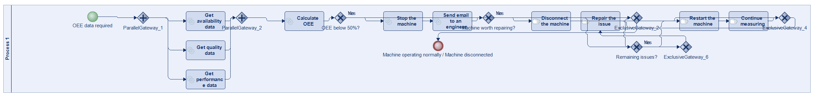
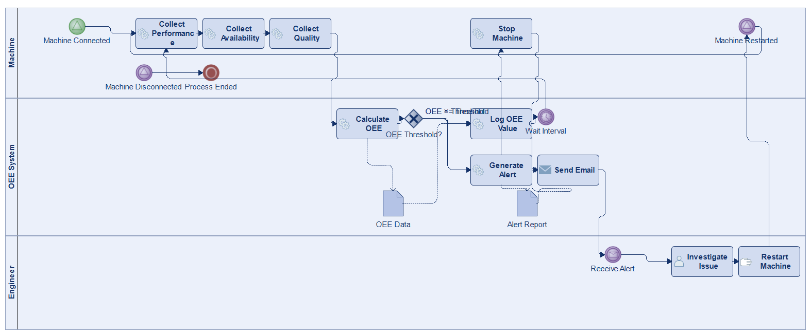
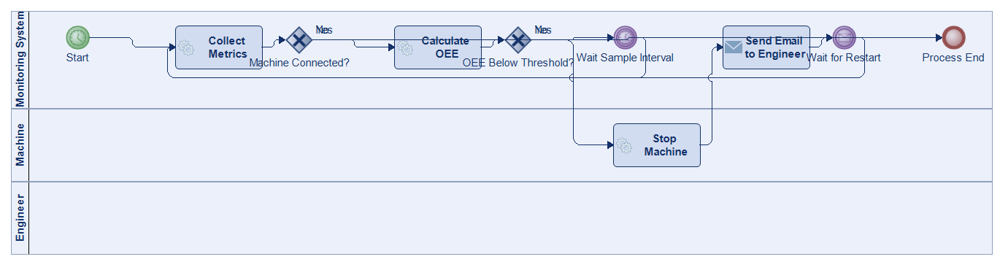
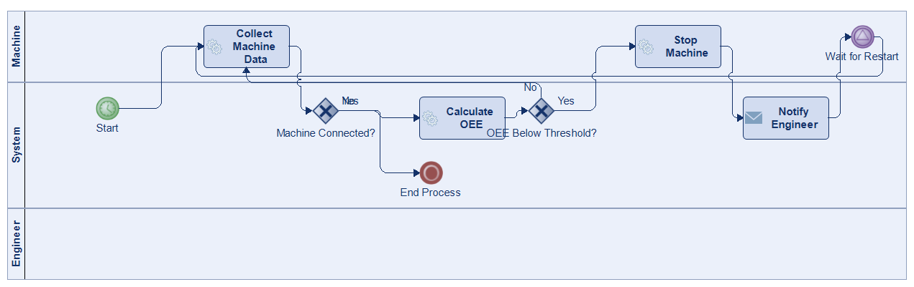
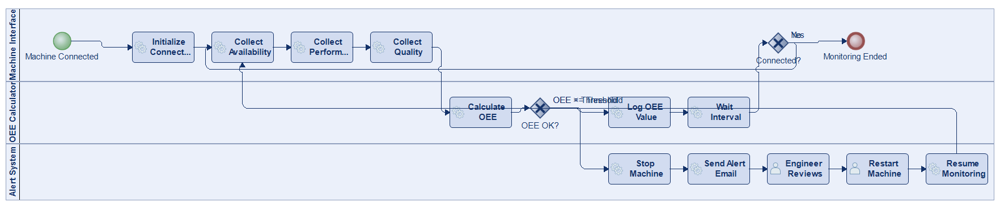
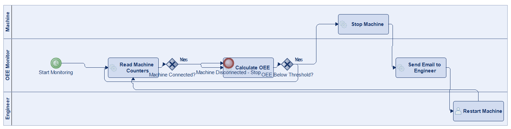
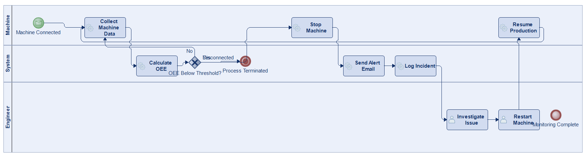

# Scenario 40

**Complexity:** Complex

[← back to comparisons index](README.md)

## Input scenario

> Title: OEE
>
> Write a process, that collects relevant information from a machine, and calculated the Overall Equipment Efficiency (OEE).
> If the OEE falls below a certain value/percentage, stop the machine and send an email to an engineer.
> When the machine is restarted, continue measuring.
> When the machine is disconnected, stop the process.

## Reference BPMN (ground truth)

| Lanes | Elements | Gateways | Flows | Data obj. | Data assoc. |
|--:|--:|--:|--:|--:|--:|
| 1 | 20 | 8 | 24 | 0 | 0 |

## Generated BPMN — 6 (approach × LLM) cells

Δ values in parentheses are `(generated − ground_truth)`.

### config-helpers / Claude Opus 4.5  ✅ executed

| metric | ground truth | generated | Δ |
|---|---:|---:|---:|
| Lanes | 1 | 3 | +2 |
| Elements | 20 | 17 | -3 |
| Gateways | 8 | 1 | -7 |
| Flows | 24 | 17 | -7 |
| Data obj. | 0 | 2 | +2 |
| Data assoc. | 0 | 4 | +4 |

**Generation:** 5,165 tokens · 22.2s · $0.058

### config-helpers / GPT-5.2  ✅ executed

| metric | ground truth | generated | Δ |
|---|---:|---:|---:|
| Lanes | 1 | 3 | +2 |
| Elements | 20 | 10 | -10 |
| Gateways | 8 | 2 | -6 |
| Flows | 24 | 11 | -13 |
| Data obj. | 0 | 0 | 0 |
| Data assoc. | 0 | 0 | 0 |

**Generation:** 4,544 tokens · 21.6s · $0.026

### config-helpers / GLM5  ✅ executed

| metric | ground truth | generated | Δ |
|---|---:|---:|---:|
| Lanes | 1 | 3 | +2 |
| Elements | 20 | 9 | -11 |
| Gateways | 8 | 2 | -6 |
| Flows | 24 | 10 | -14 |
| Data obj. | 0 | 0 | 0 |
| Data assoc. | 0 | 0 | 0 |

**Generation:** 8,579 tokens · 77.7s · $0.015

### no-helper / Claude Opus 4.5  ✅ executed

| metric | ground truth | generated | Δ |
|---|---:|---:|---:|
| Lanes | 1 | 3 | +2 |
| Elements | 20 | 16 | -4 |
| Gateways | 8 | 2 | -6 |
| Flows | 24 | 17 | -7 |
| Data obj. | 0 | 0 | 0 |
| Data assoc. | 0 | 0 | 0 |

**Generation:** 19,135 tokens · 64.3s · $0.230

### no-helper / GPT-5.2  ✅ executed

| metric | ground truth | generated | Δ |
|---|---:|---:|---:|
| Lanes | 1 | 3 | +2 |
| Elements | 20 | 9 | -11 |
| Gateways | 8 | 2 | -6 |
| Flows | 24 | 10 | -14 |
| Data obj. | 0 | 0 | 0 |
| Data assoc. | 0 | 0 | 0 |

**Generation:** 15,745 tokens · 56.5s · $0.096

### no-helper / GLM5  ✅ executed

| metric | ground truth | generated | Δ |
|---|---:|---:|---:|
| Lanes | 1 | 3 | +2 |
| Elements | 20 | 12 | -8 |
| Gateways | 8 | 1 | -7 |
| Flows | 24 | 12 | -12 |
| Data obj. | 0 | 0 | 0 |
| Data assoc. | 0 | 0 | 0 |

**Generation:** 17,116 tokens · 140.5s · $0.023
