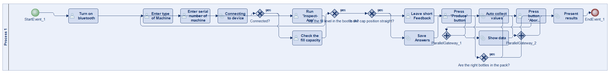
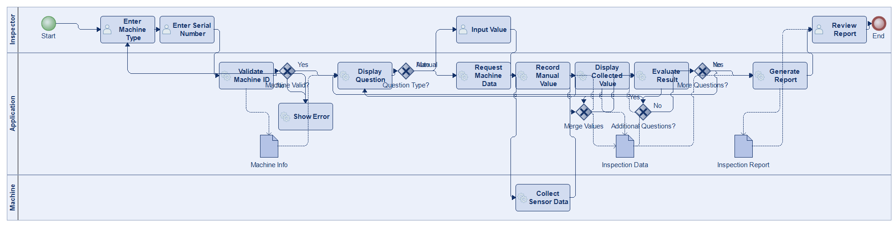
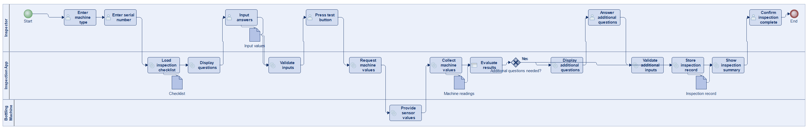
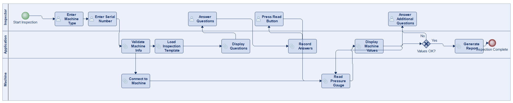
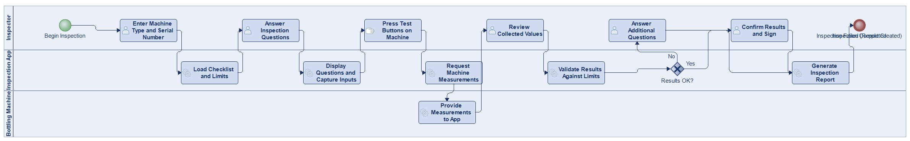
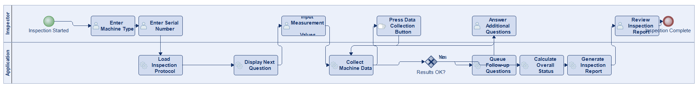

# Scenario 41

**Complexity:** Complex

[← back to comparisons index](README.md)

## Input scenario

> Title: Inspection of an Energy Drink Bottling Machine
>
> You develop an application that helps you with the inspection of a machine.
> After entering the type of the machine, and its serial number, the inspection can begin:
> * Questions are asked, and you have to input values.
> * Buttons are to be pressed, and values are automatically collected from the machine and shown to you.
> * Depending on the results, additional questions are asked (or not).

## Reference BPMN (ground truth)

| Lanes | Elements | Gateways | Flows | Data obj. | Data assoc. |
|--:|--:|--:|--:|--:|--:|
| 1 | 21 | 6 | 25 | 0 | 0 |

## Generated BPMN — 6 (approach × LLM) cells

Δ values in parentheses are `(generated − ground_truth)`.

### config-helpers / Claude Opus 4.5  ✅ executed

| metric | ground truth | generated | Δ |
|---|---:|---:|---:|
| Lanes | 1 | 3 | +2 |
| Elements | 21 | 20 | -1 |
| Gateways | 6 | 5 | -1 |
| Flows | 25 | 23 | -2 |
| Data obj. | 0 | 3 | +3 |
| Data assoc. | 0 | 8 | +8 |

**Generation:** 5,534 tokens · 25.0s · $0.067

### config-helpers / GPT-5.2  ✅ executed

| metric | ground truth | generated | Δ |
|---|---:|---:|---:|
| Lanes | 1 | 3 | +2 |
| Elements | 21 | 24 | +3 |
| Gateways | 6 | 1 | -5 |
| Flows | 25 | 20 | -5 |
| Data obj. | 0 | 4 | +4 |
| Data assoc. | 0 | 7 | +7 |

**Generation:** 5,907 tokens · 38.9s · $0.045

### config-helpers / GLM5  ✅ executed

| metric | ground truth | generated | Δ |
|---|---:|---:|---:|
| Lanes | 1 | 2 | +1 |
| Elements | 21 | 12 | -9 |
| Gateways | 6 | 1 | -5 |
| Flows | 25 | 9 | -16 |
| Data obj. | 0 | 3 | +3 |
| Data assoc. | 0 | 5 | +5 |

**Generation:** 8,967 tokens · 116.7s · $0.016

### no-helper / Claude Opus 4.5  ✅ executed

| metric | ground truth | generated | Δ |
|---|---:|---:|---:|
| Lanes | 1 | 3 | +2 |
| Elements | 21 | 17 | -4 |
| Gateways | 6 | 1 | -5 |
| Flows | 25 | 18 | -7 |
| Data obj. | 0 | 0 | 0 |
| Data assoc. | 0 | 0 | 0 |

**Generation:** 19,421 tokens · 68.5s · $0.237

### no-helper / GPT-5.2  ✅ executed

| metric | ground truth | generated | Δ |
|---|---:|---:|---:|
| Lanes | 1 | 3 | +2 |
| Elements | 21 | 16 | -5 |
| Gateways | 6 | 1 | -5 |
| Flows | 25 | 16 | -9 |
| Data obj. | 0 | 0 | 0 |
| Data assoc. | 0 | 0 | 0 |

**Generation:** 15,896 tokens · 60.2s · $0.098

### no-helper / GLM5  ✅ executed

| metric | ground truth | generated | Δ |
|---|---:|---:|---:|
| Lanes | 1 | 2 | +1 |
| Elements | 21 | 15 | -6 |
| Gateways | 6 | 1 | -5 |
| Flows | 25 | 16 | -9 |
| Data obj. | 0 | 0 | 0 |
| Data assoc. | 0 | 0 | 0 |

**Generation:** 16,353 tokens · 95.1s · $0.022
