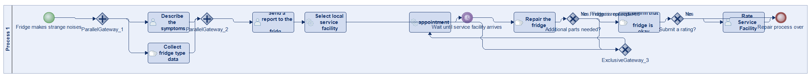
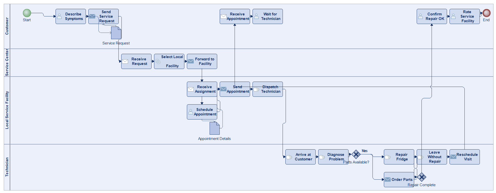
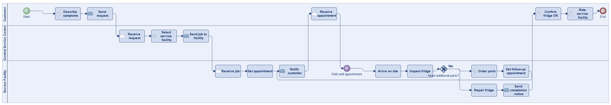
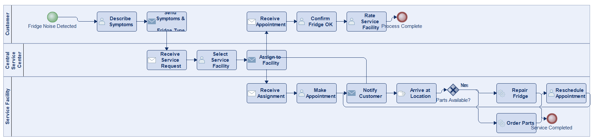
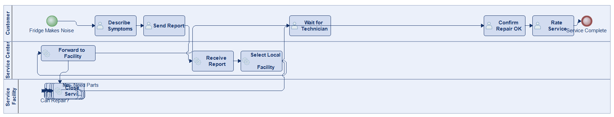
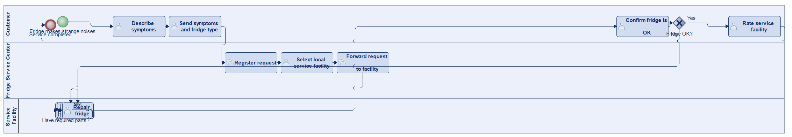
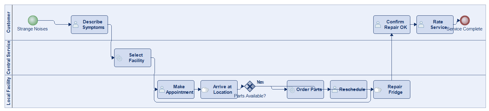

# Scenario 42

**Complexity:** Complex

[← back to comparisons index](README.md)

## Input scenario

> Title: Service for Your Fridge
>
> Your fridge produces strange noises.
> You describe the symptoms, and send them together with the type of fridge to the central fridge service center.
> They select a local service facility (which all have their own way of interacting with customers).
> The service facility makes an appointment.
> They arrive at a random time, and sometimes have to leave without repairing your fridge, because they need additional parts.
> After your fridge is repaired, you have to confirm that it is OK again.
> You can rate the service facility.

## Reference BPMN (ground truth)

| Lanes | Elements | Gateways | Flows | Data obj. | Data assoc. |
|--:|--:|--:|--:|--:|--:|
| 1 | 16 | 5 | 18 | 0 | 0 |

## Generated BPMN — 6 (approach × LLM) cells

Δ values in parentheses are `(generated − ground_truth)`.

### config-helpers / Claude Opus 4.5  ✅ executed

| metric | ground truth | generated | Δ |
|---|---:|---:|---:|
| Lanes | 1 | 4 | +3 |
| Elements | 16 | 23 | +7 |
| Gateways | 5 | 2 | -3 |
| Flows | 18 | 23 | +5 |
| Data obj. | 0 | 2 | +2 |
| Data assoc. | 0 | 4 | +4 |

**Generation:** 5,404 tokens · 22.4s · $0.064

### config-helpers / GPT-5.2  ✅ executed

| metric | ground truth | generated | Δ |
|---|---:|---:|---:|
| Lanes | 1 | 3 | +2 |
| Elements | 16 | 21 | +5 |
| Gateways | 5 | 1 | -4 |
| Flows | 18 | 21 | +3 |
| Data obj. | 0 | 0 | 0 |
| Data assoc. | 0 | 0 | 0 |

**Generation:** 6,956 tokens · 54.3s · $0.060

### config-helpers / GLM5  ✅ executed

| metric | ground truth | generated | Δ |
|---|---:|---:|---:|
| Lanes | 1 | 3 | +2 |
| Elements | 16 | 19 | +3 |
| Gateways | 5 | 1 | -4 |
| Flows | 18 | 19 | +1 |
| Data obj. | 0 | 0 | 0 |
| Data assoc. | 0 | 0 | 0 |

**Generation:** 4,749 tokens · 86.8s · $0.006

### no-helper / Claude Opus 4.5  ✅ executed

| metric | ground truth | generated | Δ |
|---|---:|---:|---:|
| Lanes | 1 | 3 | +2 |
| Elements | 16 | 16 | 0 |
| Gateways | 5 | 1 | -4 |
| Flows | 18 | 17 | -1 |
| Data obj. | 0 | 0 | 0 |
| Data assoc. | 0 | 0 | 0 |

**Generation:** 19,148 tokens · 64.8s · $0.230

### no-helper / GPT-5.2  ✅ executed

| metric | ground truth | generated | Δ |
|---|---:|---:|---:|
| Lanes | 1 | 3 | +2 |
| Elements | 16 | 15 | -1 |
| Gateways | 5 | 2 | -3 |
| Flows | 18 | 16 | -2 |
| Data obj. | 0 | 0 | 0 |
| Data assoc. | 0 | 0 | 0 |

**Generation:** 16,264 tokens · 63.3s · $0.103

### no-helper / GLM5  ✅ executed

| metric | ground truth | generated | Δ |
|---|---:|---:|---:|
| Lanes | 1 | 3 | +2 |
| Elements | 16 | 12 | -4 |
| Gateways | 5 | 1 | -4 |
| Flows | 18 | 12 | -6 |
| Data obj. | 0 | 0 | 0 |
| Data assoc. | 0 | 0 | 0 |

**Generation:** 17,383 tokens · 119.2s · $0.024
