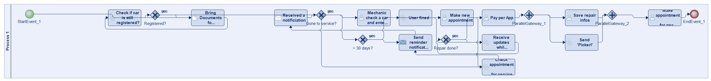
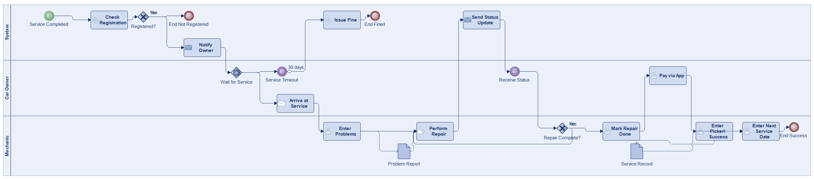
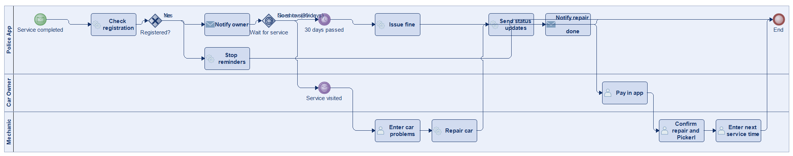
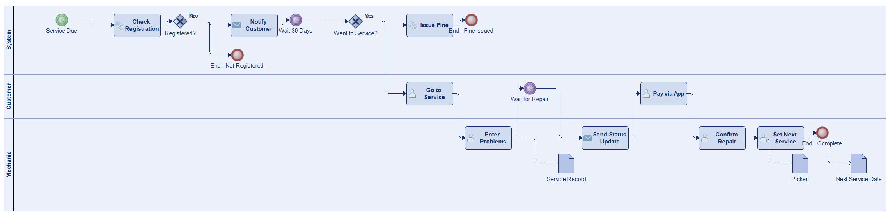
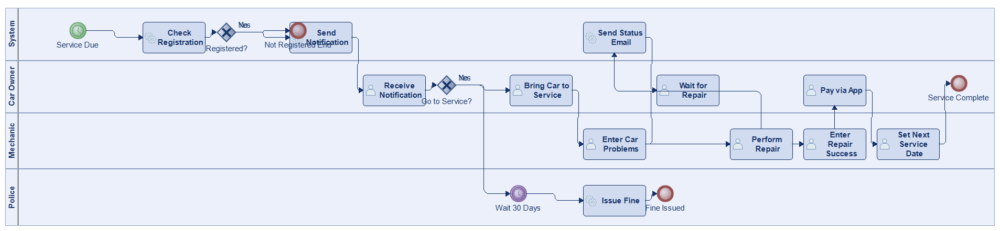
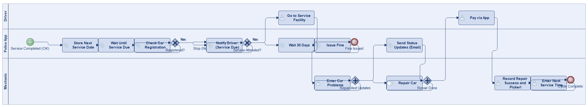
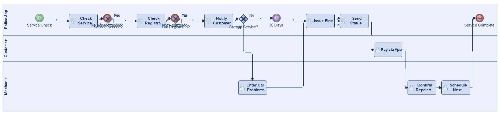

# Scenario 43

**Complexity:** Complex

[← back to comparisons index](README.md)

## Input scenario

> Title: Car Service
>
> The police has a new app to remind you of your car service.
> The process is started after a successful service.
> When a service is necessary, the system checks if your car is still registered.
> If it is registered, you are notified.
> If you do not go to the service, you are fined after 30 days.
> At the car service facility the mechanic enters the problems of your car for reference.
> While you wait (can take several days), you get status updates via email.
> You can pay through the app, when the repair is done.
> The mechanic enters that the repair was successful and you got your "Pickerl".
> The mechanic enters the time for you next service.

## Reference BPMN (ground truth)

| Lanes | Elements | Gateways | Flows | Data obj. | Data assoc. |
|--:|--:|--:|--:|--:|--:|
| 1 | 21 | 6 | 25 | 0 | 0 |

## Generated BPMN — 6 (approach × LLM) cells

Δ values in parentheses are `(generated − ground_truth)`.

### config-helpers / Claude Opus 4.5  ✅ executed

| metric | ground truth | generated | Δ |
|---|---:|---:|---:|
| Lanes | 1 | 3 | +2 |
| Elements | 21 | 20 | -1 |
| Gateways | 6 | 3 | -3 |
| Flows | 25 | 20 | -5 |
| Data obj. | 0 | 2 | +2 |
| Data assoc. | 0 | 4 | +4 |

**Generation:** 5,495 tokens · 24.8s · $0.065

### config-helpers / GPT-5.2  ✅ executed

| metric | ground truth | generated | Δ |
|---|---:|---:|---:|
| Lanes | 1 | 3 | +2 |
| Elements | 21 | 17 | -4 |
| Gateways | 6 | 2 | -4 |
| Flows | 25 | 18 | -7 |
| Data obj. | 0 | 0 | 0 |
| Data assoc. | 0 | 0 | 0 |

**Generation:** 5,683 tokens · 36.1s · $0.041

### config-helpers / GLM5  ✅ executed

| metric | ground truth | generated | Δ |
|---|---:|---:|---:|
| Lanes | 1 | 3 | +2 |
| Elements | 21 | 20 | -1 |
| Gateways | 6 | 2 | -4 |
| Flows | 25 | 16 | -9 |
| Data obj. | 0 | 3 | +3 |
| Data assoc. | 0 | 3 | +3 |

**Generation:** 18,422 tokens · 638.4s · $0.037

### no-helper / Claude Opus 4.5  ✅ executed

| metric | ground truth | generated | Δ |
|---|---:|---:|---:|
| Lanes | 1 | 4 | +3 |
| Elements | 21 | 19 | -2 |
| Gateways | 6 | 2 | -4 |
| Flows | 25 | 19 | -6 |
| Data obj. | 0 | 0 | 0 |
| Data assoc. | 0 | 0 | 0 |

**Generation:** 19,449 tokens · 64.1s · $0.236

### no-helper / GPT-5.2  ✅ executed

| metric | ground truth | generated | Δ |
|---|---:|---:|---:|
| Lanes | 1 | 3 | +2 |
| Elements | 21 | 21 | 0 |
| Gateways | 6 | 4 | -2 |
| Flows | 25 | 21 | -4 |
| Data obj. | 0 | 0 | 0 |
| Data assoc. | 0 | 0 | 0 |

**Generation:** 18,142 tokens · 88.8s · $0.129

### no-helper / GLM5  ✅ executed

| metric | ground truth | generated | Δ |
|---|---:|---:|---:|
| Lanes | 1 | 3 | +2 |
| Elements | 21 | 18 | -3 |
| Gateways | 6 | 3 | -3 |
| Flows | 25 | 17 | -8 |
| Data obj. | 0 | 0 | 0 |
| Data assoc. | 0 | 0 | 0 |

**Generation:** 23,004 tokens · 199.9s · $0.037
