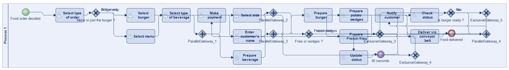
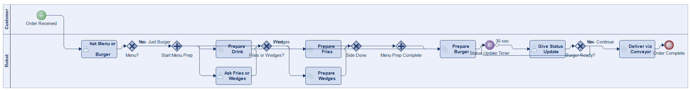
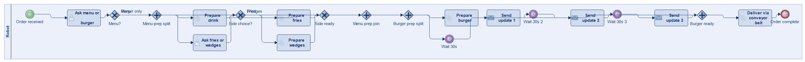
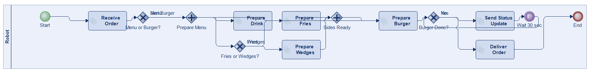
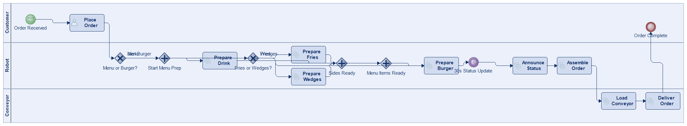
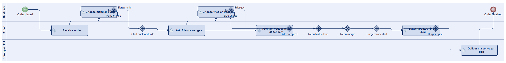
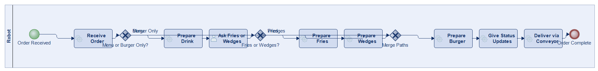

# Scenario 44

**Complexity:** Complex

[← back to comparisons index](README.md)

## Input scenario

> Title: Robotic Burger Seller near the University of Vienna
>
> The robot receives an order.
> It asks whether the customer wants a menu or just the burger.
> If he wants a menu, the robot starts preparing the drink, which depending on the size can take a variable amount of time.
> While doing so, he asks if you want fries or wedges.
> If you want fries, he prepares the fries; if you want wedges, he prepares wedges.
> Again the duration varies depending on the size fries/wedges order.
> After that, he prepares the burger, and gives you enthusiastic status updates every 30 seconds.
> Depending on the number of ingredients, the duration for creating the burger varies.
> Your order is delivered via a conveyor belt.

## Reference BPMN (ground truth)

| Lanes | Elements | Gateways | Flows | Data obj. | Data assoc. |
|--:|--:|--:|--:|--:|--:|
| 1 | 28 | 10 | 32 | 0 | 0 |

## Generated BPMN — 6 (approach × LLM) cells

Δ values in parentheses are `(generated − ground_truth)`.

### config-helpers / Claude Opus 4.5  ✅ executed

| metric | ground truth | generated | Δ |
|---|---:|---:|---:|
| Lanes | 1 | 2 | +1 |
| Elements | 28 | 17 | -11 |
| Gateways | 10 | 6 | -4 |
| Flows | 32 | 20 | -12 |
| Data obj. | 0 | — |  |
| Data assoc. | 0 | — |  |

**Generation:** 5,219 tokens · 20.5s · $0.058

### config-helpers / GPT-5.2  ✅ executed

| metric | ground truth | generated | Δ |
|---|---:|---:|---:|
| Lanes | 1 | 1 | 0 |
| Elements | 28 | 22 | -6 |
| Gateways | 10 | 7 | -3 |
| Flows | 32 | 25 | -7 |
| Data obj. | 0 | 0 | 0 |
| Data assoc. | 0 | 0 | 0 |

**Generation:** 7,071 tokens · 58.6s · $0.061

### config-helpers / GLM5  ✅ executed

| metric | ground truth | generated | Δ |
|---|---:|---:|---:|
| Lanes | 1 | 1 | 0 |
| Elements | 28 | 15 | -13 |
| Gateways | 10 | 5 | -5 |
| Flows | 32 | 18 | -14 |
| Data obj. | 0 | 0 | 0 |
| Data assoc. | 0 | 0 | 0 |

**Generation:** 15,668 tokens · 132.2s · $0.031

### no-helper / Claude Opus 4.5  ✅ executed

| metric | ground truth | generated | Δ |
|---|---:|---:|---:|
| Lanes | 1 | 3 | +2 |
| Elements | 28 | 17 | -11 |
| Gateways | 10 | 5 | -5 |
| Flows | 32 | 19 | -13 |
| Data obj. | 0 | 0 | 0 |
| Data assoc. | 0 | 0 | 0 |

**Generation:** 18,937 tokens · 63.4s · $0.223

### no-helper / GPT-5.2  ✅ executed

| metric | ground truth | generated | Δ |
|---|---:|---:|---:|
| Lanes | 1 | 3 | +2 |
| Elements | 28 | 20 | -8 |
| Gateways | 10 | 8 | -2 |
| Flows | 32 | 23 | -9 |
| Data obj. | 0 | 0 | 0 |
| Data assoc. | 0 | 0 | 0 |

**Generation:** 19,407 tokens · 106.2s · $0.147

### no-helper / GLM5  ✅ executed

| metric | ground truth | generated | Δ |
|---|---:|---:|---:|
| Lanes | 1 | 1 | 0 |
| Elements | 28 | 13 | -15 |
| Gateways | 10 | 3 | -7 |
| Flows | 32 | 14 | -18 |
| Data obj. | 0 | 0 | 0 |
| Data assoc. | 0 | 0 | 0 |

**Generation:** 21,934 tokens · 1153.2s · $0.034
