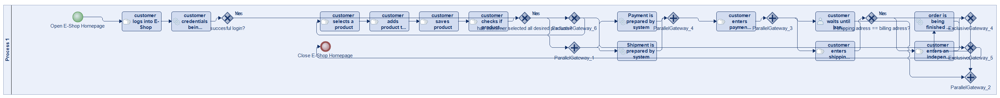
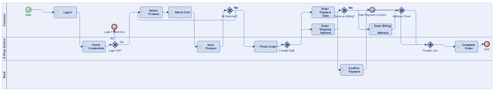
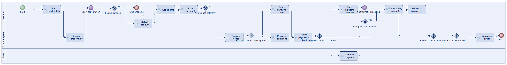
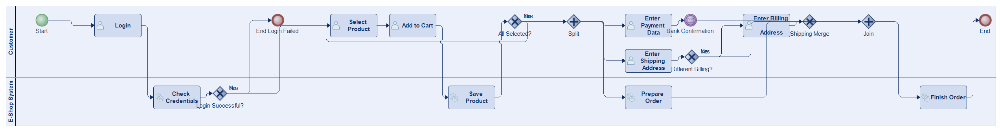
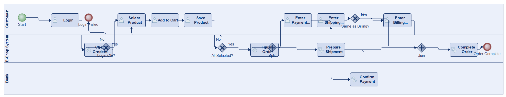
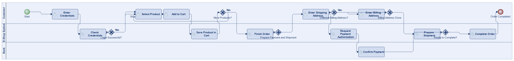
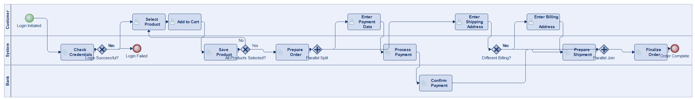

# Scenario 45

**Complexity:** Complex

[← back to comparisons index](README.md)

## Input scenario

> Title: Ordering in an Online Shop  
>
> A customer that logs into an E-Shop system and has to wait for its login confirmation (its credentials are checked by the system).
> If the login was successful then the customer can continue to select products, else the shopping experience stops.
> After selecting a product the customer has to add it to a shopping cart, save the product and check if every product was already selected.
> These steps repeat until all products were selected.
> Then the order is finished by the shopping system and simultaneously payment and shipment for the order is prepared.
> For the payment the customer has to enter its payment data and has to wait until the bank confirms the payment.
> While waiting for the payment confirmation the customer can enter its shipping address (an independent billing address can be entered if the shipping address is not equal to the billing address).
> Finally if the address and the payment steps are executed then the order will be finished by the system.

## Reference BPMN (ground truth)

| Lanes | Elements | Gateways | Flows | Data obj. | Data assoc. |
|--:|--:|--:|--:|--:|--:|
| 1 | 25 | 10 | 29 | 0 | 0 |

## Generated BPMN — 6 (approach × LLM) cells

Δ values in parentheses are `(generated − ground_truth)`.

### config-helpers / Claude Opus 4.5  ✅ executed

| metric | ground truth | generated | Δ |
|---|---:|---:|---:|
| Lanes | 1 | 3 | +2 |
| Elements | 25 | 21 | -4 |
| Gateways | 10 | 6 | -4 |
| Flows | 29 | 23 | -6 |
| Data obj. | 0 | — |  |
| Data assoc. | 0 | — |  |

**Generation:** 5,595 tokens · 26.4s · $0.067

### config-helpers / GPT-5.2  ✅ executed

| metric | ground truth | generated | Δ |
|---|---:|---:|---:|
| Lanes | 1 | 3 | +2 |
| Elements | 25 | 26 | +1 |
| Gateways | 10 | 7 | -3 |
| Flows | 29 | 29 | 0 |
| Data obj. | 0 | 0 | 0 |
| Data assoc. | 0 | 0 | 0 |

**Generation:** 7,253 tokens · 56.2s · $0.063

### config-helpers / GLM5  ✅ executed

| metric | ground truth | generated | Δ |
|---|---:|---:|---:|
| Lanes | 1 | 2 | +1 |
| Elements | 25 | 20 | -5 |
| Gateways | 10 | 6 | -4 |
| Flows | 29 | 23 | -6 |
| Data obj. | 0 | 0 | 0 |
| Data assoc. | 0 | 0 | 0 |

**Generation:** 21,884 tokens · 381.0s · $0.045

### no-helper / Claude Opus 4.5  ✅ executed

| metric | ground truth | generated | Δ |
|---|---:|---:|---:|
| Lanes | 1 | 3 | +2 |
| Elements | 25 | 20 | -5 |
| Gateways | 10 | 5 | -5 |
| Flows | 29 | 22 | -7 |
| Data obj. | 0 | 0 | 0 |
| Data assoc. | 0 | 0 | 0 |

**Generation:** 19,339 tokens · 66.2s · $0.233

### no-helper / GPT-5.2  ✅ executed

| metric | ground truth | generated | Δ |
|---|---:|---:|---:|
| Lanes | 1 | 3 | +2 |
| Elements | 25 | 22 | -3 |
| Gateways | 10 | 6 | -4 |
| Flows | 29 | 24 | -5 |
| Data obj. | 0 | 0 | 0 |
| Data assoc. | 0 | 0 | 0 |

**Generation:** 16,502 tokens · 67.2s · $0.105

### no-helper / GLM5  ✅ executed

| metric | ground truth | generated | Δ |
|---|---:|---:|---:|
| Lanes | 1 | 3 | +2 |
| Elements | 25 | 20 | -5 |
| Gateways | 10 | 5 | -5 |
| Flows | 29 | 22 | -7 |
| Data obj. | 0 | 0 | 0 |
| Data assoc. | 0 | 0 | 0 |

**Generation:** 18,775 tokens · 131.2s · $0.027
