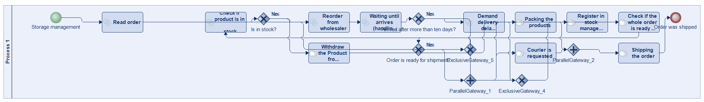
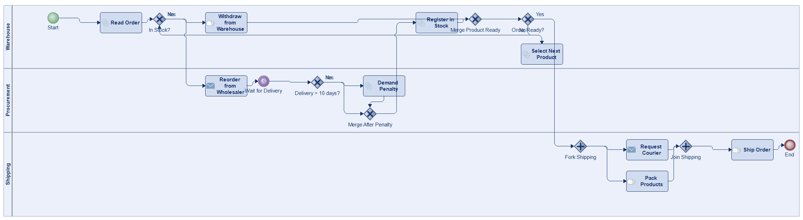
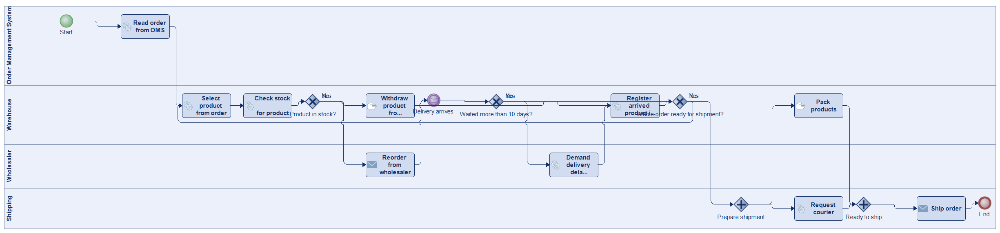
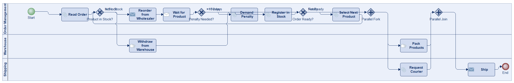
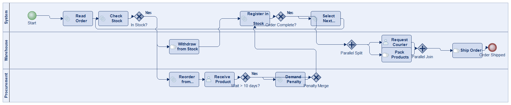
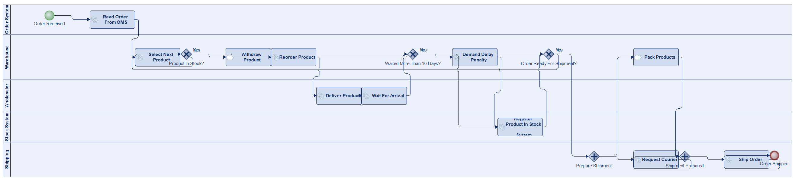
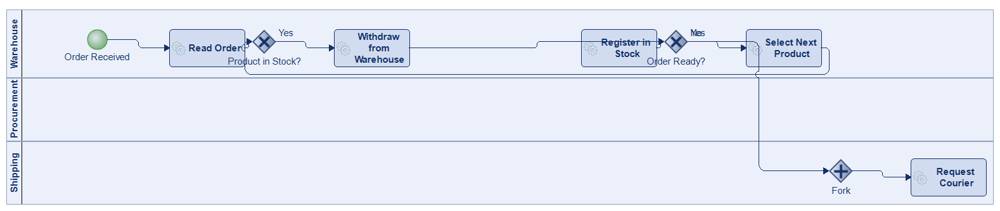

# Scenario 46

**Complexity:** Complex

[← back to comparisons index](README.md)

## Input scenario

> Title: Storage management
>
> First, the order is read from the automatic order management system.
> Then, it's checked if the first product from the order is in stock.
> If it's in stock then it's withdrawn from the warehouse.
> However, if it's not in stock then it's reordered from the wholesaler.
> Note, that if it was necessary to wait more then 10 days for the arrival of the  product then a delivery delay penalty is automatically demanded from the wholesaler.
> After the ordered product has arrived it's registered in the stock management system.
> Finally, it's checked if the whole order is ready for shipment.
> If the order is ready for shipment, a courier is requested and the products are packed simultaneously and finally shipped.
> If it isn't then the next product from the order is selected and the process starts again with checking if this order is in stock or not.

## Reference BPMN (ground truth)

| Lanes | Elements | Gateways | Flows | Data obj. | Data assoc. |
|--:|--:|--:|--:|--:|--:|
| 1 | 20 | 7 | 23 | 0 | 0 |

## Generated BPMN — 6 (approach × LLM) cells

Δ values in parentheses are `(generated − ground_truth)`.

### config-helpers / Claude Opus 4.5  ✅ executed

| metric | ground truth | generated | Δ |
|---|---:|---:|---:|
| Lanes | 1 | 3 | +2 |
| Elements | 20 | 19 | -1 |
| Gateways | 7 | 7 | 0 |
| Flows | 23 | 22 | -1 |
| Data obj. | 0 | — |  |
| Data assoc. | 0 | — |  |

**Generation:** 5,397 tokens · 21.6s · $0.062

### config-helpers / GPT-5.2  ✅ executed

| metric | ground truth | generated | Δ |
|---|---:|---:|---:|
| Lanes | 1 | 4 | +3 |
| Elements | 20 | 18 | -2 |
| Gateways | 7 | 5 | -2 |
| Flows | 23 | 21 | -2 |
| Data obj. | 0 | 0 | 0 |
| Data assoc. | 0 | 0 | 0 |

**Generation:** 5,980 tokens · 39.4s · $0.045

### config-helpers / GLM5  ✅ executed

| metric | ground truth | generated | Δ |
|---|---:|---:|---:|
| Lanes | 1 | 3 | +2 |
| Elements | 20 | 17 | -3 |
| Gateways | 7 | 5 | -2 |
| Flows | 23 | 20 | -3 |
| Data obj. | 0 | 0 | 0 |
| Data assoc. | 0 | 0 | 0 |

**Generation:** 16,312 tokens · 169.3s · $0.033

### no-helper / Claude Opus 4.5  ✅ executed

| metric | ground truth | generated | Δ |
|---|---:|---:|---:|
| Lanes | 1 | 3 | +2 |
| Elements | 20 | 19 | -1 |
| Gateways | 7 | 6 | -1 |
| Flows | 23 | 22 | -1 |
| Data obj. | 0 | 0 | 0 |
| Data assoc. | 0 | 0 | 0 |

**Generation:** 20,063 tokens · 73.5s · $0.251

### no-helper / GPT-5.2  ✅ executed

| metric | ground truth | generated | Δ |
|---|---:|---:|---:|
| Lanes | 1 | 5 | +4 |
| Elements | 20 | 18 | -2 |
| Gateways | 7 | 5 | -2 |
| Flows | 23 | 21 | -2 |
| Data obj. | 0 | 0 | 0 |
| Data assoc. | 0 | 0 | 0 |

**Generation:** 19,404 tokens · 109.0s · $0.146

### no-helper / GLM5  ✅ executed

| metric | ground truth | generated | Δ |
|---|---:|---:|---:|
| Lanes | 1 | 3 | +2 |
| Elements | 20 | 16 | -4 |
| Gateways | 7 | 5 | -2 |
| Flows | 23 | 19 | -4 |
| Data obj. | 0 | 0 | 0 |
| Data assoc. | 0 | 0 | 0 |

**Generation:** 21,185 tokens · 799.9s · $0.033
