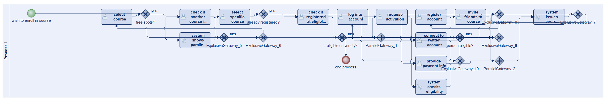
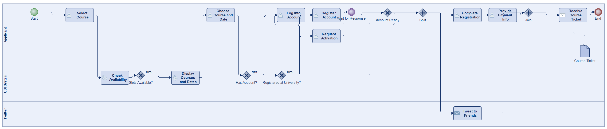
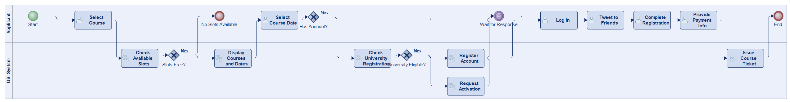
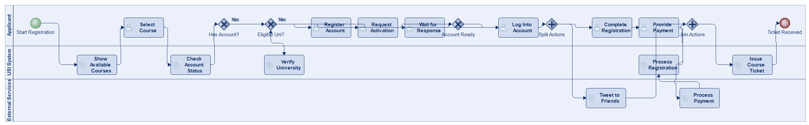
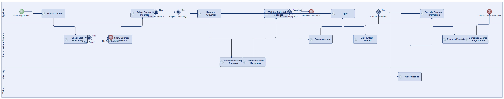
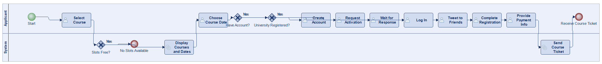

# Scenario 47

**Complexity:** Complex

[← back to comparisons index](README.md)

## Input scenario

> Title: New Application for Registering for an USI course
>
> If you want to register for a course at the sports institute, you need to select a course.
> If slots are free, the system tells you the courses, and dates.
> Select one.
> Next, you need to check if you already have an account at the sports institute.
> If not, you need to check whether you are registered at an eligible university.
> If you are, register your account.
> If you are not, request an activation and wait for a response.
> As soon as you have an account, log into it.
> The application is also connected to your twitter account, and lets you tweet to friends who might want to join you, you can complete the registration for the course and provide the payment information.
> In the end, you will receive a course ticket.

## Reference BPMN (ground truth)

| Lanes | Elements | Gateways | Flows | Data obj. | Data assoc. |
|--:|--:|--:|--:|--:|--:|
| 1 | 27 | 12 | 32 | 0 | 0 |

## Generated BPMN — 6 (approach × LLM) cells

Δ values in parentheses are `(generated − ground_truth)`.

### config-helpers / Claude Opus 4.5  ✅ executed

| metric | ground truth | generated | Δ |
|---|---:|---:|---:|
| Lanes | 1 | 3 | +2 |
| Elements | 27 | 20 | -7 |
| Gateways | 12 | 6 | -6 |
| Flows | 32 | 23 | -9 |
| Data obj. | 0 | 1 | +1 |
| Data assoc. | 0 | 1 | +1 |

**Generation:** 5,365 tokens · 23.5s · $0.061

### config-helpers / GPT-5.2  ⚠️ executed at experiment time, render failed today

_Render failed: `ERROR: org.modelio.vcore.smkernel.IllegalModelManipulationException: IllegalModelManipulationException [Error: -1, object=null, closure=org.`_  ([log](../runs/config-helpers/gpt_5_2/scenario_47/diagram_render_error.txt))

| metric | ground truth | generated | Δ |
|---|---:|---:|---:|
| Lanes | 1 | 4 | +3 |
| Elements | 27 | 24 | -3 |
| Gateways | 12 | 3 | -9 |
| Flows | 32 | 24 | -8 |
| Data obj. | 0 | 2 | +2 |
| Data assoc. | 0 | 3 | +3 |

**Generation:** 7,802 tokens · 65.1s · $0.071

### config-helpers / GLM5  ✅ executed

| metric | ground truth | generated | Δ |
|---|---:|---:|---:|
| Lanes | 1 | 2 | +1 |
| Elements | 27 | 19 | -8 |
| Gateways | 12 | 3 | -9 |
| Flows | 32 | 20 | -12 |
| Data obj. | 0 | 0 | 0 |
| Data assoc. | 0 | 0 | 0 |

**Generation:** 10,003 tokens · 172.7s · $0.018

### no-helper / Claude Opus 4.5  ✅ executed

| metric | ground truth | generated | Δ |
|---|---:|---:|---:|
| Lanes | 1 | 3 | +2 |
| Elements | 27 | 21 | -6 |
| Gateways | 12 | 5 | -7 |
| Flows | 32 | 24 | -8 |
| Data obj. | 0 | 0 | 0 |
| Data assoc. | 0 | 0 | 0 |

**Generation:** 19,359 tokens · 69.6s · $0.234

### no-helper / GPT-5.2  ✅ executed

| metric | ground truth | generated | Δ |
|---|---:|---:|---:|
| Lanes | 1 | 4 | +3 |
| Elements | 27 | 25 | -2 |
| Gateways | 12 | 5 | -7 |
| Flows | 32 | 27 | -5 |
| Data obj. | 0 | 0 | 0 |
| Data assoc. | 0 | 0 | 0 |

**Generation:** 18,942 tokens · 103.1s · $0.140

### no-helper / GLM5  ✅ executed

| metric | ground truth | generated | Δ |
|---|---:|---:|---:|
| Lanes | 1 | 2 | +1 |
| Elements | 27 | 17 | -10 |
| Gateways | 12 | 3 | -9 |
| Flows | 32 | 18 | -14 |
| Data obj. | 0 | 0 | 0 |
| Data assoc. | 0 | 0 | 0 |

**Generation:** 23,499 tokens · 243.6s · $0.038
