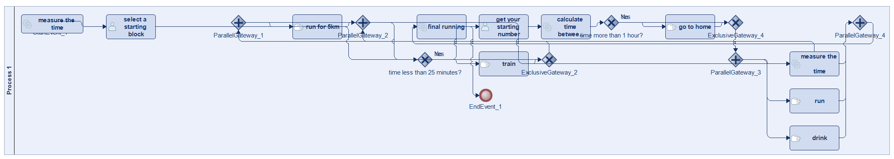
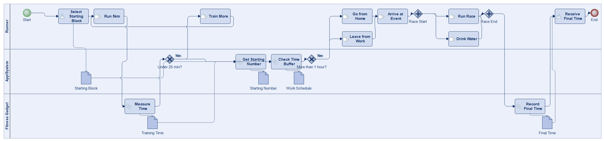
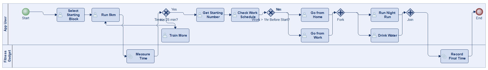
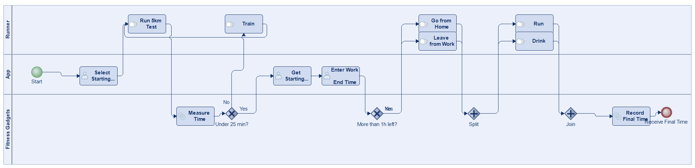
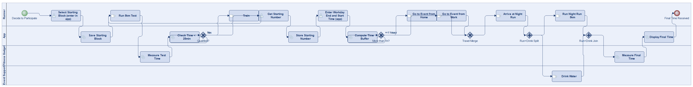
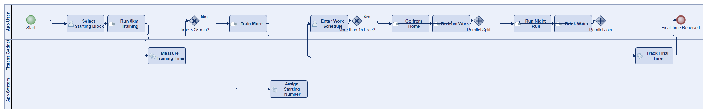

# Scenario 48

**Complexity:** Complex

[← back to comparisons index](README.md)

## Input scenario

> Title: App For Participating at the Vienna Night Run
>
> If you want to participate at the Vienna Night Run, you need to select a starting block first.
> After that, you run for 5km and measure the time.
> If you can do it in less than 25 minutes, you are good.
> If not, you need to train and check until you have achieved this goal.
> After that, you can get your starting number.
> Depending on when your work day ends, you have to find out whether you can go there from home, or need to leave directly from work.
> If more than one hour is left between your starting time and the end of your workday, you can go there from home.
> Else, you need to leave directly from work.
> While running at the Night Run, you run and drink at the same time.
> In the end, you receive your final running time.
>
> Some of the above information you have to enter into the app, some of the information is collected by fitness gadgets.

## Reference BPMN (ground truth)

| Lanes | Elements | Gateways | Flows | Data obj. | Data assoc. |
|--:|--:|--:|--:|--:|--:|
| 1 | 21 | 8 | 25 | 0 | 0 |

## Generated BPMN — 6 (approach × LLM) cells

Δ values in parentheses are `(generated − ground_truth)`.

### config-helpers / Claude Opus 4.5  ✅ executed

| metric | ground truth | generated | Δ |
|---|---:|---:|---:|
| Lanes | 1 | 3 | +2 |
| Elements | 21 | 19 | -2 |
| Gateways | 8 | 4 | -4 |
| Flows | 25 | 21 | -4 |
| Data obj. | 0 | 5 | +5 |
| Data assoc. | 0 | 8 | +8 |

**Generation:** 5,425 tokens · 21.2s · $0.062

### config-helpers / GPT-5.2  ✅ executed

| metric | ground truth | generated | Δ |
|---|---:|---:|---:|
| Lanes | 1 | 3 | +2 |
| Elements | 21 | 26 | +5 |
| Gateways | 8 | 5 | -3 |
| Flows | 25 | 23 | -2 |
| Data obj. | 0 | 5 | +5 |
| Data assoc. | 0 | 9 | +9 |

**Generation:** 7,228 tokens · 52.2s · $0.062

### config-helpers / GLM5  ✅ executed

| metric | ground truth | generated | Δ |
|---|---:|---:|---:|
| Lanes | 1 | 2 | +1 |
| Elements | 21 | 17 | -4 |
| Gateways | 8 | 4 | -4 |
| Flows | 25 | 19 | -6 |
| Data obj. | 0 | 0 | 0 |
| Data assoc. | 0 | 0 | 0 |

**Generation:** 17,962 tokens · 264.5s · $0.036

### no-helper / Claude Opus 4.5  ✅ executed

| metric | ground truth | generated | Δ |
|---|---:|---:|---:|
| Lanes | 1 | 3 | +2 |
| Elements | 21 | 17 | -4 |
| Gateways | 8 | 4 | -4 |
| Flows | 25 | 19 | -6 |
| Data obj. | 0 | 0 | 0 |
| Data assoc. | 0 | 0 | 0 |

**Generation:** 19,405 tokens · 68.7s · $0.234

### no-helper / GPT-5.2  ✅ executed

| metric | ground truth | generated | Δ |
|---|---:|---:|---:|
| Lanes | 1 | 4 | +3 |
| Elements | 21 | 24 | +3 |
| Gateways | 8 | 5 | -3 |
| Flows | 25 | 26 | +1 |
| Data obj. | 0 | 0 | 0 |
| Data assoc. | 0 | 0 | 0 |

**Generation:** 18,264 tokens · 89.8s · $0.130

### no-helper / GLM5  ✅ executed

| metric | ground truth | generated | Δ |
|---|---:|---:|---:|
| Lanes | 1 | 3 | +2 |
| Elements | 21 | 17 | -4 |
| Gateways | 8 | 4 | -4 |
| Flows | 25 | 19 | -6 |
| Data obj. | 0 | 0 | 0 |
| Data assoc. | 0 | 0 | 0 |

**Generation:** 22,695 tokens · 175.0s · $0.036
