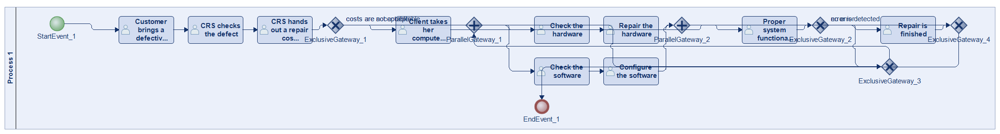
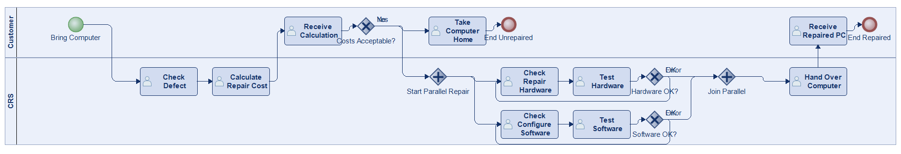
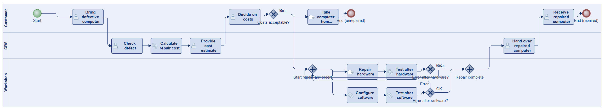
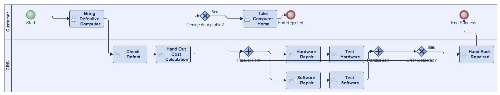
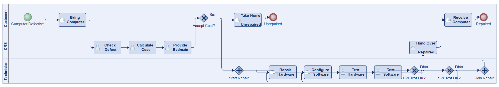
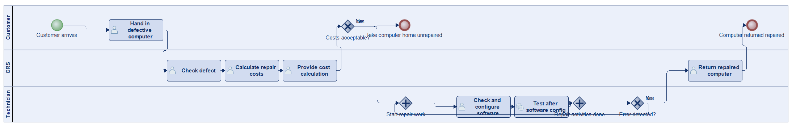
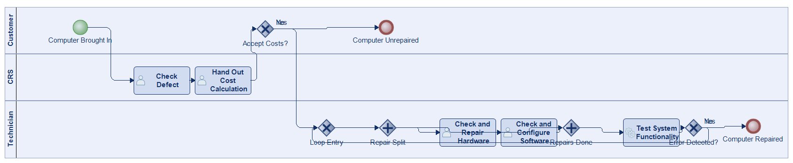

# Scenario 49

**Complexity:** Complex

[← back to comparisons index](README.md)

## Input scenario

> A customer brings in a defective computer and the CRS checks the defect and hands out a repair cost calculation back.
> If the customer decides that the costs are acceptable, the process continues, otherwise she takes her computer home unrepaired.
> The ongoing repair consists of two activities, which are executed, in an arbitrary order.
> The first activity is to check and repair the hardware, whereas the second activity checks and configures the software.
> After each of these activities, the proper system functionality is tested.
> If an error is detected another arbitrary repair activity is executed, otherwise the repair is finished.

## Reference BPMN (ground truth)

| Lanes | Elements | Gateways | Flows | Data obj. | Data assoc. |
|--:|--:|--:|--:|--:|--:|
| 1 | 18 | 6 | 20 | 0 | 0 |

## Generated BPMN — 6 (approach × LLM) cells

Δ values in parentheses are `(generated − ground_truth)`.

### config-helpers / Claude Opus 4.5  ✅ executed

| metric | ground truth | generated | Δ |
|---|---:|---:|---:|
| Lanes | 1 | 2 | +1 |
| Elements | 18 | 18 | 0 |
| Gateways | 6 | 5 | -1 |
| Flows | 20 | 20 | 0 |
| Data obj. | 0 | — |  |
| Data assoc. | 0 | — |  |

**Generation:** 5,148 tokens · 21.2s · $0.057

### config-helpers / GPT-5.2  ✅ executed

| metric | ground truth | generated | Δ |
|---|---:|---:|---:|
| Lanes | 1 | 3 | +2 |
| Elements | 18 | 20 | +2 |
| Gateways | 6 | 5 | -1 |
| Flows | 20 | 22 | +2 |
| Data obj. | 0 | 0 | 0 |
| Data assoc. | 0 | 0 | 0 |

**Generation:** 6,670 tokens · 87.2s · $0.056

### config-helpers / GLM5  ✅ executed

| metric | ground truth | generated | Δ |
|---|---:|---:|---:|
| Lanes | 1 | 2 | +1 |
| Elements | 18 | 16 | -2 |
| Gateways | 6 | 4 | -2 |
| Flows | 20 | 17 | -3 |
| Data obj. | 0 | 0 | 0 |
| Data assoc. | 0 | 0 | 0 |

**Generation:** 11,670 tokens · 166.7s · $0.022

### no-helper / Claude Opus 4.5  ✅ executed

| metric | ground truth | generated | Δ |
|---|---:|---:|---:|
| Lanes | 1 | 3 | +2 |
| Elements | 18 | 19 | +1 |
| Gateways | 6 | 5 | -1 |
| Flows | 20 | 21 | +1 |
| Data obj. | 0 | 0 | 0 |
| Data assoc. | 0 | 0 | 0 |

**Generation:** 19,489 tokens · 67.6s · $0.238

### no-helper / GPT-5.2  ✅ executed

| metric | ground truth | generated | Δ |
|---|---:|---:|---:|
| Lanes | 1 | 3 | +2 |
| Elements | 18 | 16 | -2 |
| Gateways | 6 | 4 | -2 |
| Flows | 20 | 17 | -3 |
| Data obj. | 0 | 0 | 0 |
| Data assoc. | 0 | 0 | 0 |

**Generation:** 18,485 tokens · 102.3s · $0.134

### no-helper / GLM5  ✅ executed

| metric | ground truth | generated | Δ |
|---|---:|---:|---:|
| Lanes | 1 | 3 | +2 |
| Elements | 18 | 13 | -5 |
| Gateways | 6 | 5 | -1 |
| Flows | 20 | 14 | -6 |
| Data obj. | 0 | 0 | 0 |
| Data assoc. | 0 | 0 | 0 |

**Generation:** 22,479 tokens · 175.4s · $0.036
